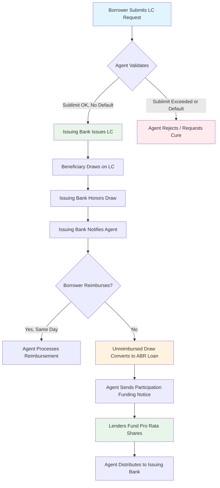

# Loan administration operational mechanics: rates, payments, and positions

> *Document 3 of 6 — Loan Administration Knowledge Base*
> *This document is current as of February 16, 2026.*
> *Related documents: Doc 1 (Market Landscape, §§ on loan products and pricing); Doc 2 (Credit Agreement Interpretation, §§ on interest provisions, conditions precedent, affirmative covenants); Doc 4 (Secondary Trading, §§ on delayed compensation and settlement); Doc 5 (Tax Withholding, §§ on withholding mechanics affecting payments); Doc 6 (Lifecycle Events, §§ on benchmark replacement and rate amendments)*

**This document is the authoritative rate reference for this knowledge base.** Other documents in the six-part series should defer to Doc 3 for current benchmark rates, day-count conventions, payment system mechanics, and rate-related market data. Where rate information appears in other documents, it should be stated as "as of [date]" with a cross-reference to Doc 3 for the most current figures.

---

**The post-LIBOR syndicated loan market has settled into stable conventions** centered on Term SOFR for US dollar loans, compounded SONIA for sterling, and a reformed EURIBOR for euro-denominated facilities. As of February 2026, the Federal Reserve has cut rates by **175 basis points** since September 2024 across six rate actions (50 bp in September 2024; 25 bp each in November 2024, December 2024, September 2025, October 2025, and December 2025; with holds at five intervening meetings), bringing the Fed Funds target to 3.50–3.75% and overnight SOFR to approximately 3.65%. [VERIFY: time-sensitive — confirm overnight SOFR as of document date via NY Fed SOFR page] This section covers the operational plumbing that loan administrators must master: benchmark rate mechanics, day-count conventions, payment systems, and the market standards that govern everything from excess cash flow sweeps to borrowing base calculations.

---

## 1. SOFR: the new backbone of USD syndicated lending [US]

### How SOFR is published

The **Secured Overnight Financing Rate (SOFR)** is published by the Federal Reserve Bank of New York at approximately **8:00 AM ET** each business day, reflecting the prior business day's overnight Treasury repo transactions. SOFR is calculated as a **volume-weighted median** of three categories of repo data: tri-party repo (collected from BNY Mellon), GCF Repo transactions (from the Office of Financial Research), and bilateral Treasury repo cleared through FICC's DVP service, with "specials" filtered out. Daily transaction volume underpinning the rate typically exceeds **$2 trillion** in notional, making SOFR one of the most robust benchmark rates globally (Source: Federal Reserve Bank of New York).

The NY Fed also publishes **SOFR Averages** (30-day, 90-day, and 180-day compounded averages) and the **SOFR Index** (a cumulative compounding factor from April 2, 2018, with initial value 1.00000000) at approximately the same time. Unlike overnight SOFR, which publishes on a T+1 basis, the Averages and Index publish on their value date (T+0). Revisions to SOFR occur only on a same-day basis, at approximately **2:30 PM ET**, and only if the underlying data warrants correction. The publication schedule follows the SIFMA US Government Securities Business Day calendar.

**For training purposes:** The specific rate values published below reflect market conditions as of the document date. Rates change with monetary policy decisions and market conditions. The more durable skill is knowing WHERE to find current rates and HOW the benchmark mechanics work — the specific values are illustrative. Key reference sources: NY Fed SOFR page for overnight and average SOFR rates; CME Group for Term SOFR; Bloomberg terminal (SOFR Index, SOFRRATE) for real-time values.

**Current published values (February 12–13, 2026):** [VERIFY: time-sensitive — verify against NY Fed SOFR page as of document date]

| Metric | Value |
|--------|-------|
| Overnight SOFR | **3.65%** |
| 30-day SOFR Average | 3.65819% |
| 90-day SOFR Average | 3.78126% |
| 180-day SOFR Average | 4.03392% |
| SOFR Index | 1.23196032 |

The 90-day and 180-day averages remain above overnight SOFR because they capture the period before recent Fed rate cuts, illustrating the backward-looking nature of these averages.

### Term SOFR: the dominant rate for new originations [US]

**Term SOFR**, a forward-looking rate derived from SOFR futures, is published by CME Group Benchmark Administration Limited (CBA) at **5:00 AM CT (6:00 AM ET)** each business day. The methodology uses volume-weighted average prices from CME's SR1 (1-month SOFR) and SR3 (3-month SOFR) futures contracts, sampled across multiple observation intervals during the prior trading day, then projected into a term structure using a model developed by Federal Reserve economists Erik Heitfield and Yang-Ho Park (Source: CME Group; ARRC).

The ARRC formally recommended Term SOFR on July 29, 2021, identifying it as "especially helpful for the business loans market—particularly multi-lender facilities, middle market loans, and trade finance loans." Term SOFR is now used by **over 2,870 firms globally** [VERIFY: time-sensitive — confirm current CME licensee count] and is the preferred rate for new USD syndicated loan originations.

**Current Term SOFR rates (February 12, 2026):** [VERIFY: time-sensitive — verify against CME Term SOFR page as of document date]

| Tenor | Rate |
|-------|------|
| 1-month | **3.65965%** |
| 3-month | **3.65253%** |
| 6-month | **3.60068%** |
| 12-month | **3.46003%** |

For current published rates, consult the NY Fed SOFR page (newyorkfed.org/markets/reference-rates/sofr) and CME Term SOFR (cmegroup.com/market-data/cme-group-benchmark-administration/term-sofr.html). The values above reflect rates as of the document date and will change with monetary policy actions.

The inverted term structure reflects market expectations of further Fed easing. Term SOFR rates are published to **five decimal places** and have built-in fallback procedures: if input data is unavailable, the prior day's final weighted futures prices are used. If published for more than three consecutive business days under fallback, CME's Oversight Committee convenes. Corrections exceeding 1 basis point are republished before 2:00 PM CT on the same day (Source: CME Group Term SOFR Reference Rates Benchmark Methodology).

### ARRC conventions for syndicated loans [US]

The ARRC's July 2020 recommendations remain the governing conventions for SOFR in syndicated loans. Two parallel frameworks exist:

**For Term SOFR (set in advance):** The rate is determined at the beginning of each interest period, mimicking the way LIBOR functioned. The borrower knows its rate upfront, and the administrative agent simply looks up the published Term SOFR rate two business days before the interest period begins (the "fixing date"). This operational simplicity is the primary reason Term SOFR has become dominant (Source: ARRC; LSTA).

**For Daily Simple SOFR (set in arrears):** The ARRC recommends a **5-business-day lookback without observation shift**. This means that on any given day of an interest period, the SOFR rate applied is the rate published five business days prior—but the interest accrual is still assigned to the actual calendar day (no shift in the observation period). The "without observation shift" convention was chosen specifically because syndicated loans have features that floating-rate notes do not: **principal can be prepaid at any time and loans are frequently traded between parties**. An observation shift would create a mismatch where a lender buying or selling a loan mid-period would have interest allocated based on rates that do not correspond to their actual holding period. The ARRC explicitly rejected alternative conventions—payment delay was deemed too disruptive to existing loan market infrastructure, and lockout periods were incompatible with prepayment flexibility (Source: ARRC Conventions for SOFR in Arrears, July 2020; LSTA).

**Daily Simple SOFR is more common than Daily Compounded SOFR** in syndicated loans because implementing simple interest is operationally straightforward (daily accruals depend only on principal outstanding), and the basis between simple and compounded SOFR is typically a few basis points or less. That said, the ARRC acknowledges compound interest more accurately reflects the time value of money and better matches derivative payment structures.

### CME Term SOFR licensing [US]

CME Group requires a license for any entity using Term SOFR. The structure comprises three license types:

- **Access License** (right to receive data): display or non-display
- **Use License** (right to reference Term SOFR in transactions): Category 1 for cash market products, Category 2 for OTC derivatives, Category 3 for service providers
- **Distribution License** (right to redistribute data to third parties)

**All lenders in a syndication need a Category 1 Use License.** Administrative agents that calculate interest need one. Vendors and service providers need a Category 3 license directly from CME. Borrowers do **not** need a license merely by being a counterparty, but must obtain one if they use Term SOFR for analysis, valuation, or pricing. The license covers subsidiaries with greater than 50% ownership by the licensed parent (Source: CME Group).

The critical commercial fact: **Category 1 Use Licenses are free through December 2026** [VERIFY: event-driven — confirm CME has not announced post-2026 fee changes]. CME has indicated that post-2026 fees will follow FRAND (Fair, Reasonable, and Non-Discriminatory) principles, but no specific fee amounts have been disclosed. This uncertainty about post-2026 pricing is a latent market concern. Category 2 (derivatives) fees are tiered by total assets, with entities below $1.5 billion exempt. Data licensing fees effective January 2026 are tiered by institution type and headcount [VERIFY: time-sensitive — confirm current CME fee schedule]. Distribution fees were waived until April 1, 2026 [VERIFY: event-driven — confirm waiver has not been extended or expired].

The broader friction point around Term SOFR involves **derivatives scope restrictions**. The ARRC's original best practices severely limited Term SOFR use in derivatives to protect SOFR futures liquidity, which caused risk concentration at dealers. The April 2023 Updated Best Practice Recommendations eased this by permitting dealers to enter Term SOFR–SOFR basis swaps with non-dealer counterparties. The underlying tension between broad market demand for Term SOFR hedging and the need to preserve the rate's data integrity persists (Source: ARRC Updated Best Practice Recommendations, April 2023).

---

## 2. International benchmarks: SONIA and EURIBOR

### SONIA for sterling loans [UK]

The **Sterling Overnight Index Average (SONIA)** is published by the Bank of England at **09:00 UK time** on the next London business day (T+1 basis). It is calculated as a **trimmed mean of the central 50%** of the volume-weighted distribution of eligible unsecured overnight sterling deposit transactions, rounded to four decimal places. Banks submit eligible transaction data by 07:00 AM for validation before publication. A **SONIA Compounded Index** has been published since August 2020 alongside the overnight rate (Source: Bank of England).

The current SONIA rate is approximately **3.7274%** (February 11, 2026) [VERIFY: time-sensitive — confirm against Bank of England SONIA page], tracking just below the Bank of England's **Bank Rate of 3.75%** (held 5-4 at the February 2026 MPC meeting, with four members favoring a cut to 3.50%) [VERIFY: time-sensitive — confirm current Bank Rate and most recent MPC decision]. The BoE made four 25 bp cuts during 2025, reducing Bank Rate from 4.75% to 3.75%.

For LMA-documented syndicated loans, the standard convention is **compounded in arrears using the Non-Cumulative Compounded Rate (NCCR) method, with a 5-banking-day lookback without observation shift** and an **Actual/365 Fixed** day count [UK]. Floors, where present, are recommended to be applied on a daily basis rather than on the compounded rate. The SONIA republication threshold is **2 basis points**; republication occurs no later than midday on the same day (Source: LMA; Bank of England; UK Working Group on Sterling Risk-Free Reference Rates).

**Term SONIA** exists but the LMA has not adopted it for standard syndicated loan documentation. The Financial Markets Standards Board limits Term SONIA use to specific cases such as export finance, emerging markets, and trade and working capital finance.

### EURIBOR: reformed and stable [EU]

**EURIBOR remains active and fully operational**, administered by the European Money Markets Institute (EMMI) in Brussels, authorized under the EU Benchmarks Regulation since July 2019 and supervised by ESMA since January 2022. The rate underpins over **€100 trillion** in outstanding financial instruments [VERIFY: time-sensitive — confirm current EURIBOR outstanding notional from EMMI] (Source: EMMI).

**Five tenors are published** on each TARGET business day at approximately **11:00 CET**: 1-week, 1-month, 3-month, 6-month, and 12-month. The day-count convention is **Actual/360** [EU].

**Current EURIBOR rates (February 13, 2026):** [VERIFY: time-sensitive — confirm against EMMI EURIBOR page as of document date]

| Tenor | Rate |
|-------|------|
| 1-week | **1.907%** |
| 1-month | **1.951%** |
| 3-month | **1.999%** |
| 6-month | **2.147%** |
| 12-month | **~2.227%** |

A **significant methodology reform completed in 2024** eliminated Level 3 (expert judgment-based contributions) from EURIBOR's hybrid methodology. The enhanced methodology now operates on two levels: Level 1 (actual transactions) and Level 2 (transaction-derived contributions with sub-levels). The panel was expanded with OP Bank (November 2024) and National Bank of Greece (January 2025). EMMI also developed **Efterm®**, a forward-looking €STR-based term rate designed as the fallback to EURIBOR, with Bloomberg SEF LLC added as a data provider in October 2025 (Source: EMMI; ESMA).

There are **no plans to discontinue EURIBOR**. ESMA has stated that discontinuation "is not part of our plans," and the recent reforms were designed to ensure long-term viability. However, fallback infrastructure is in place: the ECB publishes compounded €STR average rates, and ISDA has developed €STR-based fallback provisions. At a 2025 Eurex conference, more than half of attendees expected €STR to eventually become the main euro benchmark for swaps—but traders described this as "a marathon" given EURIBOR's deep integration in European retail products.

**TARGET closing days for 2026** [EU] (EUR settlement holidays): January 1, April 3 (Good Friday), April 6 (Easter Monday), May 1, December 25, and December 26 (falls on Saturday). The system was migrated from TARGET2 to the consolidated **T2 platform** in March 2023; the holiday calendar is unchanged.

---

## 3. Current US rate levels and the floor economics [US]

### Where rates stand today

| Rate | Current Value | Effective Date |
|------|--------------|----------------|
| **Fed Funds target** | **3.50% – 3.75%** | Since December 2025 |
| Effective Fed Funds Rate | ~3.64% | February 12, 2026 |
| Overnight SOFR | 3.65% | February 12, 2026 |
| WSJ Prime Rate | **6.75%** | Since December 2025 |

[VERIFY: time-sensitive — confirm all current rate values against NY Fed SOFR page and Federal Reserve releases as of document date]

The FOMC voted to hold rates at its January 28, 2026 meeting, with two dissenting votes (Miran and Waller) favoring an additional 25 bp cut. The cumulative easing since September 2024 totals **175 basis points** across six rate cuts: a 50 bp cut in September 2024, 25 bp cuts in November and December 2024, holds through the first half of 2025, then 25 bp cuts in September, October, and December 2025. Chair Powell indicated the current stance is "appropriate" and the market prices minimal probability of a March 2026 cut, with one additional cut expected later in 2026. Notably, **Powell's term expires May 15, 2026** [VERIFY: event-driven — confirm exact expiration date], introducing potential monetary policy uncertainty (Source: Federal Reserve; CME FedWatch).

The Prime Rate maintains its standard relationship to the Fed Funds upper target: **Prime = FFR upper bound + 300 bps** (3.75% + 3.00% = 6.75%).

### Interest rate floors are deeply out of the money

The standard SOFR floor in broadly syndicated leveraged loans is **0.50% (50 bps)**. PitchBook LCD data from the first full quarter of SOFR-based issuance showed **63% of institutional term loans with a 50 bps floor**, 33% with 75 bps or higher. Private credit deals typically feature **75–100 bps floors**. Floors apply to the **reference rate only** (SOFR or Term SOFR), not to the all-in rate including spread (Source: PitchBook LCD).

With overnight SOFR at 3.65%, floors are approximately **250–315 basis points out of the money** and have been economically irrelevant since the Fed began raising rates in March 2022. The forward curve suggests SOFR will remain above 3.0% through at least 2027 [VERIFY: time-sensitive — confirm forward curve expectations via CME FedWatch]. Because floors are so far from binding, they have not been a meaningful negotiation point in the borrower-friendly 2024–2025 repricing environment, where the focus has instead been on spread compression (average institutional loan margins hit a record low of **313 bps** in Q3 2025 [VERIFY: time-sensitive — confirm via PitchBook LCD]) (Source: PitchBook LCD; White & Case Debt Explorer).

---

## 4. Day-count conventions and payment system mechanics

### Day-count conventions by currency [JURISDICTION-SPECIFIC]

The day-count convention determines how interest accrues and is one of the most consequential operational details in loan administration.

| Currency/Rate | Day Count | Authority |
|---------------|-----------|-----------|
| USD SOFR (all variants) [US] | **Actual/360** | ARRC |
| GBP SONIA [UK] | **Actual/365 Fixed** | UK Working Group/BoE |
| EUR EURIBOR [EU] | **Actual/360** | Market convention |
| USD fixed-rate instruments [US] | 30/360 | Market convention |
| US Treasuries [US] | Actual/Actual | Market convention |

The Actual/360 convention for USD loans means the borrower effectively pays more than the stated annual rate because 365 days of accrual are divided by a 360-day year. A stated 5.00% rate yields an effective annualized cost of approximately **5.069%** (stated rate × 365/360). Most USD syndicated loan documents apply Actual/360 to all fee calculations (commitment fees, LC fees) for consistency, though some fixed-rate structures or older documentation may reference 30/360. The Actual/Actual convention is **not used** in syndicated lending (Source: ARRC; LSTA; LMA).

### Payment system cutoff times [JURISDICTION-SPECIFIC]

Loan administrators must hit precise payment windows across three major settlement systems:

**Fedwire Funds Service (USD)** [US]**:** Operates 22 hours per day, opening at **9:00 PM ET** (prior calendar day) and closing at **7:00 PM ET**. The customer transfer cutoff is **6:45 PM ET**; bank-to-bank messages are accepted until **7:00 PM ET**. Credit agreements typically specify an **agent cutoff of 1:00–2:00 PM ET** to allow processing time. The Federal Reserve announced in October 2025 plans to expand Fedwire to include Sundays and weekday holidays (22×6 schedule) by 2028–2029, but this is not yet implemented [VERIFY: event-driven — confirm Fedwire expansion timeline has not changed] (Source: Federal Reserve).

**CHAPS (GBP)** [UK]**:** Operates **6:00 AM to 6:00 PM UK time**, with customer payment (MT103) cutoff at **5:40 PM** and interbank (MT202) cutoff at 6:00 PM. Individual banks impose earlier cutoffs, typically 3:00–5:00 PM UK time. Settlement is real-time, final, and irrevocable (Source: Bank of England).

**T2 (EUR)** [EU]**:** Customer payments cut off at **5:00 PM CET**, interbank payments at **6:00 PM CET**, with end-of-day procedures completing around 6:45 PM CET. The ECB published a consultation in June 2025 on extending T2 hours, driven by the G20 cross-border payments roadmap, but no expansion has been implemented [VERIFY: event-driven — confirm T2 extension status] (Source: ECB).

Missing any cutoff means funds settle on the next business day, potentially triggering late payment provisions. Administrative agents bear the operational risk of ensuring timely instruction submission.

### Defaulting lender provisions [US]

When a lender fails to fund its commitment—typically within **2 business days** of the required date—it is classified as a "defaulting lender" under the credit agreement. The consequences are severe and well-codified. Payments that would go to the defaulting lender are redirected through a priority waterfall: first to reimburse the agent for any advances, then the swingline lender, then the LC issuing bank, then non-defaulting lenders who advanced excess amounts, then held as **cash collateral** (typically 100–105% of unreallocated fronting exposure). The defaulting lender **loses voting rights** and is excluded from "Required Lenders" calculations. It forfeits commitment fees during the default period. The borrower may exercise **"yank-a-bank" rights** to force assignment of the defaulting lender's position to a replacement at par. Non-defaulting lenders' pro rata shares are adjusted upward to absorb the defaulting lender's LC participation and swingline exposure, though no lender is forced to exceed its own commitment amount (Source: LSTA MCAPs; ABA Business Law Today, June 2022).

---

## 5. Business day conventions and loan market holidays [US]

The LSTA publishes an annual Loan Market Holiday Schedule that generally aligns with **Federal Reserve Bank of New York closings** (11 holidays in 2026). For delayed compensation calculations on loan trades, the LSTA additionally considers NYSE closings, which include Good Friday—a day the Fed remains open. The **Modified Following Business Day Convention** [US/UK] is standard for SOFR-based syndicated loans: a payment falling on a non-business day shifts to the next business day unless that day falls in the next calendar month, in which case it shifts to the prior business day. This prevents interest periods from inadvertently rolling into a different month and altering calculations. For EUR-denominated facilities [EU], business days are defined by reference to TARGET operating days (Source: LSTA; LMA).

---

## 6. LIBOR transition residuals and the credit spread adjustment

### CSA values are confirmed but fading from relevance

The fixed Credit Spread Adjustments set during the LIBOR transition, based on the five-year historical median spread between LIBOR and SOFR preceding the March 5, 2021 cessation announcement, are:

| Tenor | CSA (bps) |
|-------|-----------|
| 1-month | **11.448** |
| 3-month | **26.161** |
| 6-month | **42.826** |

These values were locked in by Bloomberg on March 5, 2021 and embedded in the ARRC's recommended fallback language, the Federal LIBOR Act (enacted December 2022), and ISDA's standard documentation. However, market practice diverged quickly: by Q3 2022, most new US syndicated loans were originated **without a CSA**. Early transition deals used flat 10 bps across all tenors or a 10/15/25 bps curve, but these were abandoned as the market normalized pure Term SOFR + spread pricing (Source: ARRC; Bloomberg; ISDA).

**Synthetic USD LIBOR—the last vestige of LIBOR—ceased publication permanently on September 30, 2024.** All 35 LIBOR settings across five currencies have now ended. The ARRC published its closing report in November 2023, and the UK Working Group on Sterling Risk-Free Reference Rates wound down on October 1, 2024. The massive **2024–2025 refinancing wave** (roughly 60% of outstanding first-lien loans repriced in 2024) has largely replaced legacy documentation that still referenced CSA-adjusted SOFR with clean Term SOFR + spread terms. Residual LIBOR transition issues are minimal and confined to a small tail of unrefinanced legacy contracts.

---

## 7. Market conventions: ECF sweeps, call protection, and ABL mechanics [US]

### Excess cash flow sweeps

ECF sweeps are the primary mandatory prepayment mechanism in leveraged loan agreements. The standard structure uses a **tiered step-down based on net leverage**:

- **75% of ECF** when leverage exceeds the opening ratio
- **50%** when leverage falls approximately 0.5× below closing
- **25%** at approximately 1.0× below closing
- **0%** at a further threshold (typically 1.5× below closing)

Leverage step-downs are commonly measured relative to closing-date leverage rather than fixed absolute ratios—a borrower-friendly evolution. ECF is a **contract-defined formula, not an accounting concept**, calculated from Adjusted EBITDA or Consolidated Net Income minus cash interest, cash taxes, scheduled amortization, permitted capex, permitted acquisitions, and working capital increases. Dollar-for-dollar deductions (historically limited to voluntary prepayments of pari passu debt) have expanded significantly to include junior debt prepayments, all capex, investments, and restricted payments. De minimis thresholds have become prevalent, with many agreements only requiring prepayment of ECF in excess of a minimum amount (Source: LSTA; PitchBook LCD).

Timing: ECF sweeps are calculated annually and typically due within **10 business days after delivery of audited financial statements**, or approximately **90–130 days after fiscal year end**.

### Private Credit ECF Sweep Variations [PRIVATE CREDIT]

ECF sweeps in private credit facilities typically differ from BSL conventions in several ways:
- **Higher sweep percentages:** Private credit agreements often start at 75% (vs. 50% in BSL), with step-downs to 50% and 25% at lower leverage levels
- **Tighter excess cash flow definitions:** Fewer permitted deductions, more limited carve-outs for capital expenditures, acquisitions, and voluntary prepayments
- **Semi-annual or quarterly calculation:** Some private credit agreements require ECF calculations more frequently than the BSL-standard annual calculation
- **Unitranche application:** In facilities with first-out/last-out structures (governed by an Agreement Among Lenders), ECF sweep proceeds may be applied differently to each tranche per the AAL waterfall
- **Lower de minimis thresholds:** Private credit facilities may set lower floors below which no sweep is required
- **Borrower-friendly exceptions:** Despite tighter base terms, some private credit deals include borrower-favorable exceptions such as growth capex carve-outs or acquisition add-back provisions

The agent must read the ECF provisions carefully for each facility — the interplay between the sweep percentage, the deduction catalog, and the measurement period determines the actual cash flow captured.

### Call protection conventions

The US broadly syndicated TLB market standard is a **101 soft call (1% premium) for 6 months** [US], applying only to "repricing transactions" where the primary purpose is reducing the borrower's effective interest cost. In European leveraged loans and some US middle-market deals, **12-month soft call periods** are more common [UK/EU] (Source: PitchBook LCD; ICLG Lending & Secured Finance 2025–2026).

Private credit employs **hard call protection**—premiums on any voluntary prepayment—typically structured as **102/101** (2% in year 1, 1% in year 2). An "overwhelming majority" of tracked US private credit deals use this schedule. Make-whole premiums (present value of future interest discounted at the Treasury rate plus 50 bps) appear in high-yield notes, mezzanine debt, and some lower middle-market transactions (Source: Proskauer Private Credit Deep Dives).

The 2024 repricing wave (**$757 billion** in institutional term loans repriced, a record [VERIFY: time-sensitive — confirm 2024 repricing volume via PitchBook LCD]) has put intense pressure on call protection. Borrowers are repricing "the day after call protection periods run out," and competition between BSL and private credit markets is eroding call protection conventions, with private credit lenders occasionally accepting soft call structures to win mandates.

### ABL borrowing base conventions [US]

Asset-based lending facilities are governed by borrowing base mechanics with standardized advance rates:

| Collateral Type | Standard Advance Rate |
|-----------------|----------------------|
| Eligible receivables | **80–85%** of face value |
| Eligible inventory | **50–65%** of NOLV (net orderly liquidation value) |
| Work-in-process | Typically **excluded** |

Receivable eligibility requires invoices less than 90 days old (or 60 days past due), generated in the ordinary course, subject to a perfected first-priority security interest, and not intercompany or foreign (unless credit-insured). **Cross-aging rules** typically render all of a customer's receivables ineligible when 25–50% become ineligible. Single obligor concentration limits are typically set at **10–25%** of total eligible receivables (Source: OCC Comptroller's Handbook: Asset-Based Lending; Lexology).

Field exam frequency is **annual** for performing borrowers, increasing to quarterly when excess availability drops below a defined threshold. Borrowing base certificates are submitted **monthly**, shifting to **weekly** when availability triggers are breached. The sole financial covenant is typically a **springing fixed charge coverage ratio of 1.0×**, activated only when availability falls below a threshold. Cash dominion mechanisms allow receivable collections to sweep directly against the outstanding revolver balance.

---

## 8. Letters of credit administration mechanics [US]

### The LC issuance workflow

The lifecycle of a syndicated LC begins with the borrower's issuance request and ends with expiry, drawing, or cancellation — and the administrative agent sits at the center of every step. Under standard LSTA-form credit agreements, the borrower submits an LC request to both the administrative agent and the issuing bank. Notice must typically arrive **no later than noon New York City time** on the business day before the requested issuance date (or by 10:00 a.m. if delivered via approved electronic communication). Most facilities require **two to five business days' advance notice** for new issuances (Source: LSTA Form of Revolving Credit Agreement; ABA Business Law Today, June 2022).

The request must specify the issuance date, proposed expiration date, stated amount, beneficiary name and address, LC type (standby or commercial), and a completed LC application on the issuing bank's standard form. The borrower must certify that representations and warranties remain accurate, no event of default exists, and that after issuance both the LC sublimit and aggregate revolving commitment caps will be respected.

The issuing bank reviews the request for form acceptability (it retains discretion to reject nonstandard forms or those containing nondocumentary drawing conditions), verifies that the same conditions precedent applicable to revolving borrowings are satisfied, and confirms sublimit headroom. The administrative agent independently verifies that outstanding LC Exposure plus the requested amount does not breach the LC sublimit or aggregate revolving commitments, then notifies all revolving lenders. Upon issuance, **each revolving lender is deemed to have automatically and irrevocably acquired a pro rata risk participation** in the LC — no separate documentation is needed (Source: LSTA MCAPs; Cadwalader Fund Finance Friday, June 2025).

### Drawing mechanics and the participation funding cascade

When a beneficiary draws on a syndicated LC, the document presentation goes directly to the issuing bank — not to the administrative agent. For standby LCs (governed by **ISP98**, the International Standby Practices), the beneficiary typically presents a draft and a certificate asserting the applicant's failure to perform. For commercial LCs (governed by **UCP 600**, the Uniform Customs and Practice for Documentary Credits), the beneficiary submits bills of lading, commercial invoices, insurance certificates, and other specified shipping documents. The issuing bank has up to **five banking days** to examine documents for compliance under both ISP98 and UCP 600 (Source: ICC; ISP98).

Once the issuing bank honors the draw and pays the beneficiary, the reimbursement cascade begins. The borrower must reimburse the issuing bank on the **same business day** (or by the next business day if notice arrives after a specified cutoff). If the borrower fails to reimburse, most credit agreements provide that the unreimbursed amount **automatically converts into a base-rate revolving loan** funded pro rata by all revolving lenders. If even that mechanism fails (because an event of default prevents a new borrowing), the agent or issuing bank sends a participation funding notice to each revolving lender, requiring each to fund its pro rata share in **immediately available funds by the next business day**. This obligation is described in model provisions as "absolute, unconditional, and irrevocable" — not affected by any default, amendment, or other circumstance (Source: LSTA MCAPs; Federal Reserve FEDS Paper 2021-060).

#### LC Drawing and Reimbursement Flow

### Fronting exposure is the issuing bank's core risk

In a fronted LC structure, a single issuing bank bears **100% direct liability** to the beneficiary, while each other revolving lender holds only an undivided risk participation. Fronting risk materializes when a participating lender fails to fund its share upon a draw — the issuing bank is left holding a disproportionate exposure.

Credit agreements mitigate fronting risk through several layered mechanisms. Lender participation obligations are unconditional. **Defaulting lender provisions** (a centerpiece of the LSTA MCAPs, most recently drafted June 2025) allow reallocation of a defaulting lender's participation to non-defaulting lenders up to their commitment limits. If reallocation cannot fully eliminate the exposure, the borrower must **cash-collateralize** the issuing bank's fronting exposure, typically at **102–105%** of the LC amount. Many facilities cap each issuing bank's individual "Fronting Commitment," and the issuing bank may refuse to issue new LCs if doing so would cause its fronting exposure to exceed that cap (Source: LSTA MCAPs; Cadwalader Fund Finance Friday, August 2020).

### LC fee calculations

LC fees in syndicated facilities follow a three-tier structure:

- **Participation fee**: Paid by the borrower to the administrative agent for ratable distribution to all revolving lenders. The rate equals the **applicable margin on revolving loans** (i.e., the SOFR spread), calculated on the average daily undrawn face amount. Paid quarterly in arrears on an Actual/360 basis. During an event of default, this fee typically increases by **200 basis points** (deal-specific — verify against the operative credit agreement).
- **Fronting fee**: Paid by the borrower directly to the issuing bank. Market-standard rates are **12.5 to 25 basis points** per annum, with 12.5 bps most common in investment-grade and broadly syndicated facilities. Calculated on average daily LC Exposure, paid quarterly (Source: Cadwalader; Cobrief).
- **Issuance and amendment fees**: One-time charges at the issuing bank's customary rates — commonly a flat dollar amount or **12.5 bps** of face amount — payable directly to the issuing bank.

### LC types in syndicated lending

**Standby LCs** constitute the vast majority of LCs issued under syndicated revolving credit facilities. They function as performance guarantees, supporting lease obligations, surety bonds, insurance requirements, workers' compensation, and utility deposits. **Commercial (documentary) LCs**, which facilitate trade by conditioning payment on presentation of shipping documents, appear more frequently in ABL facilities with import components and specialized trade finance facilities. Credit agreements that accommodate both types typically define "Trade Letters of Credit" separately and may apply different sublimits (Source: ICC Academy; LSTA).

### LC interaction with borrowing base in ABL facilities

In asset-based lending facilities, LC Exposure reduces available borrowing capacity dollar-for-dollar, even when no cash has been advanced. The availability formula is: **Excess Availability = min(Aggregate Commitments, Borrowing Base) − Aggregate Revolving Exposure**, where Aggregate Revolving Exposure includes outstanding revolving loans, swingline loans, and LC Exposure (undrawn face amount plus unreimbursed drawings). At facility maturity, outstanding LCs must be cash-collateralized at **100–105%** of face amount (Source: Lexology; OCC Comptroller's Handbook).

### Evergreen LCs and expiry tracking

Evergreen LCs automatically extend for a stated period (typically **one year**) unless the issuing bank delivers a non-renewal notice to the beneficiary **30–90 days** before the then-current expiration date. The administrative agent must maintain a comprehensive LC register tracking every expiry date, renewal date, and non-renewal notice deadline. No evergreen LC may extend beyond **five business days prior to the revolving credit maturity date**. If a default exists and notice is received at least two business days before the non-extension date, the agent must instruct the issuing bank to send non-renewal notice. LCs outstanding after maturity require cash collateralization, typically **30 days** before the facility terminates (Source: LSTA Form of Revolving Credit Agreement; Law Insider evergreen LC clause samples).

**Operational significance for the agent:** The agent must maintain real-time LC exposure tracking because LC drawings create immediate funding obligations for revolving lenders. LC sublimits typically range from **10% to 50%** of aggregate revolving commitments, with **20–33%** the most common band. The sublimit is always described as "part of, and not in addition to" the revolving commitments (Source: Cadwalader; LSTA).

---

## 9. Swingline lending mechanics [US]

### What swingline loans are and why they exist

A swingline loan is a short-term borrowing — typically **one to ten business days** in duration — that provides same-day liquidity within a revolving credit facility. Where standard revolving borrowings require one to three business days' advance notice and coordination across the full syndicate, swingline loans are funded by a **single designated lender** (almost always the administrative agent bank or a designated affiliate) and can be requested as late as **noon to 1:00 p.m. New York City time** on the funding date. The swingline sublimit is part of, not in addition to, the revolving commitments — every dollar of swingline exposure counts against the aggregate revolving cap alongside revolving loans and LC Exposure (Source: LSTA Form of Revolving Credit Agreement; Cadwalader Fund Finance Friday, September 2021).

Borrowers use swingline access for payroll processing, tax payments, urgent supplier settlements, and intraday working capital needs. The facility serves as a cash management bridge, eliminating the friction of mobilizing 10–30 syndicate banks for a two-day borrowing. Minimum borrowing amounts are lower than for revolving loans — typically **$500,000 to $1,000,000** versus $1–5 million for syndicated revolving draws.

### Borrowing mechanics

The borrower delivers a Notice of Swingline Borrowing specifying the requested date (a business day) and amount — **no interest period election is required**. Because the very short tenor makes selecting a one-, three-, or six-month term impractical, swingline loans bear interest at the **Alternate Base Rate** (the highest of prime rate, fed funds + 50 bps, and one-month Term SOFR + 100 bps) plus the applicable margin, or at **Daily Simple SOFR** plus margin. Term SOFR is not used because it requires advance rate-setting incompatible with same-day funding (Source: LSTA; Cadwalader).

**Operational note:** The ABR formula is a DEFINED TERM in each credit agreement. While the formulation above (highest of prime rate, fed funds + 50 bps, and one-month Term SOFR + 100 bps) is the post-LIBOR market standard, the agent must always reference the specific definition in the operative documents. Legacy agreements may still reference 'one-month LIBOR + 100 bps' as a component — these provisions should have been amended during the LIBOR transition, but verification is essential. Never assume the standard formula applies without checking the agreement.

Because only one lender advances funds, there is no need to send funding notices to the full syndicate and await multiple wire transfers — the core source of delay in standard revolving borrowings. Swingline proceeds generally **may not be used to refinance other outstanding swingline loans** (an anti-rollover provision). Repayment is required by the earlier of a specified number of business days after funding (typically **two to five**) and the date of the next regular revolving borrowing.

| Feature | Swingline loan | Revolving loan |
|---|---|---|
| Notice period | Same-day (by noon–1 PM cutoff) | 1 business day (ABR) / 3 business days (Term SOFR) |
| Funding source | Single swingline lender | All revolving lenders pro rata |
| Interest rate | ABR or Daily Simple SOFR only | Term SOFR (1/3/6-month) or ABR |
| Typical tenor | 1–10 business days | Through maturity; 1/3/6-month interest periods |
| Minimum amount | $500K–$1M | $1M–$5M |
| Settlement | Periodic (weekly or at lender's discretion) | Simultaneous pro rata funding on borrowing date |

### Settlement with the syndicate

Upon making a swingline loan, each revolving lender is deemed to have **irrevocably and unconditionally purchased** a risk participation equal to its pro rata share — this arises by operation of the credit agreement without separate documentation. Settlement then occurs through one of two mechanisms (Source: LSTA MCAPs; Cadwalader):

**Revolving out (refunding):** The swingline lender, at any time and in its sole discretion, requests that each revolving lender make a base-rate revolving loan equal to its pro rata share of outstanding swingline loans. The borrower is deemed to have requested this borrowing. Revolving lenders must fund by the **next business day**, and proceeds repay the swingline loan. This is the preferred mechanism because it converts swingline exposure into ordinary revolving loans.

**Participation funding:** If refunding cannot occur (because an intervening event of default or bankruptcy prevents a new revolving borrowing), each revolving lender must instead fund its participation directly. The swingline lender sends a settlement notice, and each lender pays its share — typically **by the next business day**. Future payments on the swingline loan are then distributed pro rata among participation holders. If any payment must later be returned (e.g., as a preference in bankruptcy), participating lenders must return their distributions.

Settlement frequency is commonly **weekly** but may occur at any time at the swingline lender's discretion. The administrative agent calculates each lender's share, collects settlement payments, and remits proceeds to the swingline lender.

### Swingline sublimit and defaulting lender interaction

Swingline sublimits are generally **5–10%** of total revolving commitments, with common sublimit amounts of **$10–50 million** for mid-market to large facilities. The sublimit automatically reduces if the revolving commitment is reduced below it (Source: Law Insider swingline sublimit samples; LSTA).

Defaulting lender provisions provide essential protection for the swingline lender. The core safeguard: **the swingline lender is not required to fund any new swingline loan if doing so would create fronting exposure** — defined as a defaulting lender's pro rata share of swingline loans not yet reallocated or cash-collateralized. When a defaulting lender exists, a waterfall applies: first, non-defaulting lenders' participations are recalculated on an adjusted pro rata basis (capped at each lender's commitment); second, if reallocation cannot fully cover the exposure, the borrower must **prepay swingline loans** in an amount sufficient to eliminate the remaining fronting exposure; third, the borrower must cash-collateralize any remaining LC fronting exposure. The administrative agent may also set off amounts otherwise payable to the defaulting lender to satisfy swingline-related obligations (Source: LSTA MCAPs; Lexology, "How to cut risk of dealing with a defaulting lender").

### Agent's operational role

The administrative agent's swingline responsibilities include: receiving and validating borrowing notices against sublimit and commitment headroom; confirming no event of default blocks the borrowing; tracking outstanding swingline exposure in real time alongside revolving loans and LC exposure; coordinating periodic settlement by calculating each lender's pro rata share and issuing settlement notices; collecting and distributing settlement payments; and maintaining the register of all swingline loans with borrowing dates, amounts, interest rates, and repayment dates. Agents track swingline positions using the same platforms as other loan types — typically **Finastra LoanIQ** or **FIS ACBS** — with swingline exposure feeding directly into the aggregate availability calculation (Source: SRS Acquiom; LSTA).

---

## 10. Multi-currency facility operations [JURISDICTION-SPECIFIC]

### Currency selection mechanics

Multi-currency credit agreements establish a defined universe of borrowing currencies at closing. Under LSTA convention [US], these are termed "Agreed Currencies" or "Alternative Currencies"; under LMA convention [UK/EU], the framework uses a "Base Currency" (typically USD or the borrower's functional currency) with permitted "Optional Currencies." A typical closing might authorize USD, EUR, GBP, and CHF, with a mechanism for adding currencies post-closing that requires the consent of the administrative agent and all (or a majority of) revolving lenders. Conditions for any added currency include that it must be readily available, freely traded, convertible to a Dollar Equivalent, and not subject to exchange controls (Source: LSTA MCAPs; LMA Investment Grade Facility Agreement).

If currency controls are later imposed, a previously approved currency is no longer freely traded, or a Dollar Equivalent becomes uncalculable, the administrative agent notifies all parties and the borrower must **repay or convert loans** in the affected currency into the base currency within **five business days**.

### How borrowings work across currencies

Each currency has its own benchmark rate and payment conventions, creating a structural asymmetry at the heart of multi-currency facilities:

| Currency | Benchmark | Type | Day Count |
|---|---|---|---|
| USD [US] | **Term SOFR** | Forward-looking term rate | Actual/360 |
| GBP [UK] | **SONIA** (compounded in arrears) | Backward-looking overnight rate | Actual/365 Fixed |
| EUR [EU] | **EURIBOR** (€STR as fallback) | Forward-looking term rate | Actual/360 |
| CHF [INTERNATIONAL] | **SARON** (compounded in arrears) | Overnight secured rate | Actual/360 |
| JPY [INTERNATIONAL] | **TONA / TIBOR** | Overnight unsecured / forward-looking | Actual/360 |

For USD and EUR tranches, interest is known at the start of each period — enabling straightforward borrower notification and accrual. For GBP and CHF tranches, the compounded-in-arrears methodology means the **final interest amount is not determinable until near the end of the interest period**, requiring different notification timings, lookback mechanics, and break-cost calculations. The LMA and LSTA have taken divergent approaches: LMA documentation uses compounded-in-arrears rates for all RFR currencies, while the LSTA strongly favors forward-looking **Term SOFR** for USD, creating a fundamental documentation split in cross-border facilities (Source: ARRC; LMA; LSTA).

SARON (Swiss Average Rate Overnight) uses a distinct compounding methodology: rather than applying a lookback period as with SONIA, SARON relies on the **SARON Compound Rate** published by SIX Swiss Exchange. The agent should reference the SIX-published rate directly rather than calculating compounded SARON independently. This differs from SONIA's methodology, where compounding is typically calculated using the Bank of England's Non-Cumulative Compounded Rate (NCCR) or calculated by the agent using a lookback with observation shift.

Modern credit agreements include "Benchmark Replacement" provisions with a defined waterfall: if an existing benchmark ceases or is declared non-representative, the administrative agent and borrower select a replacement giving due consideration to the Relevant Governmental Body's recommendations and evolving market conventions. "Benchmark Replacement Conforming Changes" permit the agent to make technical adjustments to timing, business day conventions, lookback periods, and breakage provisions without full lender consent — typically through a **five-day negative consent** mechanism (Source: LSTA MCAPs; LMA).

### Equivalent amount calculations

The "Dollar Equivalent" or "US Dollar Equivalent" concept converts all non-USD drawings into a common USD denominator. It is foundational for availability calculations (ensuring total exposure does not exceed commitments), financial covenant compliance, sublimit monitoring, and pro rata sharing among lenders.

Exchange rates are typically determined using the agent's spot rate in the London foreign exchange market at approximately **11:00 a.m.** on the relevant day. Dollar Equivalents are recalculated on each borrowing date, each interest payment or rollover date, quarterly for covenant testing, and upon agent request if FX movements exceed a specified threshold (commonly **5–10%**). If exchange rate movements cause aggregate USD-equivalent exposure to exceed commitments, the borrower typically has a **five-to-ten-business-day** grace period to prepay and restore compliance (Source: LSTA; LMA; SEC filings for multi-currency credit agreements).

### Currency availability and minimum amounts

Some facilities limit non-USD borrowings to specific interest periods or require minimum amounts per currency draw. Typical minimum borrowing amounts for non-USD currencies are higher than for USD — often **€1,000,000 or £1,000,000** versus $1,000,000 for USD revolving draws. Currency availability periods may be restricted: some agreements permit non-USD borrowings only during the initial term or only through a specified date before maturity (to allow for orderly currency conversion before facility termination).

### Payment system coordination

The agent bank must coordinate payments across multiple real-time gross settlement systems with different operating hours, spanning roughly **18 hours** from Asian system openings to US system closings:

- **BOJ-NET** (JPY) [INTERNATIONAL]: closes at 7:00 p.m. JST
- **SIC** (CHF) [INTERNATIONAL]: closes at 4:15 p.m. CET
- **T2** (EUR) [EU]: operates 7:00 a.m.–6:00 p.m. CET
- **CHAPS** (GBP) [UK]: operates 6:00 a.m.–6:00 p.m. UK time
- **Fedwire** (USD) [US]: customer transfers until 6:45 p.m. ET; bank-to-bank until 7:00 p.m. ET

For a multi-currency drawdown, the agent receives the borrower's utilisation request (typically **three business days' notice** for non-USD currencies versus one to three for USD), notifies lenders of their pro rata shares and the applicable currency, collects lender fundings into the agent's nostro accounts in each currency, and disburses to the borrower through the relevant RTGS system. If a lender cannot fund in the requested currency, LMA documentation provides that it must fund in the base currency at the equivalent amount. Cross-border payment instructions route through SWIFT using MT103/MT202 messages (transitioning to ISO 20022 pacs.008/pacs.009 formats). For FX-related settlements, **CLS Bank** provides payment-versus-payment settlement in 18 currencies, eliminating settlement risk (Source: ECB; Bank of England; Federal Reserve; CLS Group).

### Redenomination risk

Redenomination risk — the possibility that obligations denominated in a currency (particularly the euro) could be converted into a different national currency if a member state exits a currency union — is addressed through several contractual mechanisms. Currency cessation clauses provide that if a currency ceases to exist or becomes unavailable, it is removed from the approved list and the borrower must repay or convert within five business days. **Judgment currency clauses** require the borrower to indemnify lenders for any shortfall if a court renders judgment in a currency other than the agreement currency. Illegality provisions require prepayment if maintaining loans in a particular currency becomes unlawful. The governing law choice is significant: obligations governed by **English or New York law** enjoy stronger protection against redenomination, since courts outside a departing state are less likely to enforce redenomination legislation under the *lex monetae* principle (Source: ECB Working Paper Series; Lexology, "Redenomination risk"; Taylor & Francis).

### Operational complexity for the agent

Multi-currency administration multiplies the agent's workload across every dimension. Position records must be maintained separately by currency and by lender, with different day-count conventions (Actual/360 for USD and EUR, Actual/365 for GBP). Interest calculation mechanics differ by benchmark type — forward-looking rates (Term SOFR, EURIBOR) allow interest notification at period start, while backward-looking compounded rates (SONIA, SARON) require different lookback and observation-shift mechanics that delay final interest determination. The agent maintains **nostro accounts** at correspondent banks in each financial center, with daily reconciliation of balances.

Agent banks rely on platforms like **Finastra Fusion LoanIQ** and **FIS Wall Street Systems** for multi-currency position tracking, automated exchange rate feeds, multi-benchmark interest calculation engines, cross-timezone payment scheduling, and regulatory reporting across jurisdictions. Daily FX reconciliation of nostro accounts, marking positions to current exchange rates, and identifying discrepancies between lender and agent records are continuous operational requirements (Source: Finastra; FIS).

Multi-currency options appear in an estimated **60–80%** of investment-grade revolving credit facilities for companies with significant international operations. In the leveraged lending market, multi-currency provisions are notably **less prevalent**, appearing primarily in European leveraged transactions and cross-border "Yankee Loan" structures. Term Loan B tranches are almost exclusively single-currency USD (Source: ABA; LSTA).

---

## 11. Loan identifier systems in flux [US/INTERNATIONAL]

The syndicated loan market relies on multiple overlapping identifier systems, with the ecosystem currently in transition:

**CUSIP** [US] remains the primary instrument-level identifier, deeply embedded in loan servicing, trade settlement, and books of record. These 9-character alphanumeric codes are assigned by CUSIP Global Services (now managed by FactSet) and can only be initiated by the administrative agent for corporate loans, ensuring accuracy through amendments. In August 2023, CGS launched the **CUSIP Entity Identifier (CEI)**—a free, open-source 10-character code for legal entities—developed in collaboration with the LSTA and Versana (Source: FactSet/CUSIP Global Services; LSTA).

**LXID (LoanX ID)** [US], now owned by **S&P Global** following the IHS Markit acquisition (completed February 2022), covers over **70,000** broadly syndicated loan instruments [VERIFY: time-sensitive — confirm current LXID coverage count via S&P Global]. In June 2025, S&P expanded LXIDs to private credit instruments, integrated with S&P Capital IQ Pro and linked to ISINs, RED Codes, and ratings data (Source: S&P Global).

**MEI (Markit Entity Identifier)**, also now S&P Global property, is a 10-digit code identifying legal entities across the loan ecosystem. The MEI faces competition from the newer CEI, and the LSTA has announced a strategic **Loan Identifier Cross-Reference Initiative** to improve connectivity across the overlapping systems. **LEI** (Legal Entity Identifier) [INTERNATIONAL] is used primarily for regulatory reporting, including under the Financial Data Transparency Act. **FIGI** (Financial Instrument Global Identifier) [INTERNATIONAL], an open-source alternative promoted by Bloomberg, has drawn concern from the LSTA and CGS because agents are not the exclusive applicants, creating risk of inaccurate data for loans that are frequently amended (Source: LSTA; Bloomberg).

---

## 12. Borrowing request and funding notice workflow [US]

The borrowing request and funding notice cycle is the core daily operational workflow for administrative agents. Every dollar disbursed to a borrower under a credit facility passes through this process — from the borrower's initial request through lender funding to final disbursement and recordkeeping.

### A. Borrowing request receipt and validation

The borrower submits a borrowing request (also called a Notice of Borrowing or Borrowing Request) to the administrative agent per the credit agreement's notice provisions. Standard notice periods are:

- **Term SOFR loans:** 1–3 business days' advance notice (typically 3 business days for initial borrowings, 1 business day for continuations/conversions)
- **ABR/base rate loans:** Same-day notice, typically by noon or 1:00 PM ET on the borrowing date
- **Swingline loans:** Same-day, as late as 1:00 PM ET (see Doc 3, §9 for swingline-specific mechanics)

Upon receipt, the agent validates the borrowing request against the following conditions:

1. **No Event of Default:** No Event of Default exists or would result from the proposed borrowing (or, for certain "incurrence" defaults, the borrowing would not cause a default to arise)
2. **Representations and warranties:** The borrower's representations and warranties are true and correct in all material respects (or in all respects, for representations already qualified by materiality) as of the borrowing date — known as the "bring-down" condition
3. **Minimum borrowing amounts:** The requested amount meets the minimum borrowing amount specified in the credit agreement (typically $1–5 million for revolving loans in increments of $500,000–$1 million)
4. **Available commitments:** The requested amount does not exceed available commitments after accounting for outstanding revolving loans, swingline loans, and LC Exposure (the availability calculation from Doc 3, §8)
5. **Sublimit compliance:** The borrowing does not breach any applicable sublimits (swingline, LC, multi-currency, borrowing base in ABL facilities)
6. **Conditions precedent:** All conditions precedent to the borrowing under the credit agreement are satisfied (for initial borrowings, these include delivery of legal opinions, organizational documents, and officer's certificates; for subsequent borrowings, the bring-down of reps and no-default certification typically suffices)
7. **Interest Period selection:** The borrower's selected Interest Period is valid — typically 1, 3, or 6 months for Term SOFR loans; some agreements permit 1-week or custom periods with all-lender consent
8. **Aggregate outstandings check (revolvers):** For revolving facilities, total outstandings including the new borrowing do not exceed total revolving commitments

If the request is deficient — for example, a missing Interest Period election, an amount that would breach commitments, or a notice delivered after the required deadline — the agent notifies the borrower of the deficiency and requests cure before processing. The agent determines the applicable interest rate based on the borrower's rate selection (Term SOFR for the elected tenor, or ABR) and the applicable margin from the credit agreement's pricing grid.

### B. Funding notice to lenders

Once the borrowing request is validated, the agent prepares and distributes a funding notice to all lenders in the relevant facility:

- **Timing:** Typically by noon on the business day preceding the funding date for Term SOFR loans; by 2:00 PM ET on the same day for ABR loans
- **Content:** The notice specifies the facility (revolving, term, incremental), aggregate borrowing amount, each lender's pro rata share (calculated to the required decimal precision), funding date, Interest Period start and end dates, applicable rate (Term SOFR rate plus spread, or ABR plus spread), and the agent's account details for receipt of funds

Each lender is obligated to fund its pro rata share by the time specified in the credit agreement — typically **1:00–2:00 PM ET** on the funding date, in immediately available funds via Fedwire to the agent's designated account.

**Lender failure to fund:** If a lender fails to deliver its pro rata share by the required time, the administrative agent is **NOT** obligated to advance the unfunded amounts on the lender's behalf. Some credit agreements provide for agent advances (where the agent may, but is not required to, fund the defaulting lender's share), with enhanced reimbursement rights including interest at the Federal Funds Rate plus a premium. A lender that fails to fund within two business days of the required date typically becomes a "Defaulting Lender" subject to the provisions described in Doc 3, §4.

### C. Disbursement

Upon receiving funds from lenders, the agent disburses to the borrower on the same business day, typically by end of day:

- **Disbursement method:** Wire transfer via Fedwire (for USD) to the borrower's designated account (specified in the credit agreement or subsequent notice)
- **Position recording:** The agent updates position records to reflect the new borrowing — principal amount, facility, interest rate, Interest Period start/end dates, and each lender's funded participation
- **Interest accrual commencement:** Interest begins accruing on the funding date using the applicable day-count convention (Actual/360 for SOFR and ABR loans — see Doc 3, §4)
- **Commitment utilization update:** The agent updates the aggregate outstanding amount against total commitments, recalculating available capacity for future borrowings
- **Confirmation:** The agent sends a borrowing confirmation to the borrower and all lenders, typically on the funding date or the next business day, specifying the final terms of the borrowing

### D. Swingline borrowing (expedited)

Swingline loans follow an abbreviated version of the standard workflow, reflecting their same-day funding nature:

- **Rate:** ABR only (or Daily Simple SOFR in some agreements) — Term SOFR is incompatible with same-day funding because it requires advance rate-setting
- **Notice period:** As late as 1:00 PM ET on the borrowing date (varies by agreement; some permit noon)
- **Funding:** The swingline lender (typically the administrative agent bank or a designated affiliate) funds directly from its own resources — no syndicate coordination is required on the borrowing date
- **Agent's role:** The agent validates the request against swingline sublimit headroom, confirms no Event of Default, records the position, and monitors for periodic settlement with the revolving syndicate
- **Settlement:** Periodic (weekly or at the swingline lender's request), outstanding swingline amounts are settled by allocating them pro rata to revolving lenders through either a revolving-out mechanism or participation funding (see Doc 3, §9 for detailed swingline settlement mechanics)

### E. Letter of credit requests

LC requests follow a similar but distinct workflow from cash borrowings — the borrower seeks an irrevocable commitment rather than a cash advance:

- **Submission:** The borrower submits an LC application to the issuing bank (and typically a copy to the administrative agent), specifying the LC type, amount, beneficiary, expiration date, and drawing conditions
- **Agent's role:** The agent verifies that LC issuance does not breach the LC sublimit or aggregate revolving commitments, records the LC exposure in the facility's position records, and facilitates ongoing participation fee accrual and distribution to revolving lenders
- **Distinction from cash borrowings:** No funds flow on the issuance date — the issuing bank assumes a contingent obligation. Cash flows occur only upon a beneficiary draw (see Doc 3, §8 for detailed LC mechanics including the reimbursement cascade and participation funding)

### F. Revolving facility specific mechanics

Revolving credit facilities have distinct borrowing dynamics compared to term facilities:

- **Borrow-repay-reborrow:** Revolving commitments allow the borrower to draw, repay, and redraw funds throughout the availability period (typically through the revolving maturity date, which may differ from the term loan maturity). Each new borrowing follows the same request-validate-fund-disburse cycle
- **Continuous utilization tracking:** The agent tracks aggregate revolving utilization (revolving loans + swingline loans + LC Exposure) against total revolving commitments on a real-time basis. Available capacity changes with each borrowing, repayment, LC issuance, and swingline draw
- **Springing covenant testing:** Many leveraged credit agreements include financial maintenance covenants that are tested only when revolving utilization exceeds a threshold — typically **35–40%** of total revolving commitments at quarter-end. When this threshold is triggered, the agent may need to verify that the borrower has delivered a compliance certificate demonstrating covenant satisfaction. The agent must track utilization at each quarter-end to determine whether testing is required
- **Commitment reductions:** Voluntary commitment reductions (which reduce the revolving commitment permanently) and mandatory commitment reductions (triggered by asset sales, debt issuances, or scheduled step-downs) reduce available capacity. The agent must ensure that outstanding revolving exposure does not exceed the reduced commitment amount, and if it does, require prepayment of the excess

**[PRIVATE CREDIT]** Borrowing mechanics in private credit facilities may differ: notice periods can be shorter (lender relationships are direct), conditions precedent may be more heavily negotiated, and the borrower and agent often communicate directly rather than through formal notices. Some private credit agreements permit telephonic borrowing requests followed by written confirmation. In direct lending facilities with a single lender or small club, the funding notice process is simplified — but the agent's validation obligations (conditions precedent, sublimit compliance, rep bring-down) remain substantively identical.

---

## 13. Payment waterfall and priority of payments [US]

The payment waterfall defines the order in which the administrative agent distributes funds received from the borrower. Correct application of the waterfall is one of the agent's most critical responsibilities — errors in payment priority can create lender disputes, breach fiduciary obligations, and expose the agent to liability.

### A. Standard payment priority (non-default)

Under normal operating conditions, the administrative agent distributes payments in the following order, as defined in the credit agreement:

1. **Agent fees, costs, expenses, and indemnification amounts** owed to the administrative agent in its capacity as agent
2. **Interest payments** — distributed pro rata among lenders based on each lender's share of outstanding principal in the relevant facility
3. **Fee payments** — commitment fees (on undrawn revolving commitments), LC participation fees, and fronting fees — distributed pro rata among entitled lenders
4. **Scheduled principal payments (amortization)** — distributed pro rata among lenders of the amortizing facility (typically term loans)
5. **Voluntary prepayments** — distributed pro rata among lenders of the repaid facility; the borrower may typically choose which facility to prepay, and within term loans, may direct prepayments to a specific tranche
6. **Other amounts** — including breakage costs, increased costs, and indemnification payments owed to specific lenders

The **pro rata sharing provision** is fundamental to syndicated lending: each lender receives its proportionate share of every payment. If a lender receives a disproportionate payment — for example, through setoff rights exercised against borrower deposits held at that lender's bank — it must purchase participations from other lenders to equalize the distribution. This "sharing clause" ensures that no lender can use its bilateral relationship with the borrower to gain priority over other syndicate members (Source: LSTA MCAPs; Latham & Watkins).

### B. Mandatory prepayment application

Mandatory prepayments arise from specified trigger events and follow credit-agreement-defined application rules:

- **Asset sale proceeds:** Applied pro rata to outstanding term loans (typically with reinvestment rights of 12–18 months allowing the borrower to reinvest proceeds in productive assets before any mandatory prepayment is required). The sweep percentage may step down based on leverage — for example, 100% of net cash proceeds when leverage exceeds 4.0x, 50% between 3.5x–4.0x, and 0% below 3.5x
- **Excess cash flow sweep:** Annual calculation per Doc 3, §7; applied to term loans pro rata with leverage-based step-downs. The ECF sweep is typically the largest source of mandatory prepayments in leveraged facilities
- **Debt issuance proceeds:** 100% of net cash proceeds from non-permitted debt issuances (i.e., debt not expressly authorized by the credit agreement's negative covenants)
- **Insurance and condemnation proceeds:** Applied similarly to asset sale proceeds — typically with reinvestment rights and leverage-based step-downs
- **Application order:** Mandatory prepayments are typically applied to term loan amortization payments in **inverse order of maturity** (last scheduled payment first), reducing the borrower's near-term scheduled payments last. This application order is heavily negotiated — some agreements apply pro rata across all remaining installments, and borrowers increasingly negotiate for application in direct order of maturity or pro rata application

### C. Payment distribution in default

Upon an Event of Default and acceleration (or, in some agreements, upon the Required Lenders directing the agent to apply a modified waterfall):

- The agent collects all available funds — from borrower payments, collateral proceeds, and any other sources
- Distribution follows a modified waterfall, typically defined in the credit agreement's "Application of Proceeds" section:
  1. **Agent fees and expenses** — the agent's reimbursement, indemnification, and fee claims
  2. **Accrued and unpaid interest** — distributed pro rata among all secured parties
  3. **Outstanding principal** — distributed pro rata among all secured parties
  4. **All other obligations** — including breakage costs, hedging termination payments (if secured), cash management obligations, and other guaranteed amounts — pro rata
  5. **Surplus to borrower** — any remaining amounts after all obligations are satisfied

In **multi-tranche facilities** with an intercreditor agreement, the waterfall between tranches is governed by the intercreditor terms. First-lien obligations are satisfied before second-lien; senior before subordinated. The administrative agent for each tranche applies the waterfall within its tranche, while the intercreditor agent (or controlling agent) coordinates distributions across tranches (Source: LSTA; Covenant Review).

### D. Defaulting lender waterfall

When a lender is classified as a Defaulting Lender (see Doc 3, §4), payments otherwise distributable to that lender are redirected through a separate priority waterfall:

1. **First:** To cure the defaulting lender's unfunded obligations — fund its share of outstanding loans that it failed to fund
2. **Second:** To cash collateralize LC exposure attributable to the defaulting lender — deposited with the issuing bank at the required collateral percentage (typically 102–105%)
3. **Third:** To the swingline lender for any fronting exposure attributable to the defaulting lender's unfunded swingline participations
4. **Fourth:** To the defaulting lender for any remaining amounts after the above obligations are satisfied

The agent must track defaulting lender status and apply this modified waterfall until the default is cured (either by the defaulting lender satisfying its obligations or by assignment of its position to a replacement lender). The defaulting lender's voting rights remain suspended during this period (Source: LSTA MCAPs).

### E. Operational considerations for agents

- **Platform configuration:** Payment waterfall logic must be coded into the servicing platform (Finastra Loan IQ, FIS Wall Street Systems, or equivalent) during deal onboarding. Each facility's waterfall rules are configured as distribution rules that the system applies automatically to incoming payments
- **Reconciliation requirement:** Every payment received from the borrower must be reconciled against the waterfall before distribution to lenders. The agent must verify the payment type (interest, principal, fee, prepayment), identify the applicable waterfall step, calculate each lender's pro rata share, and distribute accordingly
- **Sacred rights protection:** Amendments that modify payment priority or pro rata sharing are **sacred rights** requiring the consent of all lenders (or all affected lenders). The agent must flag any proposed amendment that touches waterfall provisions and ensure unanimous consent is obtained before implementation
- **Complex facility challenges:** In facilities with multiple tranches (first-lien term loan, second-lien term loan, revolving facility), incremental facilities (accordion term loans or revolving commitments added post-closing), and PIK (payment-in-kind) components, waterfall calculation is one of the most error-prone operations. PIK interest capitalizes into principal, which changes the pro rata shares for subsequent distributions. Incremental facilities may have different repayment waterfalls depending on whether they are "fungible" with existing tranches
- **Documentation during onboarding:** The agent should document the waterfall logic for each deal during onboarding, mapping each credit agreement provision to the corresponding platform configuration, and verify the configuration against the credit agreement before the first payment distribution

---

## Conclusion

The operational infrastructure of syndicated lending has reached a stable post-LIBOR equilibrium, but several dynamics warrant attention. **Term SOFR licensing costs after December 2026** remain the most significant unresolved issue—CME has committed to FRAND pricing but disclosed no specifics, and the market is flying somewhat blind on a rate referenced by nearly 3,000 firms. The **EURIBOR methodology reform** that eliminated Level 3 expert judgment marks a genuine strengthening of the rate's robustness, while the absence of any cessation timeline means EUR loan documentation can continue referencing EURIBOR without urgency. In the identifier space, the proliferation of competing systems (CUSIP, CEI, LXID, MEI, LEI, FIGI) creates operational friction that the LSTA cross-reference initiative aims to resolve. And while interest rate floors and CSAs are both economically irrelevant at current rate levels, they remain embedded in legacy documentation and will matter again if the rate cycle reverses. The most consequential near-term operational development may be the **planned Fedwire expansion to 22×6 operations by 2028–2029**, which could eventually reshape business day definitions and payment mechanics across the loan market.

The three subfacility sections — letters of credit, swingline lending, and multi-currency operations — reflect the operational reality that third-party loan agents must administer these mechanics with the same precision as core interest and principal payments. In each subfacility, a single institution fronts risk on behalf of the syndicate, and the credit agreement's protective architecture (defaulting lender provisions, cash collateralization requirements, unconditional participation funding obligations) exists to prevent that concentration from becoming a loss.

The borrowing request and funding notice workflow (§12) and payment waterfall (§13) represent the agent's two most consequential daily operations: getting money out the door correctly, and distributing it back in the right order. Errors in either process — a missed validation step on a borrowing request, a misapplied waterfall in a multi-tranche facility — can create lender disputes, borrower defaults, or agent liability. These workflows must be mastered at the operational level, not merely understood conceptually.

Mastering these mechanics is not optional for a third-party agent — the LSTA's model provisions, supervisory expectations, and the syndicate's commercial expectations all converge on the same standard: operational precision, every time, across every currency and subfacility.

---

*Cross-references: Doc 1, §§ 9–10 (loan product structures, pricing conventions); Doc 2, §§ 2, 5, 10 (EBITDA definitions affecting calculations, affirmative covenants, Article II borrowing mechanics); Doc 4, §§ 5, 10 (settlement funding, delayed compensation); Doc 5, §§2, 4 (withholding mechanics on interest payments, 1042-S reporting); Doc 6, §§2, 5 (amendment/repricing operations, benchmark replacement provisions)*
