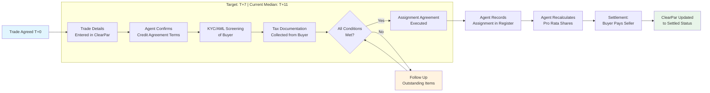

# Secondary Trading & Settlement: Comprehensive Knowledge Base

> *Document 4 of 6 — Loan Administration Knowledge Base*
> *This document is current as of February 16, 2026.*
> *Related documents: Doc 1 (Market Landscape, §§ 4, 14 on secondary trading volume and platform infrastructure); Doc 2 (Credit Agreement Interpretation, §§ 4–5 on assignment provisions, DQ lists, LME blockers; § 8 on LSTA vs. LMA documentation); Doc 3 (Operational Mechanics, §§ 1–4 on payment processing and position management); Doc 5 (Tax Withholding, §§ 1–3 on tax documentation in trade settlement, ERISA representations); Doc 6 (Lifecycle Events, §§ 1, 4, 6 on agent transitions and restructuring trades)*

---

## 1. Secondary Market Overview

### How the Secondary Loan Market Works

The secondary loan market is the marketplace where existing syndicated loan positions change hands after the initial syndication closes. Unlike equity or bond markets, the loan secondary market is an over-the-counter (OTC) market — there is no centralized exchange, no clearinghouse, and no standardized settlement infrastructure comparable to the DTCC for securities. Trades are negotiated bilaterally, typically through dealer desks at major banks (Citi, JPMorgan, Bank of America, Goldman Sachs, Morgan Stanley, Barclays, Deutsche Bank, and others) that act as intermediaries between buyers and sellers.

A CLO manager looking to sell $5 million of a term loan position will contact one or more dealer desks, which will provide a bid. The dealer may hold the position on its own balance sheet temporarily or match it immediately with a buyer. Large institutional accounts — CLOs, mutual funds, hedge funds, insurance companies, and business development companies (BDCs) — constitute the principal buyer and seller base.

### Market Size and Liquidity [US]

**[VERIFY: time-sensitive — statistics are drawn from LSTA published reports current through Q4 2025; confirm against the most recent LSTA Trade Data Study]**

The secondary loan market has grown substantially over the past decade. Full-year 2025 secondary trading volume totaled a record **$971 billion**, according to the LSTA — 18% above the prior record of $824 billion set in 2022, and 18% above 2024's $821 billion. Average daily trading volume reached approximately **$3.9 billion**, with a turnover ratio (annual trading volume divided by average outstanding) of **65–66%**, a five-year high. Three of the four busiest months in the market's history occurred in 2025, led by April's **$109.2 billion** during tariff-induced volatility, which included a single-day record of **$10.9 billion** on April 4, 2025. (Source: LSTA Trade Data Study, 2025.)

For context, monthly trading volumes in a typical environment run between $65–80 billion. More than **1,500 individual loans** traded per month through 2025 — a measure of market breadth. Despite this volume, only about **6% of loans traded electronically** as of late 2025, compared to roughly 33% for high-yield bonds, underscoring the market's continued reliance on voice and chat-based execution. [VERIFY: time-sensitive — electronic trading adoption percentage changes rapidly]

### The Role of Electronic Platforms

Electronic trading in loans is nascent but accelerating rapidly — adoption rose from approximately 1% at the start of 2024 to 6% by late 2025. The key platforms are:

**Octaura** is the primary disruptor. Founded in April 2022 by a consortium including Citi, Bank of America, Goldman Sachs, JPMorgan, Morgan Stanley, and Wells Fargo, Octaura provides electronic trading execution for syndicated loans and, as of September 2025, CLOs. By mid-2025, the platform had 27 dealers and over 160 buy-side participants, with market share growing from under 1% in early 2024 to approximately **6% of secondary loan market volume** by mid-2025. Octaura's Market Lists protocol (launched September 2024) streamlined CLO liquidation and portfolio rebalancing workflows, representing 41% of platform volume by Q1 2025. Its largest single trading day reached $1.4 billion in December 2025. **[VERIFY: time-sensitive — market share and participant figures from Octaura publications and American Banker, October 2025]**

**ClearPar** [US/INTERNATIONAL] (owned by S&P Global Market Intelligence) is not a trading platform but rather the dominant trade settlement and documentation platform. Virtually all secondary loan trade settlements in the US market flow through ClearPar. It handles trade matching, documentation generation, allocation tracking, and settlement workflow management. In 2024, ClearPar processed over 2 million allocations across 4,400+ credits and 9,300+ actively traded facilities, serving 14,000+ active entities across 1,000+ institutions. **[VERIFY: time-sensitive — ClearPar statistics from S&P Global/ClearPar LSTA presentation April 2025]**

Other platforms include **Versana** (focused on loan data digitization and analytics rather than trade execution), **StoneX LoanMatch** (an anonymous dark pool announced July 2024 targeting European and US markets, operational status uncertain [VERIFY: event-driven — StoneX LoanMatch operational status]), and **DTCC Loan/SERV** (providing post-trade services including cash settlement).

### Bid-Ask Spreads and What They Signal

The bid-ask spread — the difference between the highest price a buyer will pay and the lowest price a seller will accept — is a direct measure of market liquidity and trading cost. Tighter spreads indicate a more liquid market with greater dealer willingness to commit capital.

As of year-end 2024, the median bid-ask spread on loans in the LSTA/LSEG mark-to-market universe was approximately **50 basis points**. During the April 2025 tariff-induced volatility, spreads widened significantly — average spreads expanded to 98 bps and median spreads to **88 bps** — before recovering to approximately 50 bps median by June 2025. For comparison, bid-ask spreads on investment-grade corporate bonds typically run 5–10 bps, and high-yield bonds 25–50 bps, illustrating the additional friction inherent in loan trading. [VERIFY: time-sensitive — bid-ask spread data from LSTA/LSEG mark-to-market reports]

Spread widening is correlated with stress events and is a leading indicator of liquidity withdrawal. During the COVID sell-off in March 2020, loan bid-ask spreads exceeded 500 bps for lower-quality credits. Conversely, very tight spreads (below 40 bps) typically coincide with periods of strong CLO demand and above-par trading.

### Why Loans Settle More Slowly Than Bonds

High-yield bonds typically settle T+2 (two business days after trade date). Syndicated loans target T+7 for par trades and T+20 for distressed trades, and actual settlement times often exceed these targets. Several structural factors explain this gap:

**No central clearinghouse.** Bond trades clear through the DTCC's Fixed Income Clearing Corporation (FICC). Loan trades settle bilaterally between counterparties, with no netting, no central counterparty guarantee, and no delivery-versus-payment infrastructure as standard. Each trade requires bespoke documentation and agent processing.

**Consent and documentation requirements.** Most credit agreements require the administrative agent's consent to an assignment, and many require the borrower's consent as well (typically deemed given after 10 business days of silence). The trade cannot settle until an assignment agreement — in the form attached as an exhibit to the credit agreement — is executed by all required parties.

**Agent processing.** The administrative agent must review the assignment for compliance with credit agreement requirements (eligible assignee, minimum assignment amount, no disqualified lender issues), collect the assignment fee, update the register of lenders, and distribute funding memoranda. Third-party agents (as opposed to bank agents who are also syndicate participants) have consistently shown higher settlement times, and as their share of the market has grown, this creates a structural drag on overall settlement metrics.

**KYC/AML onboarding.** A buyer entering a syndicate for the first time must complete Know Your Customer and anti-money laundering checks, provide tax forms (W-8 or W-9), and be set up in the agent's systems. This onboarding process can take days or weeks. (See Doc 5, §§ 1–3 for comprehensive KYC/AML and tax documentation requirements.)

**Chain-of-title issues (distressed).** For distressed trades, the buyer requires delivery of predecessor transfer agreements documenting every transfer of the loan position since it shifted to distressed trading, adding layers of documentation review.

---

## 2. The Anatomy of a Loan Trade

### From Verbal Agreement to Settlement

A secondary loan trade begins with the verbal (or electronic) agreement of material terms and ends — sometimes weeks later — with the settlement of the assignment and transfer of funds. The space between those two events is where the complexity lies.

### Trade Agreement: Material Terms

A loan trade becomes binding when the parties agree on the following material terms:

- **Borrower name** and the specific credit facility (e.g., "Acme Corp Term Loan B")
- **Debt type and amount** (the face amount being traded, e.g., $5 million)
- **Purchase rate** (the price, expressed as a percentage of par — e.g., 98.50, meaning the buyer pays $4,925,000 for $5 million face amount)
- **Par vs. distressed documentation** (determines which LSTA confirmation form governs)
- **LSTA vs. LMA documentation** (determines the governing framework)
- **Trade date** (the date the trade is agreed)
- **Settlement type** (assignment is the default; participation or other if specified)

### "A Trade Is a Trade"

Both the LSTA and LMA frameworks enshrine the principle that **a trade is binding from the moment the material terms are agreed**, whether orally or in writing. This is codified in Condition 6 (Mandatory Settlement Obligations) of the LMA Standard Terms and Section 1 (Target Settlement/Settlement Date/Transfer of Debt) of the LSTA Standard Terms.

**[US]** Under New York law, oral agreements are generally unenforceable under the Statute of Frauds, but loan trades are carved out as "qualifying financial contracts" under New York General Obligations Law § 5-701(b), making oral trade agreements legally binding.

**[UK/EU]** Under English law, oral agreements are generally enforceable, and the LMA documentation explicitly reinforces that trades are binding from the trade date. The leading case is *Bear Stearns v. Forum Global Equity Limited*, which confirmed the enforceability of oral loan trade agreements.

The practical implication is powerful: once a trader says "done" on the phone, both parties are committed. If a condition necessary for settlement cannot be met (for example, borrower consent is withheld), the parties are obligated to find an alternative settlement method — typically by participation. They cannot simply walk away from the trade.

### A Typical Par Trade Timeline [US]

Here is a step-by-step walkthrough of a standard US par/near par trade from agreement through settlement:

**Day 0 (Trade Date, "T"):** Seller and buyer agree verbally to trade $5 million of Acme Corp Term Loan B at 99.25 on LSTA par/near par terms. The trade is binding.

**T to T+1:** Seller's operations desk inputs the trade into ClearPar. Buyer receives the trade on ClearPar and matches it (confirms the terms agree). The buyer provides allocation details — specifying which fund(s) will receive the position and the Market Entity Identifier (MEI) for each.

**T+1 to T+3:** ClearPar generates the LSTA Par/Near Par Trade Confirmation (Transaction Specific Terms incorporating the Standard Terms and Conditions by reference). Both parties execute the confirmation. ClearPar also generates the Assignment and Assumption Agreement in the form attached to Acme Corp's credit agreement.

**T+3 to T+5:** Buyer and seller execute the assignment agreement. Buyer selects a proposed settlement date of T+7 or earlier on ClearPar and indicates "persisted" (i.e., ready and willing to settle). If the buyer needs one business day of lead time to fund, it designates this on the platform. All of this must be completed by **T+5** under the Phase II delayed compensation requirements (effective November 1, 2016) for the buyer to be entitled to delayed compensation.

**T+5 to T+7:** The executed assignment agreement is submitted to the administrative agent. If borrower consent is required, the consent request is sent. The agent reviews the assignment for compliance with the credit agreement — confirming the buyer is an eligible assignee, the assignment amount meets the minimum threshold, and the buyer is not on any disqualified lender list.

**T+7 (Target Settlement Date):** If all consents are obtained and documentation is in order, the agent records the assignment in the register, making it effective. The agent prepares a **funding memorandum** that calculates the net settlement amount: the purchase price (face amount × purchase rate), adjusted for accrued interest and fees from the last interest payment date to the settlement date under the Settled Without Accrued Interest (SWOA) convention. The buyer wires the purchase price; the agent updates the lender of record.

**In practice,** only about one-third of par trades actually settle within T+7. The median par settlement time as of August 2025 was **T+11**, with buy-side sales (where the buy-side is the seller) settling at a median of **T+7** — a 17-month low. This is a significant improvement from 2016, when only 23% of par trades settled within T+7. **[VERIFY: time-sensitive — most recent settlement data is August 2025; Q4 2025 figures may differ]** (Source: LSTA monthly trading reports, 2025.)

**Historical context:** In Q2 2016, only 23% of par trades settled within T+7. The requirements-based delayed compensation regime (September 2016), ClearPar platform enhancements, and behavioral changes have driven meaningful improvement. However, **third-party agent processing times remain a structural drag**: ClearPar data indicates that third-party agents consistently post higher settlement times than bank agents, and as third-party agents' share of trade volume has grown, this creates a headwind for overall market settlement statistics.

### Trade settlement lifecycle

### The Agent's Operational Role in Settlement

For a third-party loan agent, the settlement workflow includes:

1. **Receive assignment documentation** — via ClearPar or directly from the parties
2. **Validate compliance** — eligible assignee, minimum amount, no DQ list issues
3. **Manage consent process** — send borrower consent notices, track response periods, apply deemed consent if applicable
4. **Coordinate with lender onboarding** — ensure KYC/AML and tax documentation is complete (see Doc 5, §§ 1–3)
5. **Record the assignment** — update the register of lenders, making the assignment legally effective
6. **Calculate and distribute the funding memo** — determine the net settlement amount
7. **Process the cash settlement** — coordinate the wire transfer of funds between buyer and seller, or between buyer, seller, and the agent's distribution account
8. **Update systems** — reflect the new lender's position in all operational systems (payment distribution, notice lists, voting records)

The quality and speed of agent processing directly impacts settlement times. A trade may sit fully documented and ready to close, waiting only for the agent to record it. Agents that batch-process assignments (rather than processing them individually as received) or that have manual workflows without ClearPar integration will see longer settlement times.

---

## 3. LSTA Trading Documentation — Par/Near Par [US]

### Structure of the Par/Near Par Trade Confirmation

The LSTA Par/Near Par Trade Confirmation is a two-part document:

**Part I: Transaction Specific Terms (TSTs).** This is the bespoke portion completed by the parties for each trade. It captures:

- Trade date and expected settlement date
- Borrower name, credit agreement date, and specific facility
- Seller and buyer identification (including MEIs)
- Purchase amount (face value of the position being traded)
- Purchase rate (price as a percentage of par)
- Form of purchase (assignment is the default; participation if specified)
- Drafting party designation (who is responsible for preparing settlement documents)
- Whether the trade will settle on a Settled Without Accrued Interest (SWOA) basis or Paid on Settlement Date basis
- Any non-standard terms agreed at the time of trade

**Part II: Standard Terms and Conditions (STCs).** These are incorporated by reference and are not negotiated on a trade-by-trade basis. The LSTA publishes and periodically updates the STCs, which govern delayed compensation, BISO provisions, mandatory settlement obligations, the settlement waterfall, and other mechanical provisions. (Source: LSTA Standard Terms and Conditions for Par/Near Par Trade Confirmations.)

### Representations and Warranties

The representations in the LSTA Par Confirm are deliberately **limited**. The parties represent as to three matters only:

1. **Nature and use of syndicate information.** Each party represents its understanding that the other may possess material non-public information about the borrower, and that each party is entering the trade based on its own independent assessment.

2. **"Big boy" provision.** This is the signature feature of LSTA par documentation. Each party acknowledges that the other may possess information that, if disclosed, might affect the party's willingness to enter the trade. Despite this, each party confirms it is a sophisticated market participant capable of assessing the risks, and it waives any claim against the counterparty for failure to disclose such information. The "big boy" language effectively precludes fraud-based claims for non-disclosure between the trading parties, subject to any applicable securities law limitations.

3. **ERISA.** Each party represents as to whether it is acting on behalf of a benefit plan subject to ERISA and related regulations. (See Doc 5 for comprehensive ERISA representation requirements in the context of trade settlement and lender onboarding.)

Critically, the LSTA Par Confirm does **not** include representations that:
- The loan is properly secured or that any security interest is perfected
- The loan has not been impaired by amendment or waiver
- The seller is not a defaulting lender
- The seller has power and authority to execute the transaction
- The buyer is an eligible assignee under the credit agreement

These representations are instead found in the **Assignment and Assumption Agreement** (the form attached to the credit agreement), which is a separate document executed as part of settlement. The LSTA architecture deliberately separates the trade agreement (the confirmation) from the transfer mechanism (the assignment agreement), with the more substantive representations residing in the latter document.

### Incorporation of the Credit Agreement's Assignment Agreement

The standard terms provide that the parties will execute an assignment agreement "in the form set forth in the applicable credit agreement" or, if no such form exists, "a reasonably acceptable assignment agreement containing customary provisions." For credit agreements governed by New York law, it is customary for this form to be substantially similar to the LSTA's published model form of Assignment and Assumption Agreement. The model form includes representations from the seller (power and authority, legal and beneficial ownership, free and clear of liens, not a defaulting lender) and from the buyer (power and authority, eligible assignee status). (Source: LSTA Form Assignment and Assumption Agreement; Kramer Levin client alerts on LSTA trading documentation.)

---

## 4. LSTA Trading Documentation — Distressed [US]

### When Does a Loan "Flip" to Distressed?

A loan trades on par/near par documentation when it is performing and trades at or near its face value. It "shifts" to distressed documentation — and the LSTA publishes formal shift dates — when the loan becomes impaired by bankruptcy, payment default, or significant credit deterioration. The LSTA published only six distressed shift dates in Q2 2024, reflecting relatively low default levels, though activity increased through 2025 as the stressed segment of the market expanded. **[VERIFY: time-sensitive — 2025 distressed shift date count from LSTA Trade Data Study]**

The practical trigger is typically a price threshold: loans trading below approximately 90 cents on the dollar are likely to be trading distressed, though the LSTA's formal shift determination is based on credit events, not price alone. The LSTA updated its Distressed Trade Confirmation (Distressed Confirm) and Purchase and Sale Agreement for Distressed Trades (PSA) most recently on **March 7, 2025**. [VERIFY: time-sensitive — confirm most recent LSTA distressed documentation update date] (Source: LSTA publications, March 2025.)

### Structure: Distressed Confirm + Purchase and Sale Agreement

Unlike par trades, which settle on just a trade confirmation plus the credit agreement's assignment form, distressed trades require additional documentation:

**The Distressed Trade Confirmation** serves the same function as the par confirm — documenting the agreed terms of the trade. Like the par confirm, it has Transaction Specific Terms and Standard Terms and Conditions.

**The Purchase and Sale Agreement (PSA)** is an additional contract between buyer and seller that provides significantly more comprehensive representations, warranties, and covenants than the par confirm. The PSA is where the heavier buyer protections reside.

### Why Distressed Documentation Is More Protective of Buyers

Distressed loans present risks that performing loans do not. The borrower may be in or near bankruptcy. The loan documents may have been amended multiple times. Security interests may have been released, subordinated, or challenged. Prior transfers may have been improperly documented. For these reasons, distressed documentation provides:

**Enhanced seller representations.** The seller represents as to the validity and enforceability of the loan, its chain of title, the absence of material amendments beyond what has been disclosed, and related matters. These go well beyond the three limited representations in the par confirm.

**Predecessor transfer agreements and chain of title.** This is the most operationally distinctive feature of distressed trading. The seller must deliver to the buyer copies of every transfer agreement (predecessor PSAs and assignments) through which the loan position has passed since it shifted to distressed trading. This creates a documentary chain of title that allows the buyer to verify that every prior transfer was properly executed. (Source: LSTA Standard Terms and Conditions for Distressed Trade Confirmations; Seward & Kissel client alerts on distressed trading documentation.)

Under the LSTA approach, the seller assigns to the buyer all of the seller's rights against prior sellers under these predecessor transfer agreements, rather than the seller "stepping up" to make representations on behalf of prior sellers. The buyer's recourse runs through the chain: if a representation made by a prior seller turns out to be false, the current buyer's remedy is to pursue the claim through the chain of assigned rights, not to sue its immediate seller for that prior seller's misrepresentation.

This chain-of-title requirement is a significant operational burden. Assembling, reviewing, and delivering predecessor transfer documentation for a loan that has changed hands multiple times in distressed trading can take weeks — which is a major contributor to longer distressed settlement times (target: T+20; actual median significantly higher). [VERIFY: time-sensitive — current median distressed settlement time]

---

## 5. LMA Trading Documentation [UK/EU]

### Structure: A Different Architecture

The LMA uses a fundamentally different documentation architecture than the LSTA. Where the LSTA separates par and distressed into distinct confirmation forms, the **LMA uses a single Trade Confirmation** with checkbox elections allowing the parties to designate whether the trade is par or distressed. The LMA confirmation spans approximately 55 pages in its current form and serves dual purposes: it documents the trade agreement and also functions as the purchase and sale agreement (for distressed trades, the LMA does not require a separate PSA). (Source: LMA Trade Confirmation; Cadwalader LMA vs. LSTA trading presentation, December 2014.)

### Representations: More Extensive Than LSTA

The LMA confirmation contains significantly more extensive representations than the LSTA par confirm. These include:

**Common representations** (applicable to both par and distressed):
- No other documents binding the seller relating to the purchased assets beyond the credit documentation
- No default by the seller or its predecessors relating to the purchased assets
- Pricing letter accuracy at settlement date
- Ancillary rights and claims not materially limited by seller or predecessors
- No "connected parties" — the seller and predecessors are not connected with any obligor under the Insolvency Act 1986 or analogous foreign provisions

**Par-specific representations** include additional assurances relating to the performing nature of the loan.

**Distressed-specific representations** mirror the enhanced protections in the LSTA's separate PSA, including chain-of-title representations. Notably, under the LMA approach, the seller makes representations on behalf of itself **and its predecessors-in-title**, giving the buyer direct recourse against its immediate seller for misrepresentations in the chain. This contrasts with the LSTA approach, where the buyer's recourse runs through the chain of assigned rights rather than direct seller liability.

### LMA vs. LSTA: Key Differences

| Feature | LSTA [US] | LMA [UK/EU] |
|---------|------|-----|
| **Documentation** | Separate par and distressed confirms | Single confirm with checkbox elections |
| **Par representations** | Three only (syndicate info, big boy, ERISA) | Extensive common + par-specific reps |
| **Distressed chain of title** | Predecessor transfer agreements delivered; seller assigns rights against prior sellers | Seller represents on behalf of itself and predecessors; buyer has direct recourse |
| **Default settlement method** | Assignment | Legal Transfer (novation or assignment) |
| **Governing law** | New York law | English law |
| **Delayed compensation** | Requirements-based system with detailed buyer obligations (see § 10) | Delayed settlement compensation from T+10 (par) or T+20 (distressed) |
| **BISO** | Detailed par and distressed BISO provisions (see § 11) | Par BISO available but not applicable by default (must be elected) |
| **Big boy provision** | Standard inclusion | Available but can be supplemented |
| **Settlement waterfall** | Assignment → participation → mutually agreed alternative | Legal transfer → participation → mutually agreed alternative |

(Source: Cadwalader LMA vs. LSTA trading presentation, December 2014; Herbert Smith Freehills/Kramer analysis of English law loan trading on LSTA terms, June 2020.)

### Governing Law Significance

The choice between LSTA and LMA documentation is driven primarily by the governing law of the underlying credit agreement. New York law-governed credit agreements trade on LSTA terms; English law-governed agreements trade on LMA terms. Cross-border trades — such as a US-law loan being traded by a London-based fund — require careful attention to which documentation framework is being used, as the representation regimes differ materially.

The LSTA recognized this issue and added **Section 27** to the Par Confirm to address risks arising when English law loans trade on LSTA par terms. This section provides additional representations (modeled on the LMA's protections) to fill the gap that arises because neither the LSTA Par Confirm nor the LMA Transfer Certificate (the English law equivalent of the assignment agreement) provides the full set of representations found in the LSTA Form Assignment and Assumption Agreement. (Source: Kramer Levin client alert, June 2020.)

---

## 6. Settlement by Assignment [US]

### The Standard US Market Settlement Method

**[US]** Assignment is the default and overwhelmingly dominant method for settling secondary loan trades in the US market. In an assignment, the selling lender transfers its rights and obligations under the credit agreement to the buying lender. After the assignment is effective, the buyer steps into the seller's shoes as a lender of record — the buyer has a direct contractual relationship with the borrower, is entitled to receive payments directly from the agent, and can exercise voting and other lender rights.

### The Assignment Agreement

The form of assignment agreement is almost always attached as an exhibit to the credit agreement. This is deliberate: by prescribing the form at closing, the parties ensure that future transfers use a pre-agreed template, reducing negotiation and delay. For New York law credit agreements, the form is typically substantially similar to the LSTA's published model form of **Assignment and Assumption Agreement**. (Source: LSTA MCAPs; LSTA Form Assignment and Assumption Agreement.)

The assignment agreement is executed by the seller (assignor) and the buyer (assignee), and in most cases requires the signature or consent of the administrative agent. Depending on the credit agreement terms, it may also require borrower consent.

### What the Agent Needs to Process an Assignment

As a third-party loan agent processing trade settlements, the agent's role is to:

1. **Receive the executed assignment agreement** — signed by assignor and assignee
2. **Verify eligible assignee status** — confirm the buyer meets the credit agreement's definition of "Eligible Assignee" or equivalent
3. **Check the disqualified lender list** — confirm the buyer is not a disqualified institution (see Section 13)
4. **Confirm minimum assignment amount** — most credit agreements require assignments to be in minimum amounts, typically $1 million for term loans ($5 million is also common). Amounts below the minimum may be assigned only if the entire remaining position is being transferred. The LSTA Model Credit Agreement Provisions (MCAPs) suggest a $1 million minimum for term loans and $5 million for revolving commitments. (The most recent finalized LSTA MCAPs are dated May 1, 2023 (reposted with corrections July 8, 2024). Draft revisions were published in February, April, and June 2025.)
5. **Obtain required consents:**
   - **Agent consent** — the administrative agent typically must consent to the assignment and will do so unless the buyer is not creditworthy (for revolving commitments) or fails to meet eligibility requirements. Agent consent is often "not to be unreasonably withheld"
   - **Borrower consent** — see below
6. **Collect the assignment fee** — typically $3,500, paid by the assignor, the assignee, or split between them (as specified in the credit agreement). The LSTA MCAPs suggest $3,500 as a standard amount [VERIFY: time-sensitive — standard assignment fee amount per LSTA MCAPs]
7. **Record the assignment in the register** — this is the moment the assignment becomes legally effective. Under New York law and the terms of most credit agreements, the register maintained by the administrative agent is the definitive record of who holds each loan position. Until the assignment is recorded in the register, it is not effective as against the borrower or the agent, regardless of what the parties may have agreed between themselves
8. **Distribute the funding memorandum** — the agent calculates and distributes the settlement amount, reflecting the purchase price adjusted for accrued interest and fees

### Borrower Consent Mechanics [US]

**[US]** Most credit agreements require borrower consent for assignments of term loans, but not for assignments of revolving commitments to existing lenders. The borrower consent regime typically works as follows:

- **Consent required, but deemed given.** The credit agreement will state that the borrower's consent is required but shall not be unreasonably withheld or delayed, and shall be **deemed given if the borrower has not responded within a specified period** — most commonly **10 business days** after notice. This "negative consent" or "deemed consent" mechanism prevents borrowers from blocking trades through inaction
- **No consent required during default.** If an Event of Default has occurred and is continuing, borrower consent is typically not required for any assignment. This ensures liquidity is maintained when the borrower is in distress
- **No consent required for transfers to existing lenders or affiliates.** Assignments to entities that are already lenders under the credit agreement, or to affiliates of existing lenders, typically do not require borrower consent

(Source: LSTA MCAPs; Crowell & Moring analysis of settlement waterfall and disqualified lender provisions.)

### Effectiveness and the Register

The assignment becomes effective upon the agent recording it in the register — not upon execution of the assignment agreement, and not upon payment of the purchase price. This is a critical operational point. The register is the authoritative record of lender positions, and the agent's act of recording is the legal trigger for the transfer of rights and obligations.

---

## 7. Settlement by Participation [US/UK/EU]

### When and Why Participations Are Used

A participation is an alternative settlement method used when assignment is not possible or practical. Common scenarios include:

- **Borrower consent is withheld or delayed.** If the borrower refuses to consent to an assignment (or fails to respond within the deemed-consent period and the trade cannot wait), the parties may settle by participation
- **The buyer does not meet eligibility requirements.** If the buyer is not an "Eligible Assignee" under the credit agreement, assignment is not available
- **Credit agreement restrictions.** Some credit agreements restrict assignments during certain periods or below certain thresholds that make assignment impractical for a particular trade

Both the LSTA and LMA standard terms codify a settlement waterfall: if assignment (or legal transfer, in LMA terms) is not possible, the parties must settle by participation. If participation is not possible, the parties must find a mutually agreeable alternative that provides the economic equivalent of the agreed trade.

### The Participation Agreement

**[US]** In a participation, the selling lender (the "grantor") retains its position as lender of record under the credit agreement. It enters into a separate agreement — the LSTA form Participation Agreement — with the buyer (the "participant"), under which the participant acquires an economic interest in the loan.

**[UK/EU]** The LMA form **Sub-Participation Agreement** serves the same function. Under English law, sub-participations create a debtor-creditor relationship between the grantor and the participant — the participant is an unsecured creditor of the grantor. This contrasts with the LSTA approach, where participations are structured as transfers of beneficial ownership interest, specifically to support true sale treatment under US GAAP. (Source: Milbank; Hunton Andrews Kurth; Crowell & Moring.)

### What the Participant Gets — and What It Doesn't

The participant receives the **economic benefits** of the loan position: its pro rata share of interest payments, principal repayments, and other distributions that the grantor receives from the agent. The participant also bears the **economic risks**: if the borrower defaults, the participant absorbs the loss on its participated share.

What the participant does **not** get is any direct relationship with the borrower, the agent, or the other lenders. The participant is not a lender of record. It does not appear in the agent's register. It cannot submit borrowing requests, exercise voting rights independently, or communicate directly with the borrower. From the agent's perspective, the participation is invisible — the agent continues to deal with the grantor as the lender of record and has no obligations to the participant.

### Voting Through the Grantor

The participation agreement typically requires the grantor to pass through voting rights to the participant. The grantor agrees to vote in accordance with the participant's instructions, or to seek the participant's approval before voting on matters requiring lender consent. However, this is a contractual obligation between the grantor and the participant — the borrower and agent are not party to the participation agreement and are not bound by it.

### Credit Risk on the Grantor

This is the most significant risk in a participation. Because the participant's relationship is with the grantor, not with the borrower or agent, the participant bears **credit risk on the grantor** in addition to credit risk on the borrower. If the grantor becomes insolvent, the participant may be treated as an unsecured creditor of the grantor, potentially losing both its principal and any accrued distributions that the grantor had received from the agent but not yet passed through.

### True Sale Considerations [US]

**[US]** Under US GAAP, whether a participation qualifies as a "true sale" for balance sheet purposes is significant for the grantor. If the participation is a true sale, the grantor can derecognize the participated portion from its balance sheet. LSTA participations are structured as transfers of beneficial ownership (rather than mere contractual rights to payment) specifically to support true sale treatment, which requires that the participant bear no credit risk on the grantor for the participated amount. The GAAP true sale analysis considers whether the grantor retains effective control, whether the transfer can be recalled, and whether the participant's cash flows depend on the grantor's solvency.

### The Elevation Right

Both LSTA and LMA participation agreements contemplate "elevation" — the conversion of a participation into a full assignment when the conditions that originally prevented assignment are resolved. If, for example, a participation was entered into because borrower consent was initially withheld, and that consent is subsequently obtained, the grantor typically has the right (and sometimes the obligation) to elevate the participation to an assignment, at which point the participant becomes a lender of record.

---

## 8. Settlement by Novation (LMA) [UK/EU]

### The LMA's Preferred Transfer Mechanism

**[UK/EU]** In European and UK loan markets governed by English law, the preferred method for transferring loan positions is **novation**, not assignment. In LMA documentation, this is referred to as "Legal Transfer" and is effected through a **Transfer Certificate** — a document executed by the transferor (seller), the transferee (buyer), and the agent.

### How Novation Differs from Assignment

The distinction is legally significant:

**Assignment** transfers existing rights from the assignor to the assignee. The underlying obligations remain the same; only the identity of the creditor changes. The original contract continues in force.

**Novation** is fundamentally different: it involves the **cancellation of the existing rights and obligations** between the transferor and the borrower, and the **creation of new, equivalent rights and obligations** between the transferee and the borrower. The original contract is discharged and replaced.

In practical terms, the economic result is the same: the buyer ends up with the loan position, and the seller no longer has it. But the legal mechanics matter for security structures.

### Why Novation Is Cleaner for English Law Security Structures

Under English law, security interests (mortgages, charges, pledges) are typically held by a **Security Trustee** on behalf of the syndicate lenders. When a loan position is novated, the old lender's rights are extinguished and new rights are created in favor of the new lender — but because the security is held on trust for all lenders from time to time, the new lender automatically benefits from the existing security without any need to transfer or re-register security interests. (See Doc 2, § 8 for a comprehensive comparison of US and LMA documentation structures including the parallel debt mechanism.)

By contrast, if a loan were transferred by assignment rather than novation, there could be questions under some jurisdictions about whether the assignee's "new" rights are properly secured, particularly in civil law jurisdictions that do not recognize the trust concept. Novation avoids this issue entirely by creating fresh rights that are secured from inception under the existing trust arrangement.

### When Assignment Is Used in LMA Markets

Assignment is available as an alternative under LMA documentation and is used in certain circumstances:

- When the credit agreement is governed by a jurisdiction's law that does not recognize novation in the same way
- When the parties specifically elect assignment rather than novation
- For US dollar-denominated tranches in multicurrency facilities, where New York law may govern a specific tranche

The LMA settlement waterfall is: Legal Transfer (novation or assignment) → participation → mutually agreed alternative.

---

## 9. Settled Without Accrued Interest (SWOA) [US]

### The Standard Convention

**Settled Without Accrued Interest (SWOA)** is the standard settlement convention for par/near par loan trades in the US market. Under SWOA:

- Interest and fees accruing **before the settlement date** belong to the **seller**
- Interest and fees accruing **on and after the settlement date** belong to the **buyer**

This is true **regardless of who actually receives the payment** from the agent. If a quarterly interest payment is made after the settlement date for a period that straddles the settlement date, the agent will pay the full amount to whoever is the lender of record on the payment date. The parties then settle between themselves the portion that belongs to the other party. (Source: LSTA Standard Terms and Conditions for Par/Near Par Trade Confirmations.)

**[UK/EU]** The LMA equivalent convention operates similarly. Under LMA standard terms, interest is apportioned between the transferor and transferee based on the transfer date. The Transfer Certificate mechanism handles this split as part of the novation process, with the agent distributing payments accordingly.

### How This Works in Practice: The Funding Memo

The administrative agent prepares a **funding memorandum** (or "funding memo") that calculates the net settlement amount. Here is a worked example:

**Trade terms:** Buyer purchases $10 million face amount of Acme Corp Term Loan B at 99.00. Settlement date is March 15. The loan pays SOFR + 300 bps quarterly on March 31, June 30, September 30, and December 31. Current SOFR is 4.30%, so the all-in coupon is 7.30%. The last interest payment date was December 31. (For current SOFR rate conventions and calculations, see Doc 3, §§ 1–2.)

**Funding memo calculation:**

| Component | Calculation | Amount |
|-----------|-------------|--------|
| Purchase price | $10,000,000 × 99.00% | $9,900,000.00 |
| Less: accrued interest (seller's portion) | $10,000,000 × 7.30% × (74/360)¹ | $149,888.89 |
| **Net amount buyer pays seller** | | **$9,750,111.11** |

¹ January 1 through March 14 = 74 days on an Actual/360 basis.

The buyer pays the seller the purchase price minus the accrued interest for the period the seller held the position. When the March 31 interest payment is made, the agent pays the full quarter's interest to the buyer (as the new lender of record). The buyer keeps the portion from March 15 to March 31 and has already been "credited" the January 1 to March 14 portion through the reduced purchase price.

### The Alternative: Paid on Settlement Date

For some trades — particularly distressed trades — the parties may agree to settle on a **"Paid on Settlement Date"** basis. Under this convention, there is no adjustment for accrued interest in the purchase price calculation. Instead, the buyer receives all payments made on or after the settlement date, including any accrued interest that economically belongs to the seller. This simplifies the calculation but shifts economic value and is typically priced into the purchase rate.

---

## 10. Delayed Compensation [US]

### The Concept

Delayed compensation is a payment from the seller to the buyer designed to put both parties in the **economic position they would have been in if the trade had settled on time**. When a trade takes longer than T+7 to settle, the buyer has agreed to purchase a yielding asset but is not yet receiving the income from it, while the seller continues to receive income on a position it has already sold. Delayed compensation addresses this mismatch.

### Evolution: Three Eras

The delayed compensation regime has evolved significantly:

**Era 1: No-Fault System (pre-September 2016).** Under the original regime, delayed compensation was automatic — the buyer was entitled to compensation for every day a trade remained unsettled beyond T+7, regardless of which party caused the delay. This system, while simple, created perverse incentives: buyers had little motivation to execute documents promptly because they would receive delayed compensation regardless, and dealers could use delayed compensation to offset the cost of short selling (selling loans they did not yet own).

**Era 2: Requirements-Based System (September 2016–present for secondary trades).** In September 2016, the LSTA replaced the no-fault system with a **requirements-based** model, implemented in two phases:
- **Phase I (September 1 – October 31, 2016):** Introduced the basic requirements framework
- **Phase II (November 1, 2016 – present):** Tightened the requirements with shorter timelines

**Era 3: Primary Delayed Compensation Protocol (January 1, 2020–present).** Extended delayed compensation to primary market allocations (new issue syndications and amendments), which had previously been exempt.

(Source: LSTA Standard Terms and Conditions; K&L Gates analysis of delayed compensation standards; Seward & Kissel client alerts on delayed compensation.)

### Secondary Delayed Compensation: The Requirements

Under Phase II (current), a buyer is entitled to delayed compensation on a par/near par trade only if it satisfies the following **Delayed Compensation Requirements**:

1. **Execute documents by T+5.** The buyer must execute (or submit signatures for) both the trade confirmation and the assignment agreement by T+5 (shortened from T+6 in Phase I). For trades settling via an Electronic Settlement Platform (ClearPar), this means checking the appropriate boxes and submitting signatures electronically.

2. **Select a settlement date of T+7 or earlier.** The buyer must designate a proposed settlement date of no later than T+7 on the Electronic Settlement Platform.

3. **Persist.** The buyer must remain ready and willing to settle through the actual settlement date — it cannot withdraw its readiness or designate a later settlement date.

4. **Lead time limitation.** If the buyer designates a one-business-day lead time (a buffer between the agent making the assignment effective and the buyer's obligation to fund), it may forfeit one day of delayed compensation. Lead times of greater than one business day are not permitted under Phase II.

If the buyer fails to meet these requirements, it **forfeits its entitlement to delayed compensation** — even if the delay is entirely the seller's or agent's fault. This is the teeth of the requirements-based system: it creates urgency for buyers to execute documents quickly.

### Exceptions

The buyer retains its entitlement to delayed compensation despite missing a deadline if:
- The parties agreed at the trade date to settle by participation rather than assignment
- The delay is caused by the seller's failure to provide required KYC information
- The assignment agreement contains a material error (buyer must notify by T+3, and if corrected by T+4, must complete requirements by T+6)
- An Electronic Settlement Platform malfunction prevented the buyer from meeting its obligations
- A CLO Blackout Period applies (newly formed CLO issuers may designate a blackout period of up to five consecutive business days preceding their indenture effective date)

### How Delayed Compensation Is Calculated

Delayed compensation is calculated as:

**Cost of Carry = Average SOFR Rate × Purchase Price × (Days in Delay Period / 360)**

Where:
- **Average SOFR Rate** is the Cost of Carry Rate defined in the STCs: the sum of individual daily simple SOFRs for the period from two business days before the Commencement Date through two business days before the Delayed Settlement Date, divided by the number of days in that period, **plus a spread adjustment of 11.448 basis points**. The 11.448 basis point spread is the 1-month LIBOR-SOFR credit spread adjustment (CSA) adopted by the LSTA when transitioning the delayed compensation calculation from LIBOR to SOFR. This fixed spread was set during the benchmark transition and reflects the historical difference between 1-month LIBOR and SOFR. It remains embedded in the LSTA's Standard Terms and Conditions and has not been updated since the January 2020 implementation of the Primary Delayed Compensation Protocol. (See Doc 3, § 5 for background on credit spread adjustments from the LIBOR transition.)
- **Purchase Price** is the amount calculated on the Commencement Date
- **Delay Period** is the number of calendar days from the Commencement Date (T+7, or T+8 if one day of lead time is used) to the actual settlement date

The LSTA publishes a **SOFR Calculator** on its website that market participants use to calculate delayed compensation amounts.

**[UK/EU]** The LMA delayed settlement compensation regime operates differently. Under LMA standard terms, delayed settlement compensation accrues from **T+10** for par trades and **T+20** for distressed trades (versus T+7 for LSTA par trades). The LMA regime does not include the same requirements-based framework — compensation is generally available without the buyer needing to meet specific document execution deadlines, though the LMA standard terms do require the buyer to act promptly and in good faith.

### Primary Delayed Compensation Protocol [US]

The **Primary Delayed Compensation Protocol**, adopted by the LSTA Board in October 2018 and effective **January 1, 2020**, extended delayed compensation to primary market allocations for the first time. Before this protocol, buyers allocated positions in new syndications received no compensation for delays between deal funding and settlement of their allocation — a period that could stretch weeks or months.

The Protocol applies only when the **seller and the administrative agent are the same or affiliated parties** (i.e., the arranger/bookrunner is also the agent), which covers the vast majority of primary syndications.

Key concepts:

**Ready Date:** The date by which the buyer must be "ready" — having completed KYC onboarding and demonstrated willingness to execute documents and fund.

**Trigger Date:** Typically the date the deal funds (for Early Day Trades, different timing applies). Delayed compensation begins to accrue on the sixth business day after the Ready Date, provided the buyer has met all requirements.

**Nine categories:** The Protocol defines nine categories of primary allocation scenarios based on the timing of the trade relative to deal funding. The two most important are:

- **Early Day Trades** (formerly "when-issued trades"): Trades entered into before the deal funds. The Protocol redefined the criteria for what constitutes an Early Day Trade.
- **Post Funding Trades:** Trades entered into after the deal has funded. These follow timing aligned with secondary trade delayed compensation.

The Protocol was designed to change behavior on both sides: buy-side firms are incentivized to complete KYC early and execute documents promptly, while arrangers/agents are incentivized to process allocations efficiently to minimize their delayed compensation liability. (Source: LSTA Primary Delayed Compensation Protocol, October 2018 / January 2020.)

**[VERIFY: event-driven — no updates to the Primary Delayed Compensation Protocol have been identified since January 2020 implementation; confirm with LSTA whether any amendments or refinements have been made]**

---

## 11. Buy-In/Sell-Out (BISO) [US]

### What BISO Is and Why It Exists

The Buy-In/Sell-Out mechanism is a contractual remedy available to a **performing party** in a loan trade when its counterparty fails to settle. BISO allows the performing party to terminate the trade and enter into a replacement "cover transaction" with a third party, with the non-performing party bearing any resulting economic loss.

BISO exists to address two systemic problems:
1. **Non-performing counterparties.** Before BISO, a party to a trade had little practical remedy — short of litigation — when its counterparty failed to deliver documents, execute agreements, or otherwise move the trade toward settlement
2. **Short selling.** BISO specifically targets the problem of dealers selling loans they do not own ("short selling") and then failing to cover those positions in a timely manner, leaving the buyer with an open trade for extended periods

(Source: LSTA Standard Terms and Conditions for Par/Near Par and Distressed Trade Confirmations; Kramer Levin client alerts on BISO provisions.)

### BISO for Par/Near Par Trades

**[US]** The par BISO provisions were implemented in 2009 and have been part of the LSTA Standard Terms and Conditions for Par/Near Par Trade Confirmations since then.

**Performing party requirements.** To invoke BISO, a party must first establish itself as a "performing party" by completing its settlement delivery obligations — executing the confirmation, delivering or accepting documents, and certifying readiness to close.

**Trigger Date and Notice.** If the trade has not settled by the **BISO Trigger Date** — **15 business days** after the trade date for par trades — the performing party may deliver a **BISO Notice** to the non-performing party. The BISO Notice states that the performing party is ready, willing, and able to settle and intends to terminate the trade and enter a cover transaction unless the non-performing party cures.

**Cure Period.** The non-performing party has **5 business days** from receipt of the BISO Notice to cure — that is, to complete its settlement delivery obligations and move the trade toward closing.

**Cover Transaction.** If the non-performing party does not cure within the cure period, the performing party may enter into a cover transaction with a third party within **10 business days** after the cure period expires. If the performing party does not timely enter into a cover transaction, the original trade obligations are deemed reinstated.

**Economic settlement.** The BISO mechanism is designed to be **economically neutral**: the parties cash-settle the difference between the original trade price and the cover trade price. If the cover transaction is at a worse price for the performing party, the non-performing party must pay the difference (Buy-in Damages or Sell-out Damages). If the cover price is better, the performing party returns the gain. Any dispute over the reasonableness of the cover price is subject to mandatory arbitration before a panel of LSTA Board members.

### BISO for Distressed Trades

Distressed BISO provisions were finalized in **September 2011** (effective for trades with trade dates on or after September 9, 2011) and reflect the longer timelines and additional complexity of distressed settlement.

**Trigger Date:** **50 business days** after the trade date (compared to 15 for par). This initial period may be extended to 60 or 70 days under certain circumstances depending on document delivery timing.

**Cure Period:** **20 business days** (compared to 5 for par), reflecting the greater complexity of assembling predecessor transfer documentation and executing distressed settlement documents.

**Cover Transaction:** The performing party has **10 business days** after the cure period to execute a cover transaction, consistent with the par provisions.

**The Upstream Shield.** This is a provision unique to distressed BISO that protects an "innocent" seller caught in a chain of open trades. A seller that has itself performed all of its obligations but cannot settle because its own upstream counterparty has not delivered can invoke the Upstream Shield by delivering:
- A copy of its upstream trade confirmation (with purchase price redacted)
- Draft transfer documents
- Copies of any predecessor transfer documentation in its possession
- A written certification that the seller is a performing party under the upstream trade

For the Upstream Shield to be effective, the open upstream trade must have a trade date **not later than 5 business days** after the trade date of the downstream trade for which the seller received the BISO Notice. If the seller's upstream counterparty is non-performing, the seller must make commercially reasonable efforts to invoke BISO against its upstream counterparty. (Source: Seward & Kissel client alerts on distressed BISO.)

**[UK/EU]** The LMA standard terms include a par BISO mechanism, but unlike the LSTA, it is **not applicable by default** — the parties must affirmatively elect BISO applicability in their trade confirmation. The LMA does not have a distressed BISO mechanism comparable to the LSTA's.

### Summary of BISO Timelines

| Parameter | Par/Near Par [US] | Distressed [US] |
|-----------|-------------|------------|
| BISO Trigger Date | T+15 business days | T+50 business days |
| Cure Period | 5 business days | 20 business days |
| Cover Transaction Window | 10 business days | 10 business days |
| Upstream Shield | Not applicable | Available |
| Arbitration | LSTA Board panel | LSTA Board panel |

---

## 12. Settlement Platforms and Operational Workflow

### ClearPar: The Settlement Engine [US/INTERNATIONAL]

ClearPar, owned by S&P Global Market Intelligence, is the central nervous system of US secondary loan trade settlement. It is not a trading platform — trades are negotiated and executed elsewhere (by voice, chat, or on Octaura). ClearPar handles everything that happens after the trade is agreed. (Source: S&P Global/ClearPar LSTA Operations Conference presentation, April 2025.)

**Trade matching.** When a dealer enters a trade on ClearPar, the counterparty receives a notification and must match the trade — confirming that the terms (borrower, amount, price, documentation type) are consistent with its records. Mismatches are flagged for resolution.

**Allocation.** The buyer provides allocation details — specifying which fund, account, or entity will receive the position, identified by MEI (Market Entity Identifier). A single trade may be allocated across multiple funds. ClearPar supports auto-allocation for buy-side firms that have pre-configured their allocation rules.

**Documentation generation.** ClearPar generates the trade confirmation (Transaction Specific Terms referencing the appropriate LSTA Standard Terms) and, for assignments, the Assignment and Assumption Agreement in the form specified by the credit agreement. The platform maintains a library of credit agreement assignment forms and matches trades to the correct template.

**Settlement workflow tracking.** ClearPar tracks the status of each trade through the settlement pipeline: trade matched → documents generated → documents executed → consents obtained → assignment recorded → settlement complete. The platform provides real-time visibility into where each trade stands and what is required to move it forward.

**Settlement timing statistics.** ClearPar's data is the primary source for industry settlement time metrics. As noted in Section 2, the median par settlement time as of August 2025 was T+11. **[VERIFY: time-sensitive — Q4 2025 figures may show different results]**

### LMA-Focused Platforms [UK/EU]

**[UK/EU]** The European loan market does not have a single dominant settlement platform equivalent to ClearPar. Settlement of LMA trades is handled through a combination of direct agent processing, custodian banks, and technology platforms. The LMA has worked with various technology providers to develop settlement infrastructure, but adoption remains more fragmented than in the US market. Notable efforts include the LMA's collaboration with Versana on loan data standardization and digitization initiatives.

---

## 13. Disqualified Lender Lists and Eligible Assignees

### How These Provisions Affect Trade Settlement

Two categories of credit agreement provisions directly constrain who may purchase a loan position in the secondary market:

### Eligible Assignee Provisions

Most credit agreements define who may receive an assignment. Historically, "Eligible Assignees" were limited to commercial banks and financial institutions, effectively excluding hedge funds, CLOs, and other non-bank investors. Over time, these definitions have broadened dramatically. The current market standard (reflected in the LSTA MCAPs) generally permits assignments to any entity that is "regularly engaged in or established for the purpose of making, purchasing, or investing in loans, securities, or other financial assets." This definition is broad enough to encompass virtually all institutional investors. (Source: LSTA MCAPs.)

However, some credit agreements retain more restrictive definitions, particularly in the investment-grade market and for revolving commitments (where the borrower has a legitimate interest in ensuring its revolver lenders are creditworthy institutions that will honor funding obligations).

### Disqualified Lender Lists

**Disqualified Institutions** (also called "blacklisted" entities) are parties that may not receive assignments or participations of the borrower's loans. The LSTA established a standardized DQ Structure in 2014 (updated via market advisory in June 2022 and incorporated in the MCAPs) that balances borrower protections with secondary market liquidity. (Source: LSTA DQ Structure; Alston & Bird distressed debt advisory, July 2023; Creditor Rights Coalition DQ analysis.)

Under the LSTA structure, DQ Lists are typically limited to:
- Competitors of the borrower designated at or before closing
- Additional competitors designated by the borrower from time to time
- Affiliates of the above that are either specifically designated or reasonably identifiable by name similarity

Key operational considerations for the agent:

**Availability of the list.** The LSTA recommends that the DQ List be posted by the agent on the electronic lender platform (Intralinks, Debt Domain, etc.) or provided to any lender that requests it. However, many credit agreements prohibit posting or sharing the list, permitting only specific inquiries ("Is Entity X on the DQ List?"). This creates significant operational friction, as loan traders often must make multiple requests and wait for responses.

**Timing problem.** Secondary trades are generally entered into **before** the buyer performs diligence on the DQ List, because obtaining the list from the agent is slow and trading opportunities are time-sensitive. Parties assume the risk that the buyer may be a DQ entity, which creates the possibility of trades that cannot settle.

**Consequences of an improper assignment.** Under the LSTA MCAPs, an assignment to a DQ entity is **not void** — it is a breach, but the assignment stands unless the credit agreement specifically provides otherwise. Remedies may include the borrower's right to repurchase the loans at par (or at market price, if specified) or to limit the DQ entity's access to confidential information, voting rights, and direction of enforcement actions. Some credit agreements take a harder line and deem such assignments void *ab initio*.

**No retroactive application.** The LSTA provides that the DQ List does not apply retroactively. If a buyer completes a trade and is subsequently added to the DQ List, the existing assignment is not affected. However, some credit agreements deviate from this standard, and recent litigation (Serta, Byju's, Packers Sanitation) has highlighted the aggressive use of DQ Lists by borrowers and sponsors to exclude distressed investors after they have already acquired positions. (Source: ICLG 2024–2025; AIMA; Creditor Rights Coalition.)

**Agent liability.** The LSTA structure provides that the administrative agent has no liability for monitoring or enforcing DQ List compliance. The agent's role is to provide the list when requested (or to respond to specific inquiries) and to process assignments as presented. If an assignee falsely represents that it is not a DQ entity, the agent is not responsible.

### Operational Impact When a Trade Hits a DQ or Eligibility Issue

If a trade has been agreed and the buyer turns out to be a DQ entity or ineligible assignee:

1. The trade remains binding ("a trade is a trade")
2. Assignment cannot proceed as long as the buyer is ineligible
3. The parties must settle by participation or an alternative method
4. If participation is also prohibited to DQ entities (as most credit agreements now provide), the parties must negotiate a cash settlement or other alternative
5. The buyer may seek to novate the position to an eligible third party
6. In extreme cases, the trade may need to be unwound, with damages negotiated between the parties

For comprehensive treatment of DQ list drafting, litigation (including the Serta, Byju's, and PSSI/Blackstone cases), and anti-LME blocker provisions, see Doc 2, §§ 4–5.

---

## 14. Private Credit Secondary Trading

### A Market in Early Formation

**[JURISDICTION-SPECIFIC: primarily US]** Private credit — direct lending, unitranche facilities, and other non-syndicated credit arrangements — has grown explosively. Corporate private credit fund AUM sits at approximately $1.7–2 trillion, while the comprehensive market (including ABF, infrastructure debt, and BDCs) approaches $3–3.5 trillion. Morgan Stanley estimated the comprehensive market at approximately $3 trillion at the start of 2025, projecting growth to $5 trillion by 2029. [VERIFY: These figures shift rapidly and definitional differences are substantial.] (Source: Morgan Stanley Investment Management, 2025; Preqin; AIMA/ACC.)

Despite this scale, secondary trading of private credit positions is fundamentally different from — and far less developed than — the BSL secondary market. Private credit was designed to be illiquid. Most direct lending agreements contain severe restrictions on transfer, reflecting the relationship-driven nature of private credit.

### Current State of the Market

The Jefferies Global Secondary Market Review (H1 2025) and industry sources provide the best available picture of this emerging market. Secondary trading volume for private credit was estimated at approximately **$25–30 billion** in 2024, a fraction of the BSL secondary market's $821 billion. Evercore projected this figure would grow to $60–80 billion by 2027 as the market matures and infrastructure develops. **[VERIFY: time-sensitive — private credit secondary volume estimates from Jefferies H1 2025, Evercore August 2025, and CFA Institute November 2025]**

Key infrastructure developments include:

**Dedicated secondary funds.** Major secondary firms (Lexington Partners, HarbourVest, Ardian, Pantheon, Blackstone Strategic Partners) have raised or are raising funds specifically targeting private credit secondaries. However, only **4% of total secondaries capital** is in dedicated credit funds, indicating the market is undercapitalized relative to the opportunity. [VERIFY: time-sensitive — dedicated PC secondary fund allocations are growing]

**Continuation vehicles.** GP-led continuation vehicles have become the most common structure for private credit secondaries. A private credit manager creates a new vehicle, acquires a portfolio of loans from an existing fund, and offers existing LPs the choice between cashing out (at a price set through a tender process) or rolling into the new vehicle.

**No standardized trading documentation.** Unlike the BSL market, there are no LSTA or LMA standard trade confirmations for private credit positions. Each transaction is documented bespoke, typically involving a purchase and sale agreement negotiated from scratch (often modeled loosely on the LSTA distressed PSA framework but heavily customized).

**No electronic settlement platform.** There is no ClearPar equivalent for private credit. Transactions are settled manually, with counsel on both sides negotiating documentation. This contributes to settlement timelines that can stretch to months, not weeks.

**Emerging marketplaces.** Several firms are exploring trading platforms for private credit loan portfolios, though these are nascent and focused primarily on portfolio-level transactions (fund interest sales, continuation vehicles) rather than individual loan-level trades. The LSTA has published a practical guide to private credit valuation as part of its expanding focus on the asset class.

### LP-Led Secondary Transactions

**[PRIVATE CREDIT]** The primary liquidity mechanism in private credit is not direct loan trading but LP-led secondaries — where limited partners in private credit funds sell their fund interests on the secondary market. These transactions involve portfolio valuation, GP consent requirements, and transfer documentation distinct from loan-level assignments. The agent's role is limited in LP secondaries (the loans themselves don't change hands), but the agent may need to process changes in beneficial ownership notifications and update KYC documentation when new LPs are subject to different regulatory regimes.

### Agent's Role in Private Credit Transfer Restrictions

**[PRIVATE CREDIT]** Private credit assignments involve significantly more friction than BSL transfers. Typical restrictions include: (1) borrower consent required for all transfers (not just non-affiliate transfers as in BSL), (2) sponsor/PE firm approval may be needed, (3) minimum hold amounts (often $1 million+) prevent fragmentation, (4) transfer to competitors is almost always prohibited, and (5) the DQ list is often broader and more actively managed. The agent must track and enforce all transfer restrictions — improper assignments can be voided.

### ClearPar Adoption in Private Credit

**[PRIVATE CREDIT]** ClearPar's private credit transaction volume grew 55% since September 2024, reflecting the growing secondary market for direct lending positions. However, adoption remains uneven — many private credit transactions still settle through manual processes outside ClearPar, particularly for bespoke bilateral deals. [VERIFY: time-sensitive — ClearPar PC adoption metrics are evolving rapidly]

### LSTA Private Credit Documentation Initiative

**[PRIVATE CREDIT]** The LSTA has expanded its focus beyond BSL to develop standardized documentation for private credit transactions, including model credit agreement provisions adapted for direct lending, standardized assignment documentation, and a private credit valuation guide. This initiative aims to reduce the documentation friction that currently slows private credit secondary trading. [VERIFY: event-driven — LSTA PC documentation initiative is ongoing; monitor for new publications]

### Implications for Loan Agents

Third-party loan agents will encounter private credit secondary activity primarily in two contexts:

1. **As agent on a private credit facility where the lender is seeking to assign.** The agent must carefully review the credit agreement's transfer provisions, which are likely far more restrictive than BSL conventions. Unlike BSL trades where the agent processes assignments as a matter of course, private credit assignments may require extensive borrower negotiation and bespoke documentation.

2. **As an observer of BSL-to-private-credit dynamics.** Private credit refinancings of BSL loans (and vice versa) create scenarios where lender positions shift between the two markets. The LSTA has noted an increasing trend of direct loans being refinanced by the BSL market, and the agent must be prepared for the operational differences between the two worlds.

---

## Appendix: Quick Reference — Key Timelines and Thresholds

| Item | Standard/Target |
|------|----------------|
| Par settlement target [US] | T+7 |
| Distressed settlement target [US] | T+20 |
| LMA par delayed compensation start [UK/EU] | T+10 |
| LMA distressed delayed compensation start [UK/EU] | T+20 |
| Buyer document execution deadline (delayed comp) [US] | T+5 |
| Buyer proposed settlement date (delayed comp) [US] | T+7 or earlier |
| Par BISO Trigger Date [US] | T+15 business days |
| Distressed BISO Trigger Date [US] | T+50 business days |
| Par BISO Cure Period [US] | 5 business days |
| Distressed BISO Cure Period [US] | 20 business days |
| Cover transaction window (par and distressed) [US] | 10 business days |
| Upstream Shield trade date limit [US] | 5 business days after downstream trade date |
| Borrower deemed consent period [US] | Typically 10 business days |
| Standard assignment fee [US] | $3,500 [VERIFY: time-sensitive — per LSTA MCAPs] |
| Minimum assignment amount (typical) [US] | $1 million (term loans) |
| Delayed comp SOFR spread adjustment [US] | 11.448 basis points |
| CLO Blackout Period (max) [US] | 5 consecutive business days |

---

## Conclusion: Key Takeaways for Loan Agent Operations

Secondary trading and settlement is where the agent's operational precision is most visible to the market. Every trade involves coordination between buyers, sellers, agent, and platforms — and the agent sits at the center.

**Key operational priorities:**
- **Settlement discipline matters:** The industry-wide push toward T+7 (from the current T+11 median) directly impacts agent operations. Third-party agents consistently post higher settlement times than bank agents — understanding and addressing the root causes (KYC processing speed, platform integration, banking infrastructure access) is a competitive imperative.
- **Trade type drives everything:** Par trades, distressed trades, participations, and sub-participations each follow different documentation, settlement, and economic mechanics. The agent must correctly identify the trade type before processing.
- **Delayed compensation is formulaic but operationally complex:** The SOFR-based delayed compensation calculation (including the 11.448 bps LIBOR-SOFR CSA) must be accurately calculated for every trade that settles beyond the standard period. Errors directly affect lender economics and are immediately visible.
- **Electronic trading is accelerating:** Octaura's growth from 0.6% to 6% of secondary volume in under three years signals a structural shift. Agents must be prepared for increasing STP demands and real-time settlement expectations.
- **Private credit secondary trading is emerging:** With ClearPar PC volumes growing 55% and the LSTA expanding its documentation standards, the historically illiquid private credit market is developing secondary trading infrastructure that agents must be prepared to support.

*Cross-references: Doc 1, §4 (secondary trading market overview); Doc 3, §§ 1–4 (payment processing for settled trades); Doc 5, §§ 1–2 (tax documentation in trade settlement); Doc 6, §1 (agent role in settlement facilitation)*

---

**Sources and Research Notes**

Principal sources for this document include: LSTA published trade data studies and monthly executive summaries (2024–2025); LSTA Standard Terms and Conditions for Par/Near Par Trade Confirmations and Distressed Trade Confirmations; LSTA Primary Delayed Compensation Protocol (October 2018 / January 2020); Kramer Levin client alerts on LSTA trading documentation and BISO provisions; Seward & Kissel client alerts on delayed compensation and distressed BISO; K&L Gates analysis of delayed compensation standards; Crowell & Moring analysis of settlement waterfall and disqualified lender provisions; Cadwalader LMA vs. LSTA trading presentation (December 2014); Herbert Smith Freehills/Kramer analysis of English law loan trading on LSTA terms (June 2020); Alston & Bird distressed debt advisory on DQ provisions (July 2023); Creditor Rights Coalition DQ analysis; ClearPar/S&P Global LSTA Operations Conference presentations (April 2025); Octaura publications and year-in-review (2025); Jefferies Global Secondary Market Review (H1 2025); Evercore Private Credit Secondary Market Commentary (August 2025); Morgan Stanley Private Credit Outlook; CFA Institute analysis of private credit secondaries (November 2025).

*All data points should be periodically verified against current sources, as market conditions, regulatory frameworks, and market conventions evolve continuously. Items marked [VERIFY: time-sensitive — reason] or [VERIFY: event-driven — reason] throughout this document indicate data points particularly susceptible to change.*

---

*Cross-references: Doc 1, §§ 4, 14 (secondary trading volume context, ClearPar and Octaura market infrastructure overview); Doc 2, §§ 4–5 (DQ list drafting and litigation, eligible assignee provisions, anti-LME blocker provisions), § 8 (LSTA vs. LMA documentation architecture, novation vs. assignment, security trust structures), § 10 (assignment and transfer provisions in credit agreements); Doc 3, §§ 1–2 (SOFR rate conventions and calculations underlying delayed compensation and funding memo computations), § 5 (LIBOR-to-SOFR transition and credit spread adjustments), §§ 6–8 (payment processing and position management post-settlement); Doc 5, §§ 1–3 (KYC/AML documentation, tax form requirements for lender onboarding as a prerequisite for trade settlement, ERISA representations); Doc 6, §§ 1, 3 (agent role in trade processing and register maintenance), § 4 (restructuring trades and distressed settlement in workout contexts), § 6 (regulatory landscape affecting secondary market activity)*
