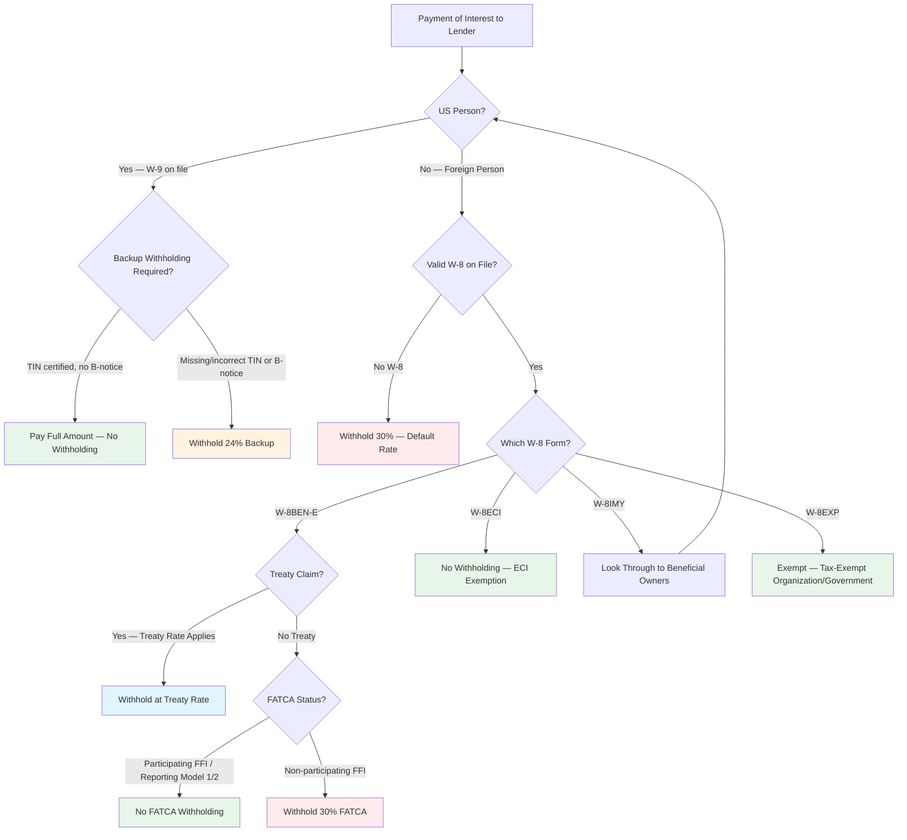

# Tax Withholding and Lender Onboarding in Syndicated Loan Administration

> *Document 5 of 6 — Loan Administration Knowledge Base*
> *This document is current as of February 16, 2026.*
> *Related documents: Doc 2 (Credit Agreement Interpretation, §§ on gross-up provisions and tax representations); Doc 3 (Operational Mechanics, §§ on payment processing and day-count conventions); Doc 4 (Secondary Trading, §§ on trade settlement tax documentation); Doc 6 (Lifecycle Events, §§ on regulatory landscape and CTA/BOI)*

---

Administrative agents in syndicated loans serve as withholding agents under IRC § 7701(a)(16), bearing independent statutory liability for correct withholding, reporting, and documentation collection. This knowledge base covers the full compliance landscape — from IRS form requirements and FATCA classifications through UK/EU withholding regimes, KYC/AML onboarding, sanctions screening, ERISA considerations, and the contractual allocation of withholding risk through gross-up provisions. The document is organized into six sections: IRS forms and documentation, US withholding tax mechanics, international withholding and treaties, reporting and compliance, lender onboarding and regulatory screening, and credit agreement provisions.

Several significant developments have reshaped the landscape recently: HMRC paused its longstanding concession on failures to withhold in January 2026 [UK], FinCEN's CTA/BOI reporting requirements were largely suspended for domestic companies [US], the One Big Beautiful Bill Act permanently extended TCJA provisions [US], the US-Chile treaty entered into force as the first new comprehensive US tax treaty in over a decade [US], and FinCEN issued Order FIN-2026-R001 on February 13, 2026, streamlining CDD beneficial ownership verification [US].

---

## 1. IRS Tax Forms: Current Versions, Validity, and Electronic Signatures

### Current form revision dates [US]

Every W-8 series form and the W-9 have confirmed current revision dates as follows:

| Form | Current Revision | Purpose | Notes |
|------|-----------------|---------|-------|
| W-8BEN | Rev. October 2021 | Foreign individuals — beneficial owner status | Updated per T.D. 9890 and T.D. 9926 |
| W-8BEN-E | Rev. October 2021 | Foreign entities — beneficial owner status, FATCA classification, treaty claims | Over 30 Chapter 4 status classifications |
| W-8ECI | Rev. October 2021 | Foreign persons claiming effectively connected income | Always requires US TIN |
| W-8IMY | Rev. October 2021 | Foreign intermediaries, flow-through entities, certain US branches | Indefinite validity absent change in circumstances |
| W-8EXP | Rev. October 2023 | Foreign governments and international organizations | Added "withholding qualified holder" status per 87 FR 80042 |
| W-9 | Rev. March 2024 | US persons — TIN certification | Draft Rev. January 2026 published but NOT finalized [VERIFY: event-driven — final form pending] |

(Source: IRS.gov form pages; IRS Instructions for the Requester of Forms W-8, Rev. June 2022)

The October 2021 forms were updated together to incorporate Section 1446(f) requirements, the FTIN "not legally required" checkbox, and electronic signature guidance referencing T.D. 9890. The **draft W-9 (Rev. January 2026)** adds a new certification checkbox for US digital asset brokers and exempt payee code 14, incorporating references to the OBBBA, but it should not be filed until finalized. No draft or pending updated versions of any W-8 form have been published. IRS "About" pages for all W-8 forms state "Recent Developments: None at this time." [VERIFY: time-sensitive — check IRS.gov quarterly for form updates]

### W-8 form validity periods and exceptions [US]

The general rule under **Treas. Reg. § 1.1441-1(e)(4)(ii)(A)** provides that a W-8 form is valid from the date of signature through the **last day of the third succeeding calendar year**. A form signed on any date in 2024 expires December 31, 2027.

Several important exceptions provide **indefinite validity** under Treas. Reg. § 1.1441-1(e)(4)(ii)(B):

**W-8IMY**: Valid indefinitely absent a change in the intermediary's status or circumstances making the information incorrect. This indefinite validity does *not* extend to the associated withholding certificates, documentary evidence, or withholding statements, which expire under their own rules. Exception: W-8IMY provided by a QDD may have a different validity period.

**W-8EXP**: Generally indefinite for integral parts of foreign governments, foreign central banks of issue, and international organizations. However, a controlled entity of a foreign government is subject to the standard three-year rule. For purposes of the withholding qualified holder exemption under IRC §1445, a W-8EXP submitted to claim this status has a **two-year** validity period (Reg. §1.1445-5(b)(3)(ii)(B)(3)), rather than the standard three-year period applicable to other W-8 forms. This distinction is relevant when the loan involves USRPI collateral. (The withholding qualified holder status relates to FIRPTA withholding under §1445, which is tangential to most loan administration but becomes relevant when loan collateral includes US real property interests.)

**W-8 with US TIN and annual reporting**: Any W-8 containing a US TIN is indefinitely valid if the withholding agent reports at least one payment annually on Form 1042-S (per § 1.1441-1(e)(4)(ii)(B)(1)).

**W-8BEN/W-8BEN-E paired with documentary evidence**: Indefinitely valid for foreign status claims (not treaty claims) when both are received before either would otherwise expire, per T.D. 9890. The pairing must be established within 30 days.

**W-8ECI**: Always follows the standard three-year rule. Always requires a US TIN. The form requires the beneficial owner to certify income is effectively connected "for the taxable year," and any change in effectively connected status triggers a change-in-circumstances obligation within **30 days**.

**Treaty claims are always subject to the three-year rule** — the indefinite validity exceptions do not extend to treaty benefit claims under any form.

(Source: IRS Instructions for Form W-8BEN, Rev. 10/2021; Treas. Reg. § 1.1441-1(e)(4)(ii))

### Electronic signatures on W-8 forms are permanently permitted [US]

**Treasury Decision 9890** (published January 2, 2020, 85 FR 192) established **permanent** regulatory authority for electronic signatures on withholding certificates at **Treas. Reg. § 1.1441-1(e)(4)(i)(B)**. This finalized temporary regulations that had been in effect since January 2017 under T.D. 9808/9809. This is separate from the COVID-era e-signature guidance for tax returns.

Requirements for a valid electronic signature: the signature must reasonably demonstrate it was made by the identified person; the signature block must include the signer's name, a time and date stamp, and a statement that the certificate has been electronically signed; the perjury statement must immediately precede the signature; and the e-signature must be the final entry. A typed name alone without supporting information is insufficient. Withholding agents maintaining electronic submission systems must ensure information integrity under § 1.1441-1(e)(4)(iv)(B), document all user access resulting in submission, and produce hard copies upon IRS request. A withholding agent may also rely on forms received from third-party repositories under § 1.1441-1(e)(4)(iv)(E).

The IRS separately made e-signatures permanent for forms filed **with** the IRS through IR-2023-199 (November 2023), integrating the policy into IRM 10.10.1. W-8 forms, however, are furnished to withholding agents (not filed with the IRS), so their e-signature authority derives independently from T.D. 9890 and is not subject to any temporary extension or sunset.

(Source: T.D. 9890, 85 FR 192; IRS Instructions for the Requester of Forms W-8, Rev. June 2022; IR-2023-199)

---

## 2. US Withholding Tax Mechanics and FATCA

### The portfolio interest exemption remains the cornerstone of cross-border lending [US]

The portfolio interest exemption under **IRC §§ 871(h) and 881(c)**, in effect since 1984, exempts qualifying US-source interest from the standard **30% withholding tax** when paid to foreign persons. For syndicated loans, it is the primary mechanism through which non-bank foreign lenders avoid US withholding. The requirements are:

The obligation must be in **registered form** — syndicated loans satisfy this through the administrative agent's register of lenders. The interest must not be **contingent interest** dependent on borrower cash flows — standard floating-rate loans (SOFR + spread) qualify because the rate references an external benchmark, not borrower performance. The foreign beneficial owner must provide a W-8BEN or W-8BEN-E certifying non-US person status, non-10% shareholder status, and non-CFC-related-person status. The creditor's jurisdiction must maintain adequate information exchange with the US.

**Three critical exceptions narrow the exemption's reach:**

**The bank exception (§ 881(c)(3)(A))** excludes interest received by a bank "on an extension of credit made pursuant to a loan agreement entered into in the ordinary course of its trade or business." A bank is defined by reference to § 585(a)(2) and includes commercial banks, savings institutions, and similar deposit-taking and lending institutions. This is the single most significant limitation in syndicated lending: **foreign bank lenders cannot claim the portfolio interest exemption on their own originations.** However, a bank that acquires a loan on the secondary market in an investment capacity — without acquiring contractual privity through the origination process — may face a different analysis. ABA guidance suggests such secondary market purchases arguably should not be subject to the exception, though this lacks definitive regulatory guidance and remains a complex factual determination flagged by the IRS LB&I Practice Unit. The exception applies only to foreign corporations that are banks, not to individuals.

**The 10% shareholder exception (§ 881(c)(3)(B))** denies the exemption to any person owning 10% or more of total combined voting power (for corporate borrowers) or 10% of capital or profits interest (for partnership borrowers). Constructive ownership rules under § 318(a) apply.

**The CFC exception (§ 881(c)(3)(C))** applies only to interest received by a CFC from a related person under § 864(d)(4). CFCs receiving interest from unrelated US borrowers can still claim portfolio interest.

In syndicated loan contexts, non-bank foreign lenders (including CLOs, credit funds, and insurance companies) routinely rely on portfolio interest. CLOs structured as Cayman SPVs are not banks and do not make extensions of credit in the ordinary course of banking, making them eligible for the exemption. The registered form requirement is satisfied because administrative agents maintain a register of lenders. No significant new proposed regulations, case law, or IRS guidance specifically addressing the portfolio interest exemption in syndicated loans was issued during 2023–2026. The IRS Practice Unit on "Portfolio Debt Exemption Requirements and Exceptions" remains the primary administrative guidance.

(Source: IRS LB&I Practice Unit RPW/T/08_01_01_01-01r; 26 USC §§ 871(h), 881(c); Treas. Reg. § 1.871-14)

### Backup withholding is permanently set at 24% [US]

The **backup withholding rate under IRC § 3406 is 24%**, confirmed permanent by the One Big Beautiful Bill Act (P.L. 119-21, signed July 4, 2025). The rate equals the fourth-lowest individual tax bracket under § 1(c). The TCJA set the brackets at 10%, 12%, 22%, 24%, 32%, 35%, 37% — originally scheduled to expire after December 31, 2025. The OBBBA permanently extended the individual rate structure, making the 24% backup withholding rate permanent with no sunset. Backup withholding applies upon: failure to furnish a TIN (W-9 failure), incorrect TIN (IRS B-Notice), notified underreporting (C-Notice), or failure to certify exemption from backup withholding.

(Source: IRS Publication 15, Circular E, 2026; IRS Notice 2025-03; 26 USC § 3406)

### FATCA landscape in early 2026 [US/INTERNATIONAL]

The US maintains FATCA IGAs with approximately **113 jurisdictions**, with Model 1 IGAs comprising the substantial majority (roughly 99) and Model 2 IGAs covering approximately 14 jurisdictions. [VERIFY: time-sensitive — additional IGAs are signed periodically; check Treasury FATCA page for current count] Over **300,000 foreign financial institutions** have registered and obtained GIINs. The IRS publishes a monthly FFI List for GIIN verification.

**Model 1 IGA jurisdictions** (FFIs report to local tax authority, which exchanges with IRS): UK, France, Germany, Canada, Australia, Singapore, South Korea, most EU nations, India, Brazil, UAE.

**Model 2 IGA jurisdictions** (FFIs report directly to the IRS): Switzerland, Japan, Hong Kong, Austria, Chile, Bermuda, Taiwan.

All FFIs in both Model 1 and Model 2 jurisdictions must register with the IRS and obtain a GIIN. Since January 1, 2017, sponsored entities must obtain their own GIIN rather than using their sponsor's.

The most significant recent guidance is **IRS Notice 2024-78** (October 28, 2024), which extended temporary TIN reporting relief for Reporting Model 1 FFIs through calendar years **2025, 2026, and 2027**, continuing relief from Notice 2023-11 but adding new requirements: FFIs must report city and country of residence, report foreign TINs if in their electronic records, and retain records through 2031. Despite this reporting relief, FFIs failing obligations may be treated as nonparticipating FFIs subject to 30% withholding.

**FATCA withholding on gross proceeds** remains deferred indefinitely — proposed regulations from 2018 (REG-132881-17) would eliminate this requirement. The 2026 Form 1042-S Instructions explicitly confirm taxpayers may rely on these proposed regulations until final regulations are issued. **Foreign passthru payment withholding** also remains indefinitely deferred — it will not be required until two years after final regulations defining "foreign passthru payment" are published (which they have not been). The current administration's deregulatory posture makes reinstatement of gross proceeds withholding extremely unlikely.

No additional FATCA-specific IRS notices were issued in 2025 or early 2026. The 2018 proposed regulations reducing burden under Chapters 3 and 4 remain in proposed form; withholding agents may continue relying on them under § 7805(b)(1)(C).

(Source: Congressional Research Service Report IF12166; IRS FATCA Governments page; Treasury FATCA page; IRS Notice 2024-78; IRS Form 1042-S Instructions, 2025)

### Chapter 3 and Chapter 4 coordination follows a clear priority hierarchy [US]

The interaction between Chapter 3 (NRA withholding, §§ 1441–1443) and Chapter 4 (FATCA, §§ 1471–1474) is governed by **Treas. Reg. § 1.1474-6**. The core rule: **Chapter 4 takes operational priority when it applies.** Under § 1.1441-3(c)(2), a withholding agent that has withheld as required under Chapter 4 is "not required to withhold under" Chapter 3. The Chapter 4 withholding may be credited against any Chapter 3 liability under § 1.1474-6(b)(1). The withholding agent must designate the withholding as under Chapter 4 for the credit to apply.

The practical coordination sequence is: (1) determine whether the payment is a withholdable payment under Chapter 4 (US-source FDAP income); (2) determine the payee's Chapter 4 status from W-8BEN-E Line 5; (3) verify GIIN against the IRS FFI list if required; (4) if the payee is a nonparticipating FFI, recalcitrant account holder, or passive NFFE without owner information, Chapter 4 withholding at 30% applies and satisfies Chapter 3; (5) if Chapter 4 withholding does not apply (compliant FFI or exempt), apply Chapter 3 analysis independently — 30% default or reduced treaty rate with proper documentation. Section 1445 (FIRPTA) and Section 1446 (partnership withholding) both take precedence over Chapter 4 under §§ 1.1474-6(c) and (d) respectively.

(Source: 26 CFR § 1.1474-6; § 1.1441-3(c)(2))

### Withholding determination flowchart

The following diagram summarizes the withholding determination process for interest payments to lenders in a syndicated loan:

### W-8BEN-E Chapter 4 classifications number over 30 categories [US]

Line 5 of Form W-8BEN-E provides checkboxes for the entity's Chapter 4 status. The classifications fall into four categories with distinct GIIN and withholding implications:

**Not subject to Chapter 4 withholding — compliant FFIs (GIIN required):** Participating FFI, Reporting Model 1 FFI, Reporting Model 2 FFI, Registered Deemed-Compliant FFI, Sponsored FFI (sponsor's GIIN), and Restricted Distributor. All require a GIIN and are not subject to Chapter 4 withholding when properly documented.

**Not subject to Chapter 4 withholding — deemed-compliant or excepted categories (no GIIN required, self-certify):** Certified Deemed-Compliant Nonregistering Local Bank (≤$175M assets), Certified Deemed-Compliant FFI with Only Low-Value Accounts (no account >$50,000), Certified Deemed-Compliant Sponsored Closely Held Investment Vehicle (<20 owners), Certified Deemed-Compliant Limited Life Debt Investment Entity, Certain Investment Entities Not Maintaining Financial Accounts, Owner-Documented FFI (only with designated withholding agent), Excepted Inter-Affiliate FFI, and various Nonreporting IGA FFI subtypes.

**Exempt beneficial owner categories (no GIIN):** Foreign Government/Central Bank of Issue, International Organization, Exempt Retirement Plans (six subtypes), Entity Wholly Owned by Exempt Beneficial Owners, and Territory Financial Institution.

**NFFE categories (no GIIN except Sponsored Direct Reporting NFFE):** Active NFFE (less than 50% passive income/assets), Passive NFFE (**must provide substantial US owner information or face 30% withholding**), Publicly Traded NFFE, Excepted Territory NFFE, Excepted Nonfinancial Group/Start-Up/Liquidating Entity, 501(c) Organization, and Nonprofit Organization.

**Subject to 30% Chapter 4 withholding:** Non-participating FFI and Passive NFFE that fails to identify substantial US owners. **Direct Reporting NFFE and Sponsored Direct Reporting NFFE** elect to report US owners directly to the IRS (GIIN required).

The operational imperative for withholding agents: **verify GIINs against the IRS FFI List** for all entities claiming a status that requires registration. If a GIIN shows "Applied for," the payee has 90 days to provide it.

(Source: Form W-8BEN-E, Rev. October 2021; IRS Instructions for Form W-8BEN-E)

**Worked example: W-8BEN-E for a Cayman Islands CLO**

CLOs domiciled in the Cayman Islands are among the most common foreign lenders in US syndicated loan syndications. Completing the W-8BEN-E for a typical Cayman CLO involves the following key decisions:

*Part I (Identification):* Name of the CLO entity (the issuer, not the manager), country of incorporation (Cayman Islands), Chapter 3 status and Chapter 4 (FATCA) status.

*Part III (Claim of Tax Treaty Benefits):* Not applicable — the Cayman Islands does not have an income tax treaty with the United States. Leave blank.

*Part IV (Chapter 3 Status):* The CLO typically claims status as a 'corporation' or 'complex trust.' The appropriate classification depends on the CLO's legal structure (typically an exempted company under Cayman law, classified as a corporation for US federal income tax purposes).

*Part XXV (Chapter 4 Status — FATCA):* Most Cayman CLOs are registered with the IRS as 'Reporting Model 1 FFIs' under the Cayman Islands' Model 1 IGA with the United States. The CLO provides its GIIN (Global Intermediary Identification Number). Alternative: some CLOs may qualify as 'Certified Deemed-Compliant FFIs' or claim another applicable FATCA status.

*Part XXX (Certification):* Signed by an authorized signatory of the CLO (typically the CLO manager or an authorized officer of the issuer, pursuant to a power of attorney or the CLO indenture).

*Key agent verification points:* (1) Verify GIIN against the IRS FFI List (apps.irs.gov/app/fatca-rit); (2) confirm the Chapter 3/Chapter 4 status is consistent with the CLO's structure; (3) ensure the form is signed by a person with authority to bind the entity; (4) calendar the 3-year expiration date for renewal.

### W-8IMY mechanics and intermediary chains in syndicated lending [US]

Form W-8IMY is used by entities that are **not the beneficial owner** of income — foreign intermediaries (QI and NQI), nonwithholding foreign partnerships, nonwithholding foreign simple and grantor trusts, withholding foreign partnerships, and certain US branches of foreign banks receiving payments on behalf of others.

The **withholding statement** is an integral component. For **nonqualified intermediaries (NQIs)**, it must include payee-specific information: name, address, Chapter 4 status, documentation type, withholding rates, and allocation percentages for each beneficial owner. For **qualified intermediaries (QIs)**, pooled withholding rate information suffices without identifying individual payees — this is the critical QI advantage of **client confidentiality**. QIs may assume primary withholding responsibility and keep customer documentation at their location; NQIs cannot assume withholding responsibility and must disclose all beneficial owner documentation upstream. There is no standardized format for withholding statements, creating operational challenges and increasing error risk.

In syndicated loan administration, W-8IMY arises most commonly when:

**Foreign partnerships hold loan interests**: The partnership provides W-8IMY as a nonwithholding foreign partnership, accompanied by W-8BEN-E or W-8BEN from each partner claiming portfolio interest. LSTA MCAP-style agreements specifically require this layered documentation.

**Foreign trusts as lenders**: Grantor trusts provide W-8IMY plus grantor documentation; simple trusts provide W-8IMY plus beneficiary documentation.

**Nominee/custodial arrangements**: When a lender of record holds positions as nominee, W-8IMY identifies the intermediary relationship and the agent must look through to beneficial owners.

**Multi-investor fund structures**: CLOs and credit funds structured as partnerships create intermediary chains, each level requiring W-8IMY.

The administrative agent must **associate** beneficial owner documentation with each W-8IMY, review withholding statements for completeness, and apply presumption rules (30% withholding) for any undocumented portion of a payment. While W-8IMY itself has indefinite validity, all associated withholding certificates and statements expire under their own rules and must be monitored. If the withholding agent cannot reliably associate a payment with valid documentation, **presumption rules apply** — typically resulting in 30% withholding.

(Source: IRS Instructions for Form W-8IMY, Rev. October 2021; IRS Foreign Intermediaries guidance)

### Change in circumstances triggers re-documentation [US]

Under **Treas. Reg. § 1.1471-3(c)(6)(ii)(E)** (Chapter 4) and **§ 1.1441-1(e)(4)(ii)(D)** (Chapter 3), documentation becomes invalid when a change in circumstances makes the information incorrect. Examples include: change of address to a US address, change in entity type or FATCA status, removal of GIIN from the IRS FFI list, information in the agent's files inconsistent with the payee's claims, addition of a US mailing address, new information learned by a relationship manager, and changes to associated accounts under aggregation rules.

Upon discovering a change, the withholding agent has **90 days** to obtain new documentation (the earlier of 90 days or the date a withholdable payment is made, for Chapter 4 purposes). Under the Chapter 3 rules, the payee must notify the withholding agent within **30 days** of any change making W-8 information incorrect. During the grace period under § 1.1441-1(b)(3)(iv), the agent may treat the account holder as a foreign person but must withhold at the **unreduced 30% rate**. After the grace period expires without valid documentation, full presumption rules apply — undocumented payees are presumed foreign and subject to 30% withholding under Treas. Reg. § 1.1441-1(b)(3).

Withholding agents must maintain monitoring procedures to detect changes in customer master files and must notify payees of their obligation to report changes. A withholding agent with **actual knowledge or reason to know** that documentation is unreliable (per § 1.1441-7(b)(1)) must withhold at 30% regardless of the documentation held. Over-withholding may be corrected through adjusted refund procedures under Treas. Reg. § 1.1461-2, or the foreign payee may claim a refund on Form 1040-NR or 1120-F.

(Source: Treas. Reg. §§ 1.1471-3(c)(6)(ii), 1.1441-1(e)(4)(ii)(D), 1.1441-1(b)(3)(iv); IRS IRM 4.10.21)

---

## 3. International Withholding: US Treaty Network, UK Regime, and EU Directives

### US tax treaty network provides 0% on interest from major financial centers [US/INTERNATIONAL]

The US tax treaty network provides **0% withholding on interest** for beneficial owners resident in all major financial centers with which the US has treaties. Based on IRS Publication 901 (Rev. September 2024) and IRS Tax Treaty Table 1 (Rev. May 2023):

| Jurisdiction | Interest Rate | Treaty Year | Key Conditions |
|---|---|---|---|
| United Kingdom | **0%** | 2001 | LOB Art. 23; contingent interest at dividend rate |
| Japan | **0%** | 2003 (amended 2013 Protocol, in force Aug. 30, 2019) | LOB Art. 22; contingent interest 10% |
| Germany | **0%** | 1989 (amended 2006 Protocol) | LOB; contingent interest **30%** |
| France | **0%** | 1994 | LOB Art. 30; contingent interest treated as dividend |
| Netherlands | **0%** | 1992 (amended 2004 Protocol) | LOB Art. 26; Art. 12 (interest) |
| Luxembourg | **0%** | 1996 (amended 2009 Protocol, in force Sept. 9, 2019) | LOB Art. 24; contingent interest as dividend |
| Switzerland | **0%** | 1996 (amended 2009 Protocol, in force Sept. 20, 2019) | LOB; contingent interest **30%** |
| Ireland | **0%** | 1997 | LOB Art. 23; contingent interest as dividend |
| Canada | **0%** | 1980 (multiple protocols) | LOB; IRS Pub. 597 |
| **Cayman Islands** | **No treaty** | — | **30% statutory rate** applies; portfolio interest exemption is primary relief |

All rates require beneficial ownership, Limitation on Benefits compliance, and that the interest not be effectively connected with a US PE. The absence of a US-Cayman treaty is operationally critical — Cayman-based CLOs, funds, and SPVs must rely on the **portfolio interest exemption** rather than treaty benefits.

(Source: IRS Publication 901, Rev. September 2024; IRS Tax Treaty Table 1, Rev. May 2023) [VERIFY: time-sensitive — treaty rates change with treaty amendments, terminations, and new treaties entering into force]

### Recent treaty developments [US/INTERNATIONAL]

| Development | Details |
|---|---|
| **US-Chile treaty entered into force** (Dec. 19, 2023) | First new comprehensive treaty in >10 years. Senate ratified 95-2 (June 22, 2023). Interest: 15% general (dropping to 10% after 5 years); **4% for banks and insurance companies**. Effective for withholding from Feb. 1, 2024. (Source: Treasury Press Release jy2003) |
| **US-Hungary treaty terminated** (effective Jan. 1, 2024) | US notified Hungary of termination July 8, 2022. Statutory 30% now applies. New treaty signed Feb. 4, 2010, remains unratified before Senate Foreign Relations Committee. (Source: Treasury Press Release jy0872; IRS Announcement 2024-5; IRS Publication 901) |
| **US-Russia treaty partially suspended** (effective Aug. 16, 2024) | Articles 5–21 and 23 suspended. US-USSR treaty as applied to **Belarus** partially suspended effective Dec. 17, 2024 through Dec. 31, 2026, specifically the trade-financing loan interest exemption. (Source: IRS Announcement 2025-5; Treasury Press Release jy2754) |
| **US-Croatia treaty** | Signed Dec. 7, 2022; 0% interest rate; awaiting Senate approval |
| **US-Poland treaty** | Signed Feb. 13, 2013; awaiting Senate approval |

### UK withholding at 20% faces operational tightening [UK]

UK withholding tax applies at **20%** (the savings basic rate) on payments of "yearly interest" — broadly, interest on loans expected to be in place for more than one year (ITA 2007, § 874). The UK Autumn Budget 2025 announced an increase to **22% from April 6, 2027**, following the savings basic rate, included in Finance Bill 2025-26 (not yet enacted). [VERIFY: event-driven — Finance Bill progress through Parliament]

**Qualifying lender exemptions under domestic law** are critical for syndicated lending and may provide alternative routes to gross payment even without treaty relief:

- **ITA 2007, § 879**: Interest paid by a bank making an advance in the ordinary course of business is exempt.
- **ITA 2007, § 933**: Interest paid to a UK-resident company beneficially entitled to the interest is exempt, though the *Hargreaves Property Holdings v HMRC* (2023, Upper Tribunal) decision narrowed the "beneficially entitled" concept, requiring genuine economic substance and not merely legal ownership.
- **ITA 2007, § 987** (Quoted Eurobond exemption): Interest on listed securities is exempt, covering debt listed on a recognized stock exchange.
- **ITA 2007, § 888A** (Qualifying Private Placement exemption): Introduced January 2016, covers unlisted debt of £10M+ with a genuine commercial purpose between unconnected parties — useful as a fallback while awaiting treaty clearance.

### The Double Taxation Treaty Passport (DTTP) scheme [UK]

Launched September 1, 2010, the DTTP scheme simplifies obtaining HMRC Directions for treaty relief. A foreign lender applies to HMRC using **Form DTTP1**, receives a unique reference number (listed on a publicly available HMRC register, last updated February 3, 2026), and provides that number to borrowers. The borrower then submits **Form DTTP2** at least 30 days before the first interest payment. HMRC issues a Direction, typically within approximately three weeks.

Passport validity is **five calendar years**, renewable. Since October 2023, HMRC no longer issues reminders when passports are due to expire. For syndicated loans with frequent composition changes, HMRC accepts **monthly consolidated notifications** with schedules of passport holders, reducing the administrative burden of individual filings. **Until the Direction is received, the borrower must continue to withhold at 20%.**

### HMRC paused its concession in January 2026 [UK]

**⚠ URGENT — HMRC Disclosure Deadline: April 5, 2026**
HMRC paused its longstanding Direction-Holder concession in January 2026, effective for interest payments made on or after that date. Any person who has made interest payments since January 2026 without withholding under the concession must: (1) disclose this to HMRC by **April 5, 2026**, and (2) account for the tax to HMRC by **April 14, 2026**. Agents administering facilities with UK-source interest payments must immediately assess their exposure and ensure timely disclosure. [VERIFY: event-driven — monitor whether HMRC reinstates the concession or provides further guidance]

In a significant development, HMRC **paused** its longstanding concession (documented at INTM413230, updated via INTM413205) under which borrowers who paid interest gross without first obtaining an HMRC Direction could make a voluntary disclosure and be assessed only for late-payment interest, not the underlying WHT.

**Under the paused concession, borrowers now face assessment for both the underlying 20% withholding tax AND late-payment interest** (Bank of England base rate + 4%, currently **7.75%**), even where the lender is treaty-entitled. This requires the lender to separately reclaim the WHT and remit to the borrower.

Standard LMA provisions do not require lenders to cooperate in this way, creating operational friction. Borrower counsel are increasingly seeking lender cooperation obligations in credit agreements. The QPP exemption (§ 888A) and quoted Eurobond exemption (§ 987) serve as alternative structures to avoid the timing gap.

HMRC has confirmed that **voluntary disclosures made before April 5, 2026** will preserve the **2021–22 tax year** within the four-year assessment window — this represents a critical operational deadline for borrowers with outstanding exposure. No timeline for reinstating the concession has been given; multiple law firm alerts (Mayer Brown, Travers Smith, Deloitte) describe the pause as effective "until further notice" while HMRC reviews its processes.

(Source: HMRC INTM413205; HMRC INTM413230; Mayer Brown, January 19, 2026; Travers Smith, January 2026; Deloitte Business Tax Briefing, January 9, 2026; PwC Tax Summaries UK)

### EU Interest and Royalties Directive [EU]

**Council Directive 2003/49/EC** eliminates withholding taxes on cross-border interest and royalty payments between **associated companies** in different EU Member States — defined as a minimum 25% direct capital holding. All 27 EU Member States participate, and all historical transitional periods have expired. The Directive's syndicated lending relevance is minimal because third-party bank lenders in a syndicate are not associated companies of the borrower; it applies only to intragroup financing.

The UK **no longer benefits** following Brexit: the implementing legislation (ITTOIA 2005, §§ 757–767) was repealed by Finance Act 2021, effective June 1, 2021.

### The Danish beneficial ownership cases reshaped EU anti-abuse analysis [EU]

The landmark **CJEU Grand Chamber decisions of February 26, 2019** (six joined cases: *N Luxembourg 1* C-115/16, *X Denmark* C-118/16, *C Danmark I* C-119/16, *Z Denmark* C-299/16, and two royalties cases) established that EU law contains a general anti-abuse principle that Member States must apply even without specific domestic anti-avoidance provisions.

The CJEU held that "beneficial owner" under the Directive is an autonomous EU law concept: a conduit company receiving interest under an obligation to pass it on shortly after receipt is not the beneficial owner. Indicia of abuse include letterbox entities with no genuine economic substance, near-contemporaneous onward payments, and back-to-back loan structures. These rulings intensified scrutiny across EU jurisdictions of intra-group payment chains, particularly affecting treasury center structures in Luxembourg, Netherlands, and Ireland.

(Source: EUR-Lex 2003/49/EC; CJEU Grand Chamber joined cases C-115/16, C-118/16, C-119/16, C-299/16; Cadwalader Brass Tax; GOV.UK March 3, 2021)

---

## 4. Reporting, Compliance, and Regulatory Developments

### 1042-S reporting transitions to IRIS as the sole electronic platform [US]

Form 1042-S filing deadline is **March 15** of the year following the payment year. For tax year 2025, the deadline is **March 16, 2026** (since March 15 falls on a Sunday). The electronic filing threshold was reduced to **10 returns** under T.D. 9972 (February 2023), effective for tax year 2023. All information returns (1099, W-2, 1042-S) are aggregated to determine the threshold, meaning virtually all withholding agents must now e-file.

The **FIRE to IRIS transition** follows this timeline: for filing season 2026 (TY 2025), both FIRE and IRIS are operational, with IRIS supporting Form 1042-S starting January 1, 2026. **FIRE will be retired December 31, 2026**, making IRIS the sole platform for filing season 2027 onward. IRIS uses XML format (versus FIRE's 1220 ASCII flat file) and requires a separate Transmitter Control Code (TCC) starting with "D."

Notable recent additions to Form 1042-S include **new income codes**: Code 60 for loan syndication fees (optional for 2025–2026 reporting), Code 59 for consent fees, and Code 61 for settlement payments. New Chapter 3 status codes (40 for Partnership QDD, 41 for US government entities) and a new Box 7d checkbox for withholding rate pool revisions were also added. [VERIFY: time-sensitive — 1042-S income codes and status codes are updated annually; check IRS Instructions for current filing year]

**Filing deadlines:**
- Paper filing: **March 15** of the year following the calendar year in which the payment was made
- Electronic filing: **March 31** (mandatory for filers with 10 or more forms; all filers may file electronically)
- Extensions: Form 7004 provides an automatic 6-month extension for filing (to September 15 for paper, September 30 for electronic), but does NOT extend the deadline for furnishing recipient copies
- Recipient copies (Copy B): Must be furnished to the recipient by **March 15**
- IRIS transition: The IRS FIRE system retires December 31, 2026; filers must transition to the IRIS (Information Returns Intake System) platform. A new Transmitter Control Code (TCC) is required for IRIS — agents should apply well in advance of the FIRE retirement date. [VERIFY: time-sensitive — verify FIRE retirement timeline and IRIS readiness]

(Source: IRS Instructions for Form 1042-S, 2025; IRS FIRE page; IRS IRIS page)

### QI agreement under Rev. Proc. 2022-43 runs through 2028 [US]

The current Qualified Intermediary agreement, issued December 13, 2022 under **Rev. Proc. 2022-43**, has a **six-year term from January 1, 2023, through December 31, 2028**. Key features relevant to loan administration: pooled reporting (QIs report on a withholding rate pool basis rather than individually), assumption of primary withholding responsibility, client documentation retention at the QI's location, expanded provisions for IRC § 1446(a) and (f) covering PTP distributions and transfers, a "Disclosing QI" concept, and a public QI list published by the IRS.

Periodic certification operates on **three-year cycles**. For review years 2022 or 2023, the certification deadline was extended to November 1, 2025; for review year 2024, the deadline is December 31, 2025. Certifications require completion of **Appendix III** (reconciliation data for Forms 1042 and 1042-S) uploaded via the QAAMS portal. QIs must also consent to name, status, and QI-EIN disclosure on a public IRS list.

For loan administration, QI status allows foreign intermediaries to maintain beneficial owner documentation locally and provide withholding rate pool information to upstream withholding agents rather than individual payee documentation — a significant operational simplification for intermediary chains.

(Source: Rev. Proc. 2022-43; IRS QAAMS page; Mayer Brown analysis, January 2023) [VERIFY: time-sensitive — QI agreement terms and certification deadlines are periodically updated]

### Withholding agent liability and the penalty framework [US]

Under **IRC § 1461**, every person required to deduct and withhold tax is "made liable for such tax" and indemnified against claims from payees for amounts properly withheld. If the agent fails to withhold, it bears the tax liability plus penalties and interest (though double collection is prevented under § 1463 to the extent the foreign person actually pays).

The penalty structure is tiered and inflation-adjusted:

**Failure to file/pay (§ 6651):** 5% of unpaid tax per month for failure to file (maximum 25%); 0.5% per month for failure to pay (maximum 25%). Minimum penalty for returns required to be filed in 2026: **$525**. First-time abatement is available administratively.

**Failure to deposit (§ 6656):** 2% if not more than 5 days late, 5% if 6–15 days late, 10% if more than 15 days late, and **15%** if unpaid more than 10 days after a delinquency notice.

**Information return penalties (§§ 6721/6722)** for returns filed in 2026: **$60** per return if corrected within 30 days (maximum $630,500); **$130** if corrected within 31 days through August 1 (maximum $1,891,500); **$330** if not corrected (maximum **$4,030,000** for large filers). For returns filed in 2027: **$340** per return, maximum **$4,191,500**. Small filers have reduced caps. **Intentional disregard** (§§ 6721(e)/6722(e)): Greater of $630 or 10% of the amount required to be reported, with no annual cap.

The **reasonable cause defense** under § 6724(a) requires demonstrating both (1) significant mitigating factors or events beyond control, and (2) responsible conduct before and after the failure, per Treas. Reg. § 301.6724-1. An agent's failures are attributed to the withholding agent — reliance on an agent does not per se constitute reasonable cause (*United States v. Boyle*, 469 U.S. 241 (1985)).

(Source: IRC §§ 1461, 6651, 6656, 6721, 6722, 6724; Rev. Proc. 2024-40; Rev. Proc. 2025-32) [VERIFY: time-sensitive — penalty amounts and thresholds are adjusted annually for inflation via Revenue Procedure]

### Section 871(m) phase-in extended through 2026, with full implementation targeted for 2027 [US]

**IRS Notice 2024-44** (May 22, 2024) provides the current relief framework for Section 871(m) dividend equivalent payment rules. Non-delta-one transactions (delta ≥ 0.8 but < 1.0) are exempt if issued before **January 1, 2027**. Only delta-one transactions (delta = 1.0) entered into on or after January 1, 2017, are currently in scope. The QDD net delta exposure method and QSL transition rules are extended through 2026. Good-faith enforcement applies through 2026 for delta-one transactions and 2027 for non-delta-one.

**No subsequent IRS notice extending relief beyond Notice 2024-44 has been identified** as of mid-February 2026, though the pattern of biennial extensions (2018, 2020, 2022, 2024) makes another extension in late 2026 probable. SIFMA continues to advocate for at least 18 months of relief after any final guidance is published. Direct impact on syndicated loan administration is limited but nonzero — facilities with equity-linked components, convertible debt, or collateral involving US equities could implicate 871(m). [VERIFY: event-driven — monitor for late-2026 IRS notice extending phase-in]

(Source: IRS Notice 2024-44; PwC; Mayer Brown; BDO; SIFMA)

---

## 5. Lender Onboarding, KYC/AML, and Regulatory Screening

### CDD beneficial ownership requirements remain fully in force [US]

The FinCEN Customer Due Diligence Rule (31 CFR § 1010.230) requires covered financial institutions to identify and verify beneficial owners of legal entity customers under two prongs: the **ownership prong** (each individual with ≥25% equity) and the **control prong** (one individual with significant management responsibility).

On **February 13, 2026**, FinCEN issued **Order FIN-2026-R001**, granting exceptive relief from the requirement to re-identify and re-verify beneficial owners at each new account opening. Under the order, covered institutions may limit beneficial ownership identification and verification to: (1) when a legal entity customer **first opens an account**; (2) when the institution has **knowledge of changes** in beneficial ownership; and (3) on a **risk basis** as part of ongoing CDD. Initial account opening identification and verification requirements remain unchanged, as do ongoing monitoring and SAR filing obligations. FinCEN stated it "anticipates making further changes to the CDD rule by rulemaking."

The CDD Rule requires collection of: name, address, date of birth, and TIN for each beneficial owner meeting the ownership or control prong. The ABA noted US banks open 140–160 million new accounts annually, calling the exceptive relief a significant burden reduction.

(Source: FinCEN Order FIN-2026-R001, February 13, 2026; 31 CFR § 1010.230; ABA Banking Journal, February 13, 2026) [VERIFY: event-driven — FinCEN anticipates further CDD rulemaking; exceptive relief may be revised or superseded by interim final rule]

### Corporate Transparency Act: domestic companies currently exempt [US]

The Corporate Transparency Act's beneficial ownership information (BOI) reporting requirement has been through extensive litigation, culminating in regulatory relief that effectively suspended domestic enforcement.

**Key litigation timeline:** *Texas Top Cop Shop, Inc. v. Garland* (E.D. Tex., nationwide injunction December 3, 2024); *McHenry v. Texas Top Cop Shop* (US Supreme Court, 8-1, January 23, 2025, staying the injunction pending Fifth Circuit); *Smith v. Treasury* (E.D. Tex., second nationwide injunction January 7, 2025, subsequently stayed February 17–18, 2025); and *National Small Business United v. Treasury* (Eleventh Circuit, December 16, 2025, unanimously **upholding CTA constitutionality** as a valid exercise of Commerce Clause authority — reversing the N.D. Alabama district court).

The decisive regulatory development was FinCEN's **March 21, 2025 interim final rule** (90 Fed. Reg. 13688), published after Treasury Secretary Bessent announced suspension of enforcement against US citizens and domestic companies on March 2, 2025. The IFR redefined "reporting company" to mean **only foreign entities** registered to do business in a US state or tribal jurisdiction. All domestic entities are fully exempt from initial, updated, or corrected BOI reports. US persons are exempt from providing BOI to any entity. Foreign entities registered before March 26, 2025, had until April 25, 2025, to file; those registered after receive a 30-day window.

The Eleventh Circuit's December 2025 ruling strengthens the CTA's legal footing and makes wholesale judicial invalidation less likely, potentially opening the door for future reinstatement of domestic reporting. The Fifth Circuit merits decision in *Texas Top Cop Shop* has not been published as of February 16, 2026. The IFR remains in effect; a final rule was expected in 2025 but appears still pending. In December 2025, FinCEN reported that progress was "delayed by various factors, including the recent lapse in appropriations." [VERIFY: event-driven — monitor for FinCEN final rule and Fifth Circuit merits decision]

Critically, CDD beneficial ownership requirements (collected by financial institutions from customers) and CTA/BOI reporting (filed by companies with FinCEN) are **separate and parallel regimes**. The CDD Rule remains fully enforceable regardless of CTA status.

(Source: FinCEN BOI page; Treasury Press Release sb0038; 90 Fed. Reg. 13688; *National Small Business United v. Treasury*, No. 24-10736 (11th Cir. Dec. 16, 2025))

### KYC/AML for syndicated loan agents [US]

For syndicated loan administration specifically, LSTA KYC Guidelines (updated 2020) establish that **agent banks are generally not required under US law to perform Customer Identification Program (CIP) procedures on primary lenders**, because the administrative agent relationship typically does not create a formal banking relationship triggering BSA/AML obligations. Despite this, many agent banks exceed legal requirements as a matter of internal policy, and third-party loan agents should establish clear internal policies reflecting their specific regulatory status.

All BSA/AML requirements — OFAC screening, SAR filing, ongoing monitoring — remain unchanged regardless of the CDD exceptive relief or CTA enforcement posture.

(Source: LSTA KYC Guidelines; LSTA 2020 KYC Initiative)

### Sanctions screening: operational requirements for loan agents [US/UK/EU]

Sanctions screening is a critical compliance function for administrative agents, though detailed operational requirements vary based on the agent's regulatory status and the jurisdictions involved.

**OFAC screening [US]:** The Office of Foreign Assets Control maintains multiple lists that administrative agents must screen against: the **Specially Designated Nationals and Blocked Persons (SDN) List**, the **Sectoral Sanctions Identifications (SSI) List**, the **Non-SDN Menu-Based Sanctions List**, and the **Consolidated Sanctions List** (which aggregates multiple sub-lists). Screening should occur at minimum upon lender onboarding/assignment, upon borrower information updates, and periodically on an ongoing basis (frequency determined by risk assessment — monthly screening of all parties is common practice among institutional agents). Positive matches require escalation to compliance counsel and, in some cases, blocking of funds under 31 CFR Part 501. The 50% Rule requires aggregation: if entities on the SDN List own 50% or more of an entity, that entity is also blocked even if not separately listed.

**UK sanctions [UK]:** The Office of Financial Sanctions Implementation (OFSI) within HM Treasury maintains the UK Sanctions List, implementing autonomous UK sanctions post-Brexit as well as UN Security Council measures. UK persons must not make funds available to or deal with assets of designated persons under the Sanctions and Anti-Money Laundering Act 2018 (SAMLA). For loan agents administering facilities with UK-incorporated borrowers or UK-based lenders, dual OFAC/OFSI screening is typically required.

**EU sanctions [EU]:** The European Commission and EU Council maintain restrictive measures lists. For facilities governed by European law or involving EU-based participants, agents must screen against EU consolidated financial sanctions lists in addition to any applicable national lists.

**Operational best practices for agents:** Maintain a written sanctions compliance program (SCP) identifying screening scope, frequency, and escalation procedures. Retain records of all screening activity. When a new lender seeks to join a facility through assignment or participation, screen the incoming entity and its beneficial owners before processing the transfer. Screen all payment instructions before executing fund transfers. Integrate screening with tax form collection during the onboarding workflow — the same documentation package (W-8/W-9, CDD, sanctions) should flow through a unified intake process. [VERIFY: event-driven — individual agent's regulatory status determines specific OFAC obligations; third-party agents that are not financial institutions may have different technical requirements than bank agents, though best practice is to apply financial institution-level screening regardless]

### ERISA considerations in syndicated lending [US]

ERISA-regulated entities (employee benefit plans, insurance company general accounts, and certain pooled investment vehicles) that participate in syndicated loans face specific compliance requirements that the administrative agent should understand, even though the agent itself typically has no ERISA fiduciary obligations.

**The plan asset regulation (29 CFR § 2510.3-101, as amended by § 2550.401c-1)** determines when the underlying assets of an investment vehicle are treated as "plan assets" of investing benefit plans. If plan assets are involved, every person exercising authority or control over those assets — potentially including the administrative agent — could be treated as an ERISA fiduciary. The regulation provides a critical exception: if benefit plan investors hold less than **25% of each class of equity interests** (the "significant participation" test), the entity's assets are not treated as plan assets. Most broadly syndicated CLOs and credit funds are structured to stay below this threshold.

**Prohibited Transaction Exemptions (PTEs)** govern how ERISA plans can participate in syndicated lending: the **QPAM exemption (PTE 84-14)** permits transactions where a qualified professional asset manager manages the plan's assets; the **VCOC exemption** under the plan asset regulation applies to venture capital operating companies; and the **INHAM exemption (PTE 96-23)** covers in-house asset managers of plans with substantial assets.

**Operational tracking for agents:**
The agent should maintain a record of each lender's ERISA status as part of the register. Key tracking points:
- Whether the lender is a benefit plan investor (or an entity whose assets constitute plan assets)
- Which PTE the lender relies upon (QPAM under PTE 84-14 is most common for CLOs and institutional investors; INHAM under PTE 96-23 for certain insurance company accounts)
- Whether the lender has provided the applicable ERISA representations in the Assignment and Assumption agreement

**Breach consequences:**
If the 25% threshold is breached — meaning benefit plan investors come to hold 25% or more of a class of equity interests in a fund investing in the loans — the fund's assets become 'plan assets.' This means the agent's activities with respect to those assets may constitute fiduciary acts under ERISA, exposing the agent to potential liability as a fiduciary. The agent should monitor the lender composition and flag potential threshold breaches to the fund manager.

**BDC interaction:**
BDCs are registered investment companies and are generally exempt from the plan asset regulation. However, BDCs may have plan asset investors in their own capital structure, creating indirect exposure. The ERISA analysis for BDC lenders focuses on the BDC's own compliance with RIC requirements rather than look-through to its investors.

**VCOC management rights:**
Some lenders claim a Venture Capital Operating Company (VCOC) exemption from the plan asset rules by obtaining 'management rights' over the borrower. These management rights are typically negotiated as side letters and may include the right to inspect books and records, attend board meetings (as observers), and consult with management. The agent should be aware that VCOC lenders may request access to borrower information beyond what is normally distributed to the syndicate, and should verify that such access is permissible under the credit agreement's confidentiality provisions.

**Operational implications for agents:** Credit agreements typically include ERISA representations (Article III or Article VIII) requiring lenders to represent that they are not using "plan assets" to acquire or hold their loan interest, or if they are, that a PTE applies. The administrative agent should collect these representations as part of the onboarding process but is **not responsible for verifying their accuracy** — the credit agreement typically makes the lender solely responsible for its ERISA compliance. When processing secondary trades (see Doc 4), the LSTA trade confirmation includes ERISA representations that should be checked for completeness. If a lender identifies itself as a benefit plan investor, the agent should flag this for counsel review to confirm applicable PTE coverage.

(Source: 29 CFR § 2510.3-101; DOL Advisory Opinions; LSTA Complete Credit Agreement Guide, Second Edition; Proskauer ERISA Practice Guide)

---

## 6. Credit Agreement Provisions and Legislative Developments

### Gross-up clauses allocate withholding risk through the Indemnified Taxes framework [US]

LSTA-style credit agreements use the **Indemnified Taxes versus Excluded Taxes** framework to allocate withholding tax risk between borrowers and lenders. All payments are made "free and clear" of taxes unless required by law. If withholding is required, the distinction between Indemnified Taxes (borrower grosses up) and Excluded Taxes (lender bears the cost) determines who absorbs the economic burden.

**Indemnified Taxes** are all taxes imposed on or with respect to payments under the loan documents other than Excluded Taxes. The borrower bears the economic burden through a gross-up obligation — if withholding is required, the borrower must increase the payment so the lender receives the amount it would have received absent withholding.

**Excluded Taxes** — which the borrower need not gross up — typically include four categories: (a) net income, franchise, and branch profits taxes imposed based on the lender's nexus with the taxing jurisdiction unrelated to the credit agreement; (b) **US federal withholding taxes in effect when the lender acquired its interest** (the "grandfathering" concept — an assignee cannot claim gross-up for withholding that existed at the time of purchase, unless the assignment was borrower-requested); (c) **taxes attributable to the lender's failure to provide required tax documentation** (W-8/W-9); and (d) **FATCA withholding** — universally carved out because compliance is within the lender's control, and the borrower should not bear this risk.

The **tax indemnity** provision provides broader protection — if the borrower makes a payment that should have been subject to withholding, or a lender incurs tax liability related to the agreement, the borrower indemnifies. A **tax credit clawback** provision requires lenders receiving tax credits attributable to borrower tax payments to remit amounts leaving them in the same after-tax position as if the relevant taxes had not been imposed.

The most recent finalized LSTA MCAPs are dated **May 1, 2023** (reposted July 8, 2024, with corrections). Draft revisions were published in February, April, and June 2025, primarily addressing Article 17 (Confidentiality). The MCAPs cover tax, yield protection, agency, assignment, defaulting lender, and disqualified institution provisions. Full text is proprietary LSTA member-only content. (See also Doc 2 for detailed credit agreement interpretation guidance.)

(Source: Law Insider definitions from SEC-filed credit agreements; LSTA Complete Credit Agreement Guide, Second Edition; LSTA website)

### LMA approach differs on key structural assumptions [UK/EU]

LMA documentation, governing European market transactions, uses the **Qualifying Lender** and **Treaty Lender** architecture reflecting UK domestic exemptions and the DTTP scheme. The critical structural difference: under LMA, the borrower takes only **change-of-law risk** — if withholding arises because a lender is not (or ceases to be) a Qualifying Lender, the borrower generally has no gross-up obligation unless the change results from new legislation after the agreement date. If a non-qualifying lender enters the syndicate through a transfer, it bears its own withholding cost.

LMA documentation now standardly uses "Rider 3" for FATCA, under which no party is obliged to gross-up for FATCA deductions (adopted as default in June 2014 for English-law investment-grade facilities; since April 2016, FATCA provisions have been incorporated directly into LMA Standard Terms at Sections 29.4 and 29.5). The LMA tax credit clawback operates similarly to the LSTA version.

A significant ongoing issue: standard LMA provisions **do not require lenders to reclaim withheld tax and remit to the borrower** — made more urgent by HMRC's January 2026 concession pause. Borrower counsel are increasingly negotiating for cooperation obligations in new and amended facilities. (See also Doc 2 for LSTA-vs-LMA comparison on broader documentation points.)

(Source: Milbank Client Alert, June 2014; Schulte Roth & Zabel LMA analysis; Society of Actuaries, Taxing Times, October 2014; Seward & Kissel analysis)

### The OBBBA permanently extends TCJA but does not change withholding rates [US]

The **One Big Beautiful Bill Act (P.L. 119-21)**, signed July 4, 2025, permanently extends the TCJA's tax structure, including the 21% corporate rate and international provisions. The **30% statutory withholding rate** on FDAP income under §§ 871(a)/881(a) is unchanged. Key provisions for loan administration:

**Permanent individual rate structure**: The seven-bracket structure (10% through 37%) is now permanent, anchoring the 24% backup withholding rate with no sunset.

**Section 163(j) restored to EBITDA basis permanently**: Effective for tax years beginning after December 31, 2024, depreciation, amortization, and depletion are once again added back to adjusted taxable income for computing the 30% business interest limitation. This is material for leveraged borrowers — the EBITDA standard significantly increases deductible interest capacity compared to the EBIT standard that applied from 2022 to 2024. Additional changes exclude Subpart F income and CFC tested income from ATI (effective 2026+), and the small business exception threshold was raised to $31 million.

**Section 899 was NOT enacted.** The proposed retaliatory tax on persons from countries imposing "discriminatory foreign taxes" (including UTPR, DSTs, and diverted profits taxes) was removed following Treasury Secretary Bessent's request in late June 2025, pursuant to the G7 understanding announced June 28, 2025. The G7 "understanding" committed to recognizing the US tax system alongside Pillar Two, fully excluding US-parented multinationals from UTPR and IIR. Congressional leaders have signaled Section 899 could be reintroduced if negotiations fail. The Senate version had notably clarified that Section 899 would **not** override the portfolio interest exemption, confirming Congress's intent to preserve that cornerstone of cross-border lending. Had it survived, existing credit agreement gross-up provisions would likely have required borrowers to compensate affected foreign lenders for the incremental withholding.

(Source: Tax Foundation; Davis Polk Client Update, July 11, 2025; Skadden, July 2025; RSM; Grant Thornton)

### OECD Pillar Two does not change withholding mechanics but reshapes lender economics [INTERNATIONAL]

Pillar Two (GloBE minimum tax) does **not** directly alter US withholding tax rates or mechanics. It operates at the corporate income tax level as a top-up tax. The US has not enacted Pillar Two implementing legislation, though GILTI/NCTI (renamed under the OBBBA) functions as a partial analog.

On **January 5, 2026**, the OECD published the formal **Side-by-Side Package**, recognizing the US tax regime as a qualified system. The US is currently the only jurisdiction listed in the OECD Central Record as having a qualified regime for the Side-by-Side safe harbor, effective for fiscal years beginning January 1, 2026. The European Commission confirmed application under the EU Minimum Tax Directive on January 12, 2026.

Over **50 jurisdictions** have Pillar Two rules in effect, including 22 of 27 EU Member States implementing the IIR and QDMTT by 2025. For cross-border lending, US withholding tax on interest paid to foreign lenders counts as a **covered tax** in the lender's jurisdiction, increasing its jurisdictional ETR. For typical institutional bank lenders in major jurisdictions with ETRs well above 15%, this does not create a top-up tax issue. For entities in low-tax jurisdictions, US withholding tax actually helps meet the 15% minimum. The Subject-to-Tax Rule (STTR) is relevant only for connected-party payments, not arm's-length syndicated lending.

(Source: OECD Pillar Two Model Rules; OECD Side-by-Side Package, January 5, 2026; KPMG, January 12, 2026; Grant Thornton; Tax Foundation) [VERIFY: event-driven — US qualification for Side-by-Side safe harbor is pending ongoing OECD review; monitor for changes to qualified regime status]

---

## Conclusion: The Administrative Agent as Regulatory Fulcrum

The administrative agent sits at the intersection of US tax withholding (Chapters 3 and 4), international treaty networks, UK and EU regimes, sanctions compliance, and anti-money laundering obligations — each with its own documentation requirements, deadlines, and penalties.

Three developments demand immediate operational attention: HMRC's January 2026 concession pause creates new risks for UK borrowers paying interest gross before obtaining a Direction, requiring rethinking of standard LMA provisions and potentially incorporating lender cooperation obligations or deferral mechanics — with a critical protective disclosure deadline of **April 5, 2026** [UK]. FinCEN's February 2026 exceptive relief (FIN-2026-R001) modestly eases CDD obligations by eliminating per-account beneficial ownership re-verification [US]. And the FIRE-to-IRIS transition for 1042-S e-filing, with FIRE retiring December 31, 2026, requires all withholding agents to migrate systems [US].

The deeper structural insight is that withholding tax compliance in syndicated lending is fundamentally a **documentation problem** — the difference between 0% and 30% withholding often turns entirely on whether the administrative agent holds a valid, properly completed W-8BEN-E or has obtained an HMRC Direction. The gross-up provisions in credit agreements, whether LSTA or LMA, are designed to allocate the *economic consequences* of documentation failures, not to relieve the withholding agent of its independent statutory liability under § 1461 [US]. An administrative agent that fails to withhold because it relied on a facially invalid form, or that failed to apply the presumption rules for an undocumented lender, bears liability regardless of how the credit agreement allocates risk among the commercial parties.

---

*Cross-references: Doc 2, §§ 3, 7, 10–11 (gross-up drafting, tax representations, Article V affirmative covenants, intercreditor agreements); Doc 3, §§ 1–3, 13 (SOFR/SONIA/EURIBOR mechanics affecting interest calculations subject to withholding, payment waterfall); Doc 4, §§ 3, 5, 8 (trade settlement tax documentation, assignment agreement forms, participation tax treatment); Doc 6, §§ 6.1–6.2 (regulatory landscape, CTA/BOI operational context)*
