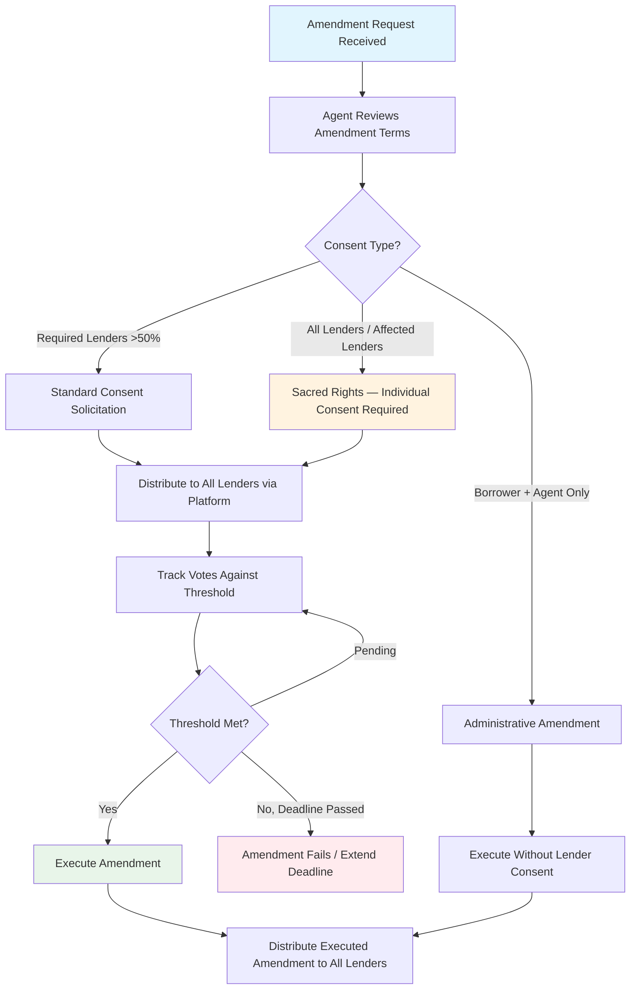
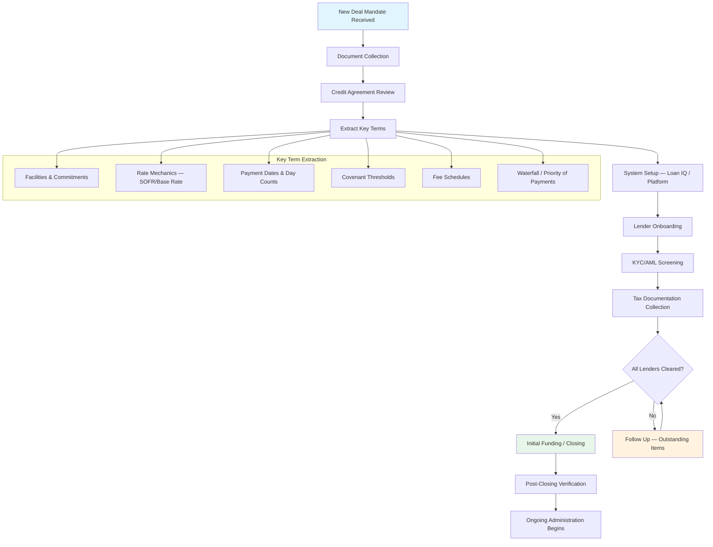

# Lifecycle Events, Agent Administration, and Operational Excellence

> *Document 6 of 6 — Loan Administration Knowledge Base*
> *This document is current as of February 16, 2026.*
> *Related documents: Doc 1 (Market Landscape & Loan Products, §§1–15); Doc 2 (Credit Agreement Interpretation, §§1–11); Doc 3 (Operational Mechanics, §§1–13); Doc 4 (Secondary Trading & Settlement, §§1–14); Doc 5 (Tax Withholding & Lender Onboarding, §§1–6)*

**This is the capstone document in the six-part knowledge base.** It assumes you have absorbed the foundational material from Documents 1–5 and are ready to integrate knowledge of agent roles, lifecycle events, regulatory constraints, and operational judgment into a working professional framework. Every section is designed to be independently useful as a reference. Where regulatory or legal developments are recent and potentially shifting, items are flagged with `[VERIFY: time-sensitive — reason]` or `[VERIFY: event-driven — reason]`. Jurisdiction-specific content is marked [US], [UK/EU], or [JURISDICTION-SPECIFIC].

---

## 1. Agent Roles and Responsibilities — A Deep Dive

### 1.1 The Administrative Agent (US) / Facility Agent (UK)

The administrative agent sits at the center of every syndicated loan. Think of this role as the operational nervous system of the deal: every payment, every notice, every rate calculation, and every trade flows through the agent. The term "Administrative Agent" is standard in LSTA (US) documentation; the equivalent under LMA (UK/EU) documentation is "Facility Agent." The functions are substantively identical, though the legal framework and specific contract language differ.

**Core functions include:**

**Payment processing.** The borrower makes all payments to the agent, who then distributes funds pro rata to lenders based on their respective shares. On a $500 million term loan with 30 lenders, the agent receives one wire from the borrower and sends 30 wires out — each calculated to the penny based on each lender's share of principal, interest, and fees. A single miscalculation ripples across the entire syndicate.

**Communication hub.** The agent is the single point of contact between borrower and lenders. Financial statements, compliance certificates, default notices, borrowing requests, and amendment proposals all flow through the agent. In practice, the agent maintains an online data platform (a "lender portal") where documents are posted and accessible to all syndicate members.

**Register maintenance.** The agent maintains the official register of lenders — a ledger recording each lender's name, address, commitment amount, and outstanding principal balance. This register is the authoritative record of who owns what. It is legally significant: under the Internal Revenue Code, maintaining a proper register is necessary for loans to qualify as "registered obligations" exempt from certain withholding taxes [US]. When a loan trades in the secondary market, the trade is not complete until the agent processes the assignment and updates the register.

**Rate setting and interest calculations.** For floating-rate loans (the vast majority of leveraged loans), the agent determines the applicable interest rate at the start of each interest period. Post-LIBOR transition, this typically means looking up Term SOFR (published by CME Group) and adding the contractual spread. The agent calculates accrued interest, applying the correct day-count convention (almost always Actual/360 for US dollar loans), checking any interest rate floor, and preparing funding notices. For current benchmark rate details, SOFR publication mechanics, and day-count conventions, see Doc 3, §§1–6.

**Trade settlement.** When lenders buy and sell loan participations or assignments in the secondary market, the agent processes the paperwork. An assignment requires an executed Assignment and Assumption (or Transfer Certificate in LMA deals), agent consent (if required), borrower consent (if required and no default exists), payment of an assignment fee (typically **$3,500** per assignment in the US market), and register update. US secondary loan trading volume reached a record **$971 billion in 2025**, so settlement processing is a high-volume, operationally intense function. (Source: LSTA Secondary Trading Data) [VERIFY: time-sensitive — trading volume figure is annual data that updates each year]

**Amendment and consent administration.** When the borrower seeks an amendment or waiver, the agent distributes the proposed language, tracks lender responses, confirms whether the required threshold has been met, and coordinates execution. For a broadly syndicated loan with 200+ lenders, this is a complex logistical exercise.

#### Agent protections — exculpation, indemnification, and reliance [US/UK/EU]

Credit agreements contain robust protections for the agent, reflecting the fundamental principle that **the agent is performing a ministerial, not fiduciary, role**. These protections include:

**Exculpation.** The agent has no liability to lenders except for its own gross negligence or willful misconduct. Both LSTA and LMA model provisions explicitly state the agent owes no fiduciary duties to lenders. The agent is not responsible for the creditworthiness of the borrower or the adequacy of collateral.

**Indemnification.** Lenders must indemnify the agent pro rata for any losses, expenses, or liabilities incurred in connection with the facility — except those resulting from the agent's gross negligence or willful misconduct. If the agent is sued by a third party in connection with its role, the lenders bear the cost proportionally.

**Reliance on documents.** The agent may rely on any document, notice, or communication it reasonably believes to be genuine and correct. The agent has no duty to independently verify borrower-provided information. If a compliance certificate says the borrower is in compliance, the agent is entitled to rely on that representation.

**Independent credit decision.** Each lender represents that it made its own independent decision to participate in the credit facility, without relying on the agent. This shields the agent from claims that it should have warned lenders about credit deterioration.

#### The "two hats" problem

In many deals, the administrative agent is also a lender — it "wears two hats." Standard LSTA and LMA language provides that the agent, in its capacity as a lender, has the same rights and powers as any other lender and may exercise them as though it were not the agent. The agent and its affiliates may conduct any business with the borrower without accounting to the other lenders.

This creates inherent tensions. The agent-as-lender may have information (from its commercial banking relationship) that it cannot or does not share with the syndicate. In distressed situations, the agent-as-lender may want different remedies than other lenders. The agent's lending desk may want to sell its position while the agency desk continues to administer the loan. **These conflicts are a primary driver of the growth of independent third-party agents**, particularly in restructuring situations where neutrality is essential.

#### Successor agent mechanics

An agent may resign at any time by giving notice to lenders and borrower (typically 30 days). Required Lenders can also remove the agent. Common triggers for resignation include: the agent has sold its lending position, conflicts of interest have emerged, the deal has become distressed and the agent is uncomfortable taking enforcement direction, or the economics no longer justify the administrative burden.

Upon resignation, Required Lenders (in consultation with the borrower, unless an Event of Default has occurred) appoint a successor. If no successor is appointed within the specified period, the resigning agent may appoint one. Independent third-party agents frequently step in as successor agents in distressed situations, bringing conflict-free expertise. Major independent agent providers include Alter Domus, Kroll (formerly Lucid Issuer Services), TMF Group, Ocorian, CSC, and SRS Acquiom.

#### Agent fees

Agent fees are typically negotiated in a separate fee letter between the agent and the borrower. Annual administrative agent fees for leveraged loans range from roughly **$25,000 to $150,000+** depending on deal complexity, number of lenders, and frequency of amendments. Collateral agent fees may be separate or bundled. These fees are payable regardless of whether the loan is performing — they compensate for the ongoing administrative burden.

---

### 1.2 The Collateral Agent (US) / Security Trustee (UK)

The collateral agent holds and manages the security interests that protect lenders if the borrower defaults. This role involves different legal structures depending on jurisdiction.

#### US model: collateral agent as agent [US]

In the US, the borrower grants a security interest to the collateral agent, who holds that interest as agent on behalf of the secured parties. The collateral agent is named as the secured party on UCC-1 financing statements, mortgages, and other security documents. The collateral agent's duties are ministerial: it acts only at the direction of Required Lenders (or as specified in an intercreditor agreement) and exercises no independent discretion.

Key responsibilities include:

**UCC filings.** The collateral agent files UCC-1 financing statements to perfect security interests in personal property. A standard UCC-1 has a **five-year duration** (UCC § 9-515). Continuation statements must be filed within the six-month window before expiration to maintain perfection. Missing this window has devastating consequences — the security interest becomes unperfected and is **deemed never to have been perfected** against purchasers for value, meaning the lender loses priority retroactively. The collateral agent must maintain rigorous tracking systems for all UCC filing expiration dates.

**Collateral release.** When collateral is sold or disposed of in accordance with the credit agreement (e.g., an asset sale permitted by covenants), the collateral agent releases the applicable security interest. Release is typically automatic for permitted dispositions, subject to conditions in the loan documents.

**Enforcement on lender instruction.** Upon an Event of Default, the collateral agent enforces security interests — foreclosing on collateral, exercising control over deposit accounts, or taking possession of pledged assets — but only at the direction of Required Lenders (or as specified in the intercreditor agreement). The collateral agent does not decide whether to foreclose; it executes what lenders direct.

#### UK model: security trustee on trust [UK/EU]

In the UK and other common law jurisdictions, security is held by a security trustee on trust for the benefit of all secured parties. Unlike the US agency model, the security trustee has genuine fiduciary duties to the beneficiaries (lenders), though credit agreements significantly limit and define those duties.

**The trust structure offers critical advantages for loan trading.** When a lender sells its loan in the secondary market, the security does not need to be transferred — it remains vested in the security trustee for the benefit of whoever holds the economic interest. This enormously simplifies secondary trading compared to a system where each lender would need separate security.

In civil law jurisdictions that do not recognize trusts (many continental European countries), a **parallel debt** mechanism is used. Under this structure, the outstanding debt is deemed independently owed to the security trustee, which creates a claim the trustee can enforce. The parallel debt reduces as actual payments are made to syndicate members. This is a drafting device to work around the absence of trust law — conceptually awkward but legally functional [JURISDICTION-SPECIFIC].

#### Intercreditor responsibilities

When a borrower has multiple layers of debt (first lien, second lien, mezzanine), the collateral agent operates within the framework of an intercreditor agreement (ICA). The ICA dictates the priority of claims, the circumstances under which junior creditors can take enforcement action (usually only after a standstill period), and how collateral proceeds are distributed (the "waterfall"). The collateral agent must follow the ICA waterfall precisely — paying first-lien claims before second-lien claims, and so on. For comprehensive analysis of intercreditor agreement structures and agent operational considerations, see Doc 2, §11.

---

### 1.3 Sub-agency, delegation, and third-party loan agents

For the organization this document serves — a third-party loan agent that is **not** a fund administrator — understanding both operating models is essential.

#### Model A: Named agent with direct obligations

In this model, the third-party firm is named directly in the credit agreement as the Administrative Agent, Collateral Agent, or both. The firm has a direct contractual relationship with the borrower and all lenders. It receives all protections (exculpation, indemnification, reliance) and bears all obligations specified in the loan documents.

This is the cleanest model from a legal clarity standpoint. The third-party agent is fully visible to all parties and stands behind its work product. It is also the model with the most significant liability exposure, offset by the contractual protections discussed above.

#### Model B: Sub-agent/delegate performing functions on behalf of an agent bank

In this model, the agent bank remains the named agent in the credit agreement, but delegates specific functions to the third-party firm. The delegation may cover payment processing, rate calculations, register maintenance, trade settlement, or all of the above. The sub-agent typically operates under a services agreement with the named agent, not under the credit agreement directly.

Key implications of this model: the sub-agent has no direct contractual relationship with lenders or borrower (unless separately established); the named agent remains ultimately responsible for the delegated functions; liability flows primarily through the services agreement; and the sub-agent may or may not be visible to lenders and borrower depending on how the arrangement is structured.

Credit agreements typically permit delegation. LSTA model language allows the agent to "perform any and all of its duties and exercise its rights and powers hereunder... by or through any one or more sub-agents appointed by the Agent." The agent remains responsible for its sub-agents as if it performed the work itself.

#### The escrow agent role

A third-party loan agent frequently serves as escrow agent on the same deal where it serves as administrative or collateral agent. The escrow agent holds funds (closing escrows, indemnity escrows, purchase price adjustments) under an escrow agreement until release conditions are satisfied. This role carries fiduciary-like duties specific to the escrow agreement: the escrow agent must follow release conditions precisely and cannot release funds absent proper authorization. Escrow disputes are among the most sensitive situations an agent encounters. For full escrow operational procedures, see §1.7.

#### Operational implications common to all models

Regardless of which hat the third-party agent wears on a given deal, certain operational imperatives apply:

The agent must maintain a meticulous deal file — the fully executed credit agreement and all amendments, the security documents, the intercreditor agreement, fee letters, assignment agreements, and all correspondence. This file is the agent's primary defense in any dispute.

Every calculation must be reproducible and auditable. Interest calculations, pro rata share determinations, and payment waterfalls should be documented step-by-step, not just as outputs.

Communication records must be comprehensive. Who was told what, when, and how. In a disputed amendment or a questioned payment, contemporaneous records are the agent's best friend.

---

### 1.4 Fiduciary Duty Framework: Understanding Your Legal Obligations

The firm simultaneously operates as administrative agent, collateral agent, and escrow agent — each role carries a different legal duty standard derived from a different source of law. Understanding these distinctions is critical because the protections available to you differ by role.

| Role | Duty Source | Legal Basis | Standard | Key Protection |
|------|-----------|-------------|----------|----------------|
| Administrative Agent | **Contractual** | Credit agreement §9/10 (LSTA model provisions) | Gross negligence / willful misconduct | Broad exculpation, reliance on certificates, no fiduciary duty |
| Collateral Agent | **Contractual + Statutory** | Credit agreement + UCC Article 9 (US) | Commercially reasonable conduct for collateral disposition | UCC safe harbors for foreclosure; contractual exculpation for administrative acts |
| Escrow Agent | **Common Law** | Quasi-fiduciary obligation as stakeholder | Strict compliance with release conditions | Limited — escrow agent cannot unilaterally release funds |
| UK Security Trustee | **Statutory** | Trustee Act 1925/2000, s.1 Trustee Act 2000 | Fiduciary duty of care and loyalty | Cannot fully exclude duty of care by contract (UCTA 1977 §3; UTTLTA 1999 §3) |
| Trust Company Agent | **Regulatory** | State banking law (e.g., NY Banking Law Art. III-A) | State-law fiduciary duty; regulatory examination | Charter-based protections; state oversight |

**Critical operational point:** When acting as BOTH administrative agent AND escrow agent on the same transaction — which is common — you operate under BOTH duty regimes simultaneously. The contractual exculpation that protects you as administrative agent (gross negligence/willful misconduct standard) does NOT extend to your escrow agent duties. As escrow agent, you must strictly comply with release conditions regardless of what any party instructs. If release conditions are ambiguous, you should interplead (deposit funds with a court and let the parties litigate) rather than make a judgment call.

**Administrative Agent exculpation (LSTA model provisions):**
The credit agreement typically provides that the agent: (a) has no duties or obligations except those expressly set forth in the loan documents, (b) may rely on communications, statements, and documents believed to be genuine, (c) may consult with legal counsel and is not responsible for advice given, (d) shall not be liable for any action taken or omitted in good faith absent gross negligence or willful misconduct, (e) is not deemed to have knowledge of any default unless notified in writing by a lender or the borrower. Each lender acknowledges it has independently made its own credit decision and will continue to do so.

**Escrow agent operational safeguards:**
- Never release escrowed funds without strict compliance with ALL stated release conditions
- When in doubt about whether conditions are satisfied, require written joint instructions from ALL relevant parties
- If parties disagree about whether release conditions are met, interplead — do not choose sides
- Document all communications regarding escrow releases meticulously
- Understand that escrow agent liability is personal — E&O insurance should specifically cover escrow operations

---

### 1.5 Lender Register: The Legal Record of Ownership

The register maintained by the administrative agent is the definitive legal record of loan ownership. It determines who receives payments, who votes on amendments, and who has standing as a lender under the credit agreement. Register errors can result in misdirected payments, incorrect vote tabulations, and agent liability.

**What the register must contain:**
For each lender: legal name, commitment amount (by facility), outstanding principal balance (by facility), contact information for notices, tax documentation status (W-9/W-8 form type and expiration), ERISA status (if applicable), Disqualified Lender status, and any special instructions (e.g., payment splitting, multiple accounts).

**When the register is updated:**
The register is updated upon ASSIGNMENT EFFECTIVENESS — not on trade date, not on settlement date, but on the date the assignment becomes effective under the credit agreement. For LSTA standard terms, effectiveness requires: (a) execution of the Assignment and Assumption agreement by assignor, assignee, and (where required) borrower or agent, (b) payment of the assignment processing fee (standard: $3,500 per LSTA MCAPs), and (c) recording by the agent. The agent should not record assignments until all conditions to effectiveness are satisfied, including receipt of required tax forms from the assignee.

**Register vs. trading records:**
ClearPar tracks trades (agreed but not yet settled). The register tracks ownership (settled and effective). A trade appears in ClearPar on trade date; it appears in the register only when the assignment is effective. The agent must reconcile these regularly — any persistent discrepancy between ClearPar position data and the register is a red flag requiring investigation.

**Legal significance:**
Under UCC Article 9 and most credit agreements, the register is conclusive absent manifest error. A party not recorded in the register is not a lender under the credit agreement — it has no right to receive payments, no right to vote, and no standing to enforce. This is why register accuracy is among the agent's highest-liability functions.

**Participations vs. assignments:**
Participations do NOT appear in the register. In a participation, the selling lender (grantor) retains its position in the register; the participant has a contractual relationship with the grantor, not with the borrower or agent. The agent deals only with registered lenders. This distinction matters for voting (only registered lenders vote), payment (agent pays registered lenders, who then pass through to participants), and KYC (agent must KYC assignees, not participants — but tax documentation requirements differ; see Doc 5, §2).

**Common register errors and their consequences:**
- Failing to update after assignment effectiveness → payments go to former lender → agent liability for misdirection
- Incorrect commitment amounts → wrong pro rata calculations for all payments → potential clawback issues
- Tax documentation expiration not tracked → withholding obligations triggered → agent liability under IRC §7701(a)(16)
- DQ list not cross-referenced → assignment to disqualified lender → borrower remedies triggered

---

### 1.6 Regulatory Status and Obligations for Third-Party Loan Agents

Understanding your firm's regulatory status is foundational to understanding which rules apply to your daily work. Third-party loan agents exist in several regulatory configurations, each carrying different obligations.

**What a non-trust-company, non-bank third-party agent IS:**
A contractual agent operating under the authority granted by credit agreements. The firm is appointed as administrative agent, collateral agent, and/or escrow agent through the loan documentation — its authority derives from contract, not from a banking charter or regulatory license. This means the firm is NOT a regulated financial institution under most federal banking laws, NOT a bank or trust company subject to OCC/FDIC/state banking examination, and NOT subject to the full suite of prudential regulations that govern bank-affiliated agents.

**Regulatory obligation triggers for non-chartered agents:**

*Payment processing and money transmission:*
Processing and distributing loan payments may trigger state money transmitter licensing (MTL) requirements. The analysis is state-specific. Key exemptions that may apply: the bank/trust company exemption under the CSBS Model Money Transmission Modernization Act (adopted in 31 states covering approximately 99% of transaction volume), the agent-of-payee exemption (the agent acts on behalf of the payee-lender, not the payor-borrower), and the payment processor exemption (the agent does not hold funds for transmission but processes payments as an intermediary). A formal MTL analysis should be conducted with counsel for each state in which the firm operates. [VERIFY: event-driven — CSBS MTMA adoption count may increase as additional states adopt]

*BSA/AML and KYC:*
Per the LSTA's longstanding position, administrative agents in syndicated loans are NOT 'financial institutions' under 31 USC §5312(a)(2) and are therefore NOT subject to Bank Secrecy Act requirements including Customer Identification Program (CIP), Currency Transaction Reporting (CTR), or Suspicious Activity Reporting (SAR) obligations. However, contractual KYC obligations in credit agreements typically EXCEED regulatory minimums — the agent is bound by whatever the credit agreement requires, even if regulatory law does not mandate it. In practice, institutional counterparties (banks, CLO managers, insurance companies) increasingly expect bank-equivalent KYC documentation regardless of the agent's regulatory status.

FinCEN's Customer Due Diligence (CDD) rule (31 CFR §1010.230) requiring beneficial ownership identification applies to 'covered financial institutions' — which does not include non-bank, non-trust loan agents. The February 2026 streamlining order (FIN-2026-R001) affects bank counterparties' verification processes but does not directly impose obligations on the agent.

*ERISA:*
If a lender in the syndicate is a plan asset vehicle (employee benefit plan or entity whose assets are treated as plan assets under DOL Regulation §2510.3-101), the agent may have fiduciary exposure. The 25% significant participation test determines whether an entity's assets are treated as plan assets — if 25% or more of any class of equity interests is held by benefit plan investors, the entity's underlying assets are plan assets. The agent should track plan asset status of lenders and understand the Prohibited Transaction Exemptions (PTEs) available, particularly PTE 84-14 (QPAM exemption) and PTE 96-23 (INHAM exemption). A breach that causes the agent to be treated as a fiduciary carries personal liability implications.

*Data security and operational compliance:*
SOC 2 Type II certification is effectively market-required for institutional loan agency — it is not a regulatory mandate but a counterparty expectation that functions as a de facto requirement. Institutional investors, arranging banks, and CLO managers typically require SOC 2 Type II reports as a condition of engagement. ISO 27001 certification provides additional credibility for cross-border operations. Cyber insurance and errors & omissions (E&O) coverage are standard expectations.

*Cross-border operations:*
If the firm administers facilities with UK or EU nexus, additional regulatory considerations arise. UK: the FCA may require authorization depending on the scope of activities (loan administration alone typically does not trigger authorization, but ancillary activities might). EU: the Credit Servicing Directive (2021/2167) applies to credit servicers for non-performing loans originated by credit institutions — standard performing loan agency is generally outside scope. Legal analysis suggests loan agency is likely exempt from CRD6 'lending' authorization requirements (Mayer Brown, DLA Piper), but the position is not definitively settled in all member states. For cross-border tax obligations, see Doc 5, §3.

**When entity status matters for future planning:**
Certain activities or client requirements may eventually necessitate a different entity structure:
- **Trust Indenture Act §310(b):** To serve as indenture trustee for publicly registered debt securities, the entity must be a bank, trust company, or corporation meeting specific capital requirements
- **CSBS MTMA coverage:** Trust company and bank charters provide automatic exemption from state MTL requirements in all adopting states
- **Institutional credibility:** Some arranging banks and institutional investors prefer or require agents with banking or trust company charters
- **Payment system access:** Direct access to Fedwire and other payment systems typically requires a banking charter or Federal Reserve master account

---

### 1.7 Escrow Agent Operations

A third-party loan agent frequently serves as escrow agent on the same deal where it serves as administrative or collateral agent. The escrow agent holds funds under an escrow agreement until release conditions are satisfied. This role carries fiduciary-like duties specific to the escrow agreement: the escrow agent must follow release conditions precisely and cannot release funds absent proper authorization. Escrow disputes are among the most sensitive situations an agent encounters.

**Types of escrows in loan transactions:**

*Closing escrows:* Hold purchase price or loan proceeds pending satisfaction of closing conditions. Release conditions are typically mechanical (receipt of all closing deliverables). These are the most common and least complex escrow arrangements.

*Indemnity escrows:* Hold a portion of transaction proceeds (typically 5-15% of purchase price) to secure the seller's indemnification obligations. Release conditions involve claims procedures, time-based releases (typically 12-18 months), and dispute resolution mechanics. The escrow agent must carefully track claim deadlines and release schedules.

*Purchase price adjustment escrows:* Hold funds pending final working capital or other post-closing financial adjustments. Release requires agreement between parties on the adjustment amount or an independent accountant's determination. These escrows can remain open for months while parties negotiate adjustments.

*Earn-out escrows:* Hold contingent consideration payable upon achievement of performance milestones. Release conditions are the most complex — they require verification of financial or operational metrics against defined targets. Disputes are common; the escrow agent should NOT attempt to determine whether earn-out conditions are satisfied (this is a quasi-judicial determination).

*Tax escrows:* Hold funds for tax-related contingencies (transfer taxes, tax indemnities, withholding amounts pending treaty documentation). Release conditions are tied to tax authority actions or documentation receipt.

*Environmental remediation escrows:* Hold funds earmarked for environmental cleanup obligations. Release typically requires environmental consultant certification and may be staged over multiple remediation phases.

**Release condition interpretation:**
Release conditions must be read literally. If the escrow agreement requires 'joint written instructions signed by authorized representatives of both parties,' then: a phone call is insufficient, an email may or may not qualify (check the definition of 'written'), a fax with one signature is insufficient, and a letter from counsel (rather than the party directly) may not qualify absent specific authorization language. When in doubt, insist on strict compliance. The cost of delay is far less than the cost of an improper release.

**Joint instruction requirements and dispute resolution:**
Most escrow agreements require joint instructions from the parties for release. If parties cannot agree:
1. The escrow agent should notify all parties that it cannot release funds absent joint instructions or a court order
2. If the dispute persists beyond a reasonable period (often defined in the escrow agreement as 30-60 days), the agent should consider interpleader — filing an action asking the court to accept the escrowed funds and determine the proper distribution
3. Interpleader protects the escrow agent from liability to either party
4. The escrow agent is typically entitled to deduct its fees and costs (including legal fees for the interpleader action) from the escrowed funds before depositing them with the court

**Investment of escrowed funds:**
Escrowed funds must be invested per the escrow agreement's permitted investments clause. Typically limited to: US Treasury obligations with maturities not exceeding 90 days, money market funds invested in Treasury or government agency obligations, FDIC-insured demand deposit accounts, and certificates of deposit. The escrow agent should NOT invest in anything not explicitly permitted. Interest earned is typically allocated per the escrow agreement (often to the depositing party, subject to tax reporting).

**Fee structures:**
Escrow agent fees include: acceptance fee (one-time, payable at closing), annual administration fee (payable during the escrow period), transaction fees (for each release, investment change, or amendment), and extraordinary fees (legal review, interpleader, tax reporting). Fees are typically borne by the borrower or split between parties per the escrow agreement.

**Resignation and successor mechanics:**
The escrow agent may resign upon notice (typically 30-60 days). The parties must appoint a successor within the notice period; if they fail to do so, the escrow agent may petition a court to appoint a successor or interplead the funds. The resigning agent's obligations continue until a successor accepts appointment and receives the escrowed funds.

**Relationship to the credit agreement:**
The escrow agreement is a separate document from the credit agreement, though they are related. The escrow agent's duties are defined by the escrow agreement, not the credit agreement. However, release conditions in the escrow agreement often reference credit agreement events (e.g., closing of a refinancing, satisfaction of a financial test). The agent must understand both documents to properly administer the escrow.

---

### 1.8 Agent Fee Structures and Billing

Understanding the economics of loan agency is essential for all roles — operations staff process and track fees, relationship managers negotiate them, engineers build billing systems, and product teams design service offerings.

**Fee categories:**

*Annual administrative agent fee:*
A flat annual fee paid by the borrower for the agent's ongoing administrative services. Market range for third-party agents: typically $25,000-$75,000 for straightforward BSL facilities, $75,000-$150,000+ for complex multi-tranche or private credit facilities, and $150,000-$500,000+ for large, complex transactions with multiple currencies, borrowing bases, or CLO-related requirements. Paid annually in advance, typically on the anniversary of the closing date. Not subject to pro rata sharing with lenders.

*Assignment processing fee:*
$3,500 per assignment is the LSTA MCAP-recommended standard (payable by the assigning or purchasing lender, per the credit agreement). This fee compensates the agent for processing the assignment documentation, performing KYC on the new lender, collecting tax forms, updating the register, and recalculating pro rata shares. Some credit agreements set different amounts or cap the fee.

*Amendment/consent processing fee:*
Fees for processing amendments, waivers, and consent solicitations. Not standardized — typically negotiated in the agent's fee letter. Range: $5,000-$25,000+ depending on complexity. Complex amendments involving multiple consent thresholds, sacred rights, or structural changes command higher fees.

*LC-related fees:*
The agent facilitates LC participation fee distribution but typically does not directly earn LC fees (these flow to the issuing bank and participating lenders). The agent's role is to track LC exposure, calculate participation shares, and distribute fees. Fronting fees (paid to the issuing bank) are typically 12.5-25 bps per annum.

*Commitment fee distribution:*
The agent accrues commitment fees on undrawn commitments and distributes them to lenders (typically quarterly in arrears). The agent's role is calculation and distribution — the fee itself is a lender revenue item, not an agent revenue item.

*Borrowing base administration fee:*
For ABL facilities requiring borrowing base monitoring: additional annual fee ($15,000-$50,000+) for processing monthly/weekly borrowing base certificates, tracking eligible collateral, and monitoring advance rates.

*Extraordinary fees:*
Fees for services outside the ordinary course: restructuring/workout administration, successor agent transition, significant document amendments, litigation support, or regulatory compliance beyond standard requirements. Typically charged hourly or as negotiated flat fees.

**Billing mechanics:**
- Annual fees: invoice on anniversary date (or quarterly in advance for some arrangements)
- Assignment fees: invoice upon assignment effectiveness
- Amendment fees: invoice upon completion of the amendment process
- The agent's fee letter (separate from and confidential to the credit agreement) governs the fee schedule
- Agent fees are FIRST in the payment waterfall — they are paid before any distribution to lenders

**Fee negotiation dynamics:**
Third-party agents compete on both price and service capability. Key considerations: (a) complex facilities with multiple currencies, tranches, or borrowing bases command higher fees; (b) distressed or restructuring situations typically trigger extraordinary fee provisions; (c) volume relationships (agent serves multiple facilities for the same sponsor or arranging bank) may support fee concessions; (d) the agent's fee must cover the operational cost of servicing — underpricing leads to under-servicing, which leads to operational risk.

---

## 2. Lifecycle Events — Amendments, Waivers, and Consents

Amendments are among the most operationally complex events in a loan's life. They require precise understanding of consent thresholds, meticulous tracking of lender responses, and careful execution mechanics.

### 2.1 Types of amendments and consent thresholds [US/UK/EU]

#### Required Lenders consent

Most amendments and waivers require consent of "Required Lenders" — typically defined as lenders holding more than **50%** of outstanding loans and unused commitments. Some deals (particularly club deals and European transactions) use a **66⅔% supermajority** threshold. This allows the borrower to modify terms without needing every lender to agree, which is essential for a broadly syndicated loan with dozens or hundreds of lenders.

The LSTA's Model Credit Agreement Provisions (MCAPs) — most recently finalized on May 1, 2023 (reposted with corrections July 8, 2024), with draft revisions published in February, April, and June 2025 — include updated Required Lender voting provisions that reflect lessons from recent amendment disputes.

#### Sacred rights — unanimity or affected lender consent

Certain fundamental protections cannot be modified without the consent of **every lender** (or every directly affected lender). These "sacred rights" exist because they protect each individual lender's core economic bargain. They typically include:

- **Payment terms.** No extension of any scheduled principal, interest, or fee payment date without the consent of each affected lender. No reduction or forgiveness of any amount payable.
- **Commitment increases.** No increase in any individual lender's commitment without its consent.
- **Pro rata sharing.** No change to the pro rata distribution of payments or collateral proceeds — the fundamental principle that every dollar is shared proportionally.
- **Voting thresholds.** No change to the definition of "Required Lenders" or the amendment provisions themselves.
- **Release of all or substantially all collateral.** This typically requires all-lender or supermajority consent.

The Serta Simmons, TriMark, and Incora cases (discussed in §4) revealed that gaps in sacred rights provisions could be exploited. In response, the market has developed several new protective provisions, including **"Serta blockers"** (restricting non-pro rata uptier transactions) and expanded sacred rights definitions that now cover situations having the "effect of" subordinating lenders, not just direct subordination actions. For the complete legal analysis of these developments, see Doc 2, §4.

#### The "affected lender" nuance

Some sacred rights require consent of "each lender directly and adversely affected" rather than all lenders. This matters when an amendment affects only one tranche — say, extending the maturity of a term loan B while leaving a term loan A untouched. Only term loan B lenders would need to consent. Determining which lenders are "affected" sometimes requires careful legal analysis.

### 2.2 Amendment mechanics [US/UK/EU]

**Simple amendment.** A document that modifies specific provisions of the credit agreement. Executed by borrower, agent, and the requisite number of consenting lenders. The amendment is attached to or incorporated into the existing credit agreement.

**Amendment and Restatement (A&R).** When changes are extensive — perhaps after multiple prior amendments have made the document unwieldy, or in connection with a fundamental restructuring — the entire credit agreement is restated in a single clean document incorporating all changes. A&Rs are common in refinancings, significant covenant modifications, and transactions where new lenders are entering the deal.

**Waiver.** A formal agreement that specified defaults "shall be deemed not to have occurred" for purposes of the loan documents. A waiver is narrower than an amendment: it forgives a specific breach but does not change the underlying covenant going forward. If the borrower violates the same covenant next quarter, it needs a new waiver.

**Consent.** A one-time permission for a specific action — for instance, permitting a particular acquisition that would otherwise violate the investment covenant. Unlike a waiver (which addresses a past breach) or an amendment (which changes terms going forward), a consent authorizes a discrete act.

**Forbearance agreement.** The lenders agree to refrain from exercising remedies for a defined period despite acknowledged defaults. Forbearance is not a waiver — the defaults remain outstanding, and the lenders retain their rights to act once the forbearance period expires. Forbearance agreements typically include borrower acknowledgments of the debt, additional fees, tighter covenants, and enhanced reporting. They are a tool of the workout process (discussed in §4).

### 2.3 Consent fees and operational mechanics [US]

Lenders typically receive a **consent fee** for approving amendments, particularly those that benefit the borrower (such as covenant relief). Market practice ranges from **5 to 25 basis points** of the consenting lender's commitment, though fees are higher in distressed situations. The fee is structured as an incentive: only lenders who consent by the deadline receive the fee.

**Worked example — consent solicitation process:**

A borrower with a $750 million term loan (40 lenders) wants to amend its leverage covenant from 5.0x to 5.5x. Required Lenders threshold is 50%.

1. Borrower's counsel drafts the amendment. Agent reviews for form and consistency.
2. Agent distributes the proposed amendment to all 40 lenders via the lender portal, along with a consent form and deadline (typically 5–10 business days for routine amendments; longer for complex ones).
3. As consents come in, the agent tracks responses against each lender's commitment. The agent needs lenders holding at least $375 million (50% of $750 million) to consent.
4. If lenders holding $400 million consent, the threshold is met. The agent confirms effectiveness, distributes the executed amendment, and processes consent fees.
5. The agent updates its systems to reflect the new covenant level and adjusts compliance monitoring accordingly.

For a large, broadly syndicated deal, tracking consents from 100+ lenders — each with potentially different contact information, internal approval processes, and signing authority — is a significant operational exercise. Technology platforms help, but the agent must ultimately confirm every signature is authorized and every calculation is correct.

### 2.4 Electronic Consent Collection

Modern consent solicitations are increasingly managed through dedicated platforms that provide workflow automation, audit trails, and deadline management:

**Primary platforms:**
- **Debt Domain** (part of Donnelley Financial Solutions/DFIN): Widely used for document distribution, consent solicitation, and data room management in syndicated loan transactions
- **SyndTrak** (S&P Global): Integrated with the broader S&P loan ecosystem (ClearPar, WSO); used for consent tracking and lender communications
- **Intralinks** (SS&C Technologies): Originally a virtual data room platform, now offers consent management and lender communication features
- **S&P Global AmendX** (launched March 3, 2026): Purpose-built amendment processing platform designed specifically for consent solicitation workflows, integrating with Debt Domain for document management [VERIFY: event-driven — AmendX launched recently; verify adoption and feature set]

**Operational workflow:**
1. Agent uploads amendment documentation to the platform and sets consent deadline
2. Platform distributes to all lenders with voting rights (filtered by the consent threshold and any excluded lenders)
3. Authorized signatories are verified against the agent's records (important: only authorized signatories' votes count)
4. Lenders submit consent/rejection through the platform
5. Agent tracks voting progress against the required threshold in real time
6. Platform maintains a complete audit trail of all communications and votes
7. Upon achieving the required consent threshold, agent processes the amendment
8. Agent distributes executed amendment to all lenders (consenting and non-consenting)

**Record retention:**
All consent solicitation records — including vote tabulations, communications with lenders, and signed consents — should be retained for the life of the facility plus a minimum of 7 years (consistent with general commercial record retention; longer if required by the credit agreement or applicable regulations).

---

## 3. Refinancings and Repricings

### 3.1 Distinguishing refinancing, repricing, and extension [US]

These three transactions accomplish different economic objectives through different mechanics:

**Repricing** reduces the borrower's interest cost without fundamentally changing the loan structure. The borrower typically amends the existing credit agreement to reduce the spread over SOFR, or issues new incremental loans at a lower spread and uses proceeds to repay the existing higher-spread loans within the same documentation. Repricings became the dominant transaction type in 2024, when approximately **$757 billion** in US leveraged loans were repriced — a record driven by strong CLO demand, tight secondary spreads, and a benign credit environment. (Source: PitchBook LCD) [VERIFY: time-sensitive — repricing volume is annual data that updates each year]

**Refinancing** replaces existing debt with entirely new debt — new credit agreement, new lender group (potentially), new closing process. A refinancing is used when the borrower wants more fundamental changes: a different structure, different collateral package, or a materially different lender base.

**Amend-and-extend (A&E)** pushes out the maturity date within the existing documentation framework. Individual lenders opt in or opt out. Non-extending lenders keep their original terms (and original maturity), creating a new tranche of extended loans alongside the original non-extended tranche. Many modern credit agreements include **pre-wired A&E provisions** that set out the mechanics in advance, reducing the need for a full amendment process.

### 3.2 Soft call protection and its operational implications [US]

Most term loan B facilities include a **"soft call"** or "repricing premium" provision requiring the borrower to pay a **1% premium** if the loan is repriced or refinanced within a specified period — typically 6 months to 1 year from closing. Borrowers routinely reprice the day after call protection expires, making this date operationally significant.

**Worked example:** A $500 million term loan B closes on March 1, 2026, with a 6-month soft call. The call protection expires on September 1, 2026. If the borrower reprices on August 31, it owes a 1% premium ($5 million). If it waits until September 1, no premium is owed. The agent must track these dates and ensure that any repricing transaction correctly accounts for the call protection.

### 3.3 Secondary market pricing drives repricing activity [US]

**The relationship between secondary trading levels and repricing activity is direct and powerful.** When a loan trades above par in the secondary market, it signals that investors are willing to accept a lower yield than the loan currently offers — creating a clear opportunity for the borrower to reprice.

In 2024, persistent demand from CLO issuance (which reached record levels globally) created a supply shortage estimated at **$192 billion**. This pushed secondary prices above par for many performing loans, and borrowers responded with an unprecedented wave of repricings. Almost **60% of outstanding US leveraged loans were repriced** during the year, compressing spreads by roughly **60 basis points**. Only about **10% of total 2024 leveraged loan volume** represented genuine new money — the rest was refinancing, repricing, and extension activity. (Source: PitchBook LCD; S&P Global) [VERIFY: time-sensitive — repricing activity data is annual and updates each year]

For a loan administrator, repricing transactions generate significant operational work: processing paydowns of old tranches, booking new tranches, updating rate schedules, recalculating pro rata shares, and in some cases processing assignment paperwork as non-participating lenders exit and new lenders enter.

---

## 4. Defaults, Workouts, and Restructuring

This section covers the loan lifecycle when things go wrong — from the first signs of borrower stress through formal bankruptcy. For a third-party agent, the stakes rise dramatically in distressed situations. Mistakes become more consequential, communication becomes more sensitive, and the legal framework becomes more complex.

### 4.1 Default identification and the critical distinction [US/UK/EU]

**A "Default" (or "Potential Event of Default") is not the same as an "Event of Default."** This distinction matters enormously:

A **Default** is an event that, with the giving of notice, lapse of time, or both, would become an Event of Default. Common examples: the borrower misses a financial covenant by a small margin but has a 30-day cure period; the borrower fails to deliver financial statements by the due date but has a grace period. During a Default, the borrower is typically restricted from making new borrowings under the revolving facility, but lenders cannot accelerate the loan or enforce collateral.

An **Event of Default** is a fully crystallized breach — the grace period has expired, the cure period has lapsed, or the event is of a type that triggers immediately (such as a bankruptcy filing). Only upon an Event of Default can Required Lenders direct the agent to accelerate the loan (declare all amounts immediately due and payable) and enforce collateral.

**Standard Events of Default include:** non-payment (usually with a 3-business-day grace period for interest; no grace period for principal in many deals); breach of financial covenants (after any cure period); breach of other covenants; cross-default (default on other material debt); material misrepresentation; insolvency or bankruptcy filing; material judgments; invalidity of security interests; and change of control.

**The "continuing" default concept.** If the credit agreement requires a default to be "continuing" before remedies can be exercised, a cured default cannot be the basis for acceleration. But if the agreement does not use "continuing" language, a default that occurred and was later cured may still technically support acceleration unless formally waived. This seemingly minor drafting point has been litigated repeatedly.

### 4.2 Default notification procedures [US/UK/EU]

The borrower is typically required to promptly notify the agent of any Default or Event of Default. The agent distributes the notice to all lenders. **The agent has a limited, ministerial role here** — it passes along information but does not independently investigate or make credit judgments.

However, the agent must be attentive. If information available to the agent (such as missed payments, late financial deliverables, or public reporting) suggests a default may exist, the agent has an obligation to act within its contractual duties. The precise scope of this obligation has been debated in litigation. Prudent practice: if the agent identifies something that looks like a potential default, escalate internally, document the observation, and consider whether the credit agreement requires action.

### 4.3 The workout spectrum

When a borrower enters financial distress, the path forward typically follows one of several tracks:

#### Forbearance

The first step in many workouts. Lenders agree to refrain from exercising remedies for a defined period (typically 30–90 days, sometimes longer) while the borrower develops a restructuring plan. The forbearance agreement typically includes: borrower acknowledgment that specified defaults exist; borrower waiver of any defenses or claims against lenders; enhanced financial reporting; additional fees to lenders; sometimes additional collateral or guarantees; tight milestones the borrower must meet; and a "termination trigger" allowing lenders to end forbearance immediately if the borrower fails to perform.

In a syndicated credit, forbearance from non-payment defaults generally requires Required Lender consent. Forbearance from payment defaults may require the consent of all affected lenders, depending on how the credit agreement is drafted.

#### Out-of-court restructuring

If the parties can agree, the loan is restructured without a bankruptcy filing. Common restructuring tools include: maturity extension, interest rate reduction, covenant relief, debt-for-equity conversion, additional equity contribution from the sponsor, amortization reduction, and PIK (payment-in-kind) toggles that allow interest to accrue rather than be paid in cash.

**Tax trap for administrators [US]:** For loans that are regularly traded on an established market, a significant modification of terms (as defined under Treasury Regulations) may be treated as a deemed exchange of the old loan for a new loan. This can create cancellation-of-debt income for the borrower and affects lenders' tax basis. The agent should ensure that tax counsel has reviewed any significant restructuring.

#### Liability management transactions — operational implications for agents [US]

Liability management transactions (LMTs) have become the dominant form of restructuring activity, accounting for **69% of the default count** in the trailing 12-month period as of December 2024. (Source: Octus/Covenant Review) [VERIFY: time-sensitive — LMT percentage updates with new default data] These transactions — uptier exchanges, dropdown financings, and "double dip" structures — allow a subset of lenders to improve their position at the expense of non-participating lenders.

**For the agent, LMTs are operationally treacherous.** Uptier transactions create new tranche structures with superpriority layers that the agent must build into payment waterfalls, increasing waterfall complexity significantly. The agent faces a fundamental neutrality challenge: it may be asked to cooperate with the borrower in executing an LME while simultaneously owing contractual duties to all lenders — including those being subordinated. Consent solicitations for anti-LME blockers (Serta blockers, J.Crew blockers, expanded sacred rights) add significant operational burden, as each blocker may have different consent thresholds and affected-lender definitions that must be tracked precisely. Post-Serta structures such as "extend-and-exchange" transactions and direct amendments to assignment provisions require careful analysis of which sacred rights are implicated. An independent third-party agent is often in the best position to navigate these conflicts neutrally. For the complete legal analysis of Serta, Incora, and other landmark LME decisions, see Doc 2, §4.

### 4.4 Bankruptcy: Chapter 11 basics for loan administration [US]

When an out-of-court solution fails, the borrower may file for Chapter 11 bankruptcy protection. For the loan agent, this fundamentally changes the operating environment.

**The automatic stay** (Bankruptcy Code § 362) immediately prohibits all collection efforts, enforcement actions, and creation of liens against the debtor. The agent cannot accelerate the loan, enforce collateral, or setoff accounts without court permission.

**The agent's role shifts.** The agent becomes primarily a communication conduit and claims administrator. Key responsibilities include: filing proofs of claim on behalf of the syndicate; maintaining records of each lender's claim amounts; distributing information from the debtor and the bankruptcy court to lenders; processing any court-ordered payments; and coordinating with counsel to the lender group.

**DIP (Debtor-in-Possession) financing** is typically the first order of business in a Chapter 11 case. The debtor seeks court approval to borrow new money to fund operations during bankruptcy. DIP financing carries **super-priority status** — it must be repaid before nearly all other claims.

Current market terms for DIP financing are notably expensive. Interest rates on DIP facilities in 2024–2025 generally ranged from **12% to over 17%**, with fee structures sometimes exceeding **20% of the facility amount** when commitment fees, backstop fees, exit fees, and other charges are aggregated. A defining trend is the **roll-up DIP**, where pre-petition debt is converted into DIP obligations with super-priority status. In early 2025, roughly **62% of DIP facilities included roll-up components**, and in most cases the roll-up amount exceeded the new money. (Source: Debtwire; Reorg) [VERIFY: time-sensitive — DIP market terms and roll-up percentages update with new bankruptcy filings]

**Priming liens.** Under § 364(d), the court can authorize DIP liens senior to existing pre-petition liens if: (1) the debtor cannot obtain financing otherwise, and (2) existing lenders receive **adequate protection**. Adequate protection (§ 361) may include: periodic cash payments, replacement liens on other assets, or an equity cushion in the collateral. Whether adequate protection is truly "adequate" is one of the most fiercely litigated issues in Chapter 11.

**Adequate protection payments** are ongoing payments to pre-petition secured lenders during bankruptcy, compensating them for any decline in collateral value. They are typically structured as current interest payments — often at the non-default contract rate, though lenders frequently argue for the default rate.

**Claims administration.** The agent files proofs of claim for the entire syndicate, but each lender is ultimately responsible for ensuring its claim is properly documented. Upon emergence or liquidation, the agent distributes recovery proceeds according to the credit agreement waterfall and applicable bankruptcy orders.

---

## 5. Rate Conversions and Benchmark Transitions

### 5.1 Interest period mechanics [US]

Most leveraged loans bear interest at a floating rate — a benchmark rate plus a fixed spread (margin). The borrower selects an interest period (typically 1 month or 3 months) at the start of each period. At the end of the period, the borrower can "roll" into a new period at the then-current benchmark rate.

**Worked example:** A $100 million term loan bears interest at Term SOFR + 300 basis points, with a 1.00% SOFR floor. The borrower selects a 1-month interest period starting February 1. On that date, 1-month Term SOFR is 4.25%.

- Applicable rate: max(4.25%, 1.00%) + 3.00% = **7.25%**
- Day count: Actual/360
- February has 28 days, so the interest for this period is: $100,000,000 × 7.25% × (28/360) = **$563,889**

The agent calculates this amount, sends a funding notice to the borrower, collects payment, and distributes pro rata to lenders.

**Rate conversions** occur when the borrower switches from one rate type to another — for instance, from Term SOFR to a base rate (prime-based rate) loan. Base rate loans carry higher spreads but allow prepayment without breakage costs. The agent must process the conversion, calculate any interest due on the expiring period, and begin accruing at the new rate.

### 5.2 The LIBOR-to-SOFR transition and current SOFR conventions [US]

The LIBOR-to-SOFR transition, completed June 30, 2023, required replacement of legacy LIBOR references with SOFR plus credit spread adjustments (CSAs) codified under the ARRC framework. The CSA values — ranging from 11.448 bps for one-month to 71.513 bps for twelve-month — are now embedded in virtually all converted facilities and remain relevant for understanding the basis between legacy and replacement economics. For the complete CSA table, SOFR publication mechanics, and rate convention details, see Doc 3, §§1–6.

### 5.3 Current SOFR conventions [US]

**Term SOFR** (published by CME Group) is the dominant rate in the US syndicated loan market. It is a forward-looking term rate derived from SOFR futures, published in 1-, 3-, 6-, and 12-month tenors. It functions like LIBOR did — the rate is known at the start of the interest period, which simplifies operational processes.

**Daily Simple SOFR** applies the daily SOFR rate without compounding. The rate is not known until the end of the interest period, requiring a lookback mechanism (typically 2–5 business days) so that payments can be calculated in advance.

**Daily Compounded SOFR** applies daily compounding on top of the daily rate. More theoretically precise but operationally more complex. Less common in the loan market than Term SOFR.

**Key conventions:** Business day convention is "Modified Following" (if a payment date falls on a non-business day, it moves to the next business day unless that crosses a month boundary, in which case it moves to the preceding business day). Day count is **Actual/360** for US dollar loans. Interest rate floors apply to the SOFR component only for new originations; for legacy fallback contracts, floors applied to SOFR plus the CSA. For detailed rate values, publication schedules, and calculation worked examples, see Doc 3, §§1–4.

### 5.4 Benchmark replacement provisions for future transitions [US/UK/EU]

Modern credit agreements include **hardwired benchmark replacement provisions** that provide an automatic mechanism for replacing the reference rate if a benchmark cessation or non-representativeness event occurs. The standard fallback waterfall is:

1. Term SOFR (if available)
2. Daily Simple/Compounded SOFR
3. A rate selected by the agent in consultation with the borrower, subject to Required Lender negative consent (lenders can object within a specified window, typically 5 business days)

The alternative "amendment approach" gives the agent authority to negotiate and agree on a new benchmark with the borrower, subject to Required Lender negative consent. This is more flexible but creates more operational work.

**Lesson for future transitions:** The LIBOR transition taught the market that early preparation, standardized documentation, and clear fallback mechanics are essential. The ARRC's work on recommended conventions and the LSTA's model language provided the templates. Any future benchmark disruption (however unlikely for SOFR, which is based on a deep, liquid treasury repo market) would follow a similar playbook.

---

## 6. Regulatory Landscape

### 6.1 United States regulatory framework [US]

#### Dodd-Frank Act and the Volcker Rule [US]

The Dodd-Frank Act (2010) created the post-crisis regulatory architecture. The Volcker Rule (Section 619 of Dodd-Frank, codified at 12 U.S.C. § 1851) restricts banks from proprietary trading and limits their relationships with hedge funds and private equity funds — including CLOs.

The Volcker Rule has been significantly relaxed through successive amendments. The "Volcker 2.0" amendments (effective January 2020) simplified compliance by tiering banks based on trading activity. The more consequential **"Volcker 2.1" amendments** (effective October 2020) addressed CLOs specifically: CLOs may now hold up to **5% of assets in non-loan debt securities** (the "bond bucket"), and "for cause" removal rights in CLO documents are no longer treated as "ownership interests" that would trigger the covered fund rules. This means banks can freely invest in senior CLO tranches — a critical development for CLO market liquidity.

No additional Volcker Rule amendments have been finalized under the current administration as of early 2026, but the broader deregulatory posture makes further tightening extremely unlikely. [VERIFY: event-driven — monitor for any new rulemaking under current administration]

#### Interagency Leveraged Lending Guidance — rescinded [US]

In a **major development on December 5, 2025**, the OCC and FDIC jointly **rescinded** the 2013 Interagency Guidance on Leveraged Lending. This guidance, which had set a de facto **6x leverage ceiling** and required demonstration that borrowers could repay at least 50% of total debt within 5–7 years, had been a defining constraint on bank leveraged lending for over a decade. (Source: OCC/FDIC Joint Statement, December 5, 2025)

The Government Accountability Office (GAO) had previously determined that the 2013 Interagency Leveraged Lending Guidance constituted a 'rule' under the Congressional Review Act that had never been submitted to Congress as required — providing additional legal basis for the rescission.

The agencies stated the guidance was "overly restrictive," impeded banks' application of general risk-management principles, and contributed to banks losing market share to non-bank lenders. The replacement framework is **principles-based**: eight general principles covering risk appetite, underwriting standards, and lifecycle monitoring, without prescriptive leverage thresholds.

**The Federal Reserve has not yet formally withdrawn from the 2013 guidance**, though it is widely expected to follow. For institutions supervised by the Fed, the guidance technically remains in effect but practical enforcement had already weakened considerably. [VERIFY: event-driven — confirm whether Fed has withdrawn as of your reading date]

The rescission, combined with a more capital-neutral approach to Basel III, is expected to bring some leveraged lending activity back onto bank balance sheets — though private credit's structural advantages (speed, flexibility, fewer regulatory constraints) mean the shift to non-bank lending is unlikely to fully reverse.

#### Basel III/IV Endgame — delayed and reduced [US]

The original July 2023 proposal would have increased aggregate bank capital requirements by approximately **16%**. That proposal is effectively dead. Under the current administration, Fed Vice Chair for Supervision Michelle Bowman announced in August 2025 that a new, "industry-friendly" re-proposal would come in early 2026, and it is expected to be approximately **capital-neutral**. [VERIFY: event-driven — monitor for re-proposal publication]

The practical impact on the loan market: stricter capital rules were a primary driver of the shift from bank to non-bank lending. Corporate private credit fund AUM sits at approximately **$1.7–2 trillion** (Preqin narrow measure), while the comprehensive market approaches **$3–3.5 trillion**. A capital-neutral approach may moderate this shift but will not reverse the structural growth of private credit. (Source: Preqin; Bloomberg; industry estimates)

#### CLO risk retention: LSTA v. SEC [US]

In *Loan Syndications & Trading Ass'n v. SEC*, 882 F.3d 220 (D.C. Cir. 2018), the D.C. Circuit held that **open-market CLO managers are not "securitizers"** under Section 941 of Dodd-Frank and therefore **are not required to retain 5% of credit risk**. The court reasoned that CLO managers do not transfer assets to the CLO — they select assets for purchase in arm's-length market transactions.

The government chose not to appeal, and **this ruling remains in full force**. It applies to open-market CLOs (where the manager buys assets in the secondary market) but not to balance-sheet CLOs (where an originator transfers its own loans to the securitization vehicle). This creates a significant transatlantic asymmetry with EU rules (discussed below).

For agents servicing cross-border CLO portfolios, the EU-US asymmetry creates operational complexity: EU risk retention rules (Article 6, Securitisation Regulation) still require a 5% retention and due diligence obligations on EU institutional investors, meaning a CLO marketed to both US and EU investors must comply with the more restrictive EU framework even after the US rule's invalidation.

#### SEC regulation of loan funds [US]

The SEC's Liquidity Risk Management Rule (Rule 22e-4), adopted in 2016 and amended in 2018, governs open-end mutual funds and ETFs that hold bank loans. Key requirements: each portfolio investment must be classified into one of four liquidity categories; funds must maintain a **highly liquid investment minimum**; and no more than **15% of assets may be illiquid**. Bank loans, which typically settle T+7 or longer, sit at the "lower end of the liquidity spectrum." (Source: SEC Rule 22e-4; SEC guidance, August 2024)

The current SEC under Chair Paul Atkins has taken a deregulatory approach. **Mandatory swing pricing** — which would have required funds to adjust NAV for redemption costs — was never adopted and is effectively dead. Monthly N-PORT public reporting amendments have been **delayed to November 2027**. [VERIFY: event-driven — monitor for any changes to N-PORT timeline]

#### Corporate Transparency Act and beneficial ownership reporting [US]

The Corporate Transparency Act's BOI reporting requirements were effectively suspended for domestic companies by FinCEN's March 2025 interim final rule, though the Eleventh Circuit upheld the CTA's constitutionality in December 2025, leaving open the possibility of future reinstatement. CDD beneficial ownership requirements remain fully in force; FinCEN's February 13, 2026 Order FIN-2026-R001 provides welcome relief from per-account re-verification requirements. For the complete CTA litigation timeline, current FinCEN guidance, and operational KYC/AML requirements, see Doc 5, §§4–5.

### 6.2 UK/EU Regulatory Developments Affecting Agent Operations [UK/EU]

This section focuses on UK/EU regulatory developments with direct operational impact on agent functions — particularly for agents servicing cross-border facilities, multi-currency deals, or CLO portfolios. Regulatory developments primarily affecting consumer lending or bank prudential capital are noted briefly where they may indirectly affect agent operations.

#### EU Securitisation Regulation — risk retention [UK/EU]

Under **Article 6 of Regulation (EU) 2017/2402**, the originator, sponsor, or original lender of any securitization must retain a material net economic interest of **not less than 5%** on an ongoing basis. Unlike the US (where open-market CLO managers are exempt), this requirement applies to **all CLOs** with EU nexus.

The five permitted retention methods are:

1. **Vertical slice** — 5% of each tranche
2. **Horizontal (first loss)** — a first loss piece of at least 5%
3. **Randomly selected exposures** — equivalent to 5% of total pool
4. **Revolving exposures** — originator's interest of at least 5%
5. **First loss exposure in each exposure** — at least 5% of each securitized exposure

A significant recent development: the ESAs' Joint Committee Report (March 31, 2025) reinterpreted the "sole purpose test" to mean no more than **50% of an originator's income** should derive from securitized exposures, causing some CLO issuance to pause temporarily. Existing CLOs are grandfathered. [VERIFY: event-driven — monitor for final regulatory text implementing the Joint Committee Report]

#### EU Benchmarks Regulation [UK/EU]

The EU Benchmarks Regulation (BMR) was substantially amended effective January 1, 2026. The amended regulation now applies only to **critical and significant benchmarks** (those referenced by at least **€50 billion** in financial instruments), reducing the number of administrators in scope by an estimated 80–90%. **EURIBOR** remains the only benchmark designated as "critical" under ESMA supervision and continues as the primary floating-rate benchmark for euro-denominated syndicated loans. **€STR** (Euro Short-Term Rate), published by the ECB, serves as the risk-free rate fallback.

#### UK Motor Finance Commission / FCA Consumer Duty [UK]

The UK Supreme Court's ruling in *Hopcraft v Close Brothers; Johnson v FirstRand* [2025] UKSC 33 (August 1, 2025) largely overturned the Court of Appeal's motor finance commission decision. The FCA subsequently proposed an industry-wide consumer redress scheme (CP25/27) with estimated industry costs of £9–18 billion. **For agents:** this may affect lender provisioning and financial reporting for institutions with motor finance exposure — agents administering facilities for such lenders should monitor borrower compliance certificates for disclosure of related provisions. [VERIFY: event-driven — confirm whether FCA final rules have been published]

The FCA Consumer Duty is primarily aimed at consumer-facing firms. Its relevance to syndicated loan agency is limited, though it may have downstream effects where CLO ETF distribution chains include retail investors. [VERIFY: event-driven — monitor FCA guidance on wholesale market application]

#### EU AML Regulation (AMLR) and AMLA [UK/EU]

The EU adopted a comprehensive new **AML Package** in May 2024. The centerpiece is the **AML Regulation (AMLR — Regulation (EU) 2024/1624)**, a directly applicable "single rulebook" replacing the patchwork of national transpositions under previous directives. It applies from **July 10, 2027**. The new **EU Anti-Money Laundering Authority (AMLA)**, based in Frankfurt, commenced operations on **July 1, 2025**, and will begin direct supervision of **40 high-risk cross-border entities** from January 1, 2028. Key features include harmonized CDD requirements, a beneficial ownership threshold of **25%** (with a possible 15% threshold for high-risk sectors), and "perpetual KYC" requiring at least annual updates for high-risk clients. [VERIFY: time-sensitive — confirm AMLA operational timeline]

**For agents:** The harmonized CDD requirements will affect counterparty documentation expectations — EU-regulated lenders entering syndicates will increasingly apply the AMLR standard to their own KYC of the borrower and may expect agents to support this through standardized documentation packages.

#### UK Withholding Tax Rate Change [UK]

The UK income tax basic rate on interest payments increased from 20% to **22%** effective April 6, 2025, with corresponding implications for treaty rate calculations and gross-up provisions on facilities with UK-source interest payments. For the complete UK withholding tax framework and operational implications, see Doc 5, §3.

#### MiFID II and the loan market [UK/EU]

**Syndicated loans are generally not "transferable securities" under MiFID II** and therefore fall outside its regulatory perimeter. They are not freely negotiable on capital markets, not standardized in the required manner, and not distributed to the general public. However, CLO notes (the securitized output of the loan market) **are** transferable securities and are subject to MiFID II requirements. The LMA maintains the position that traditional syndicated loans are outside MiFID II's scope, and no recent regulatory changes have altered this.

#### Post-Brexit Regulatory Divergence [UK]

Post-Brexit regulatory divergence is accelerating. Under the Financial Services and Markets Act 2023, the UK is progressively replacing retained EU law with domestically tailored PRA and FCA rules. The UK's statutory "competitiveness and growth" secondary objective for regulators signals a more flexible approach than the EU.

### 6.3 Cross-border requirements [US/UK/EU]

#### AML/KYC framework

**US [US]:** The Bank Secrecy Act, USA PATRIOT Act, and FinCEN Customer Due Diligence Rule require financial institutions to maintain Customer Identification Programs (CIP), Customer Due Diligence (CDD) procedures, ongoing monitoring, SAR filing, and AML compliance programs. The **Anti-Money Laundering Act of 2020** modernized the BSA framework and enhanced whistleblower protections.

**UK [UK]:** The UK Money Laundering Regulations (MLR 2017, as amended) implement AML requirements domestically. Post-Brexit, the UK framework is diverging from EU rules but maintains substantively similar CDD, ongoing monitoring, and reporting obligations.

For the complete operational KYC/AML framework applicable to loan agent onboarding, see Doc 5, §§4–5.

#### Sanctions screening (OFAC, EU, UK) [US/UK/EU]

**OFAC sanctions compliance** is a critical function for any loan agent handling US-dollar payments or dealing with US persons [US].

**Statute of limitations:** The statute of limitations for OFAC civil enforcement doubled from 5 years to **10 years** under H.R. 815 (signed April 24, 2024). The extension applies retroactively to violations occurring after April 24, 2019.

**Recordkeeping requirements:** OFAC extended its recordkeeping requirement to **10 years** (from 5 years) through an interim final rule published in September 2024, effective March 12, 2025. Agents must retain all sanctions screening records, blocked property reports, and transaction documentation for a minimum of 10 years.

Civil penalties can reach **$377,700 per violation (or twice the transaction amount, whichever is greater)** under IEEPA. (Source: OFAC; 31 CFR Part 501; 90 FR 2867, January 15, 2025) [VERIFY: time-sensitive — OFAC civil penalty amounts are adjusted annually for inflation; verify current amount at ofac.treasury.gov]

The agent must screen against the SDN List and all consolidated sanctions lists at onboarding, at each payment, and whenever lists are updated. Re-screening against updated lists is essential — not just one-time onboarding checks. In 2024–2025, Russia remained the dominant sanctions focus, though the current administration has increased attention to Iran and designated drug cartels as Foreign Terrorist Organizations. Syria sanctions were removed effective July 1, 2025. [VERIFY: event-driven — sanctions designations change frequently; verify current country programs]

EU and UK maintain their own sanctions regimes, which may overlap with but differ from US sanctions. A loan agent operating cross-border must screen against all applicable regimes — US, EU, UK, and potentially others depending on the jurisdictions involved. For detailed sanctions screening operational procedures and vendor tools, see Doc 5, §5.

#### GDPR [UK/EU]

GDPR enforcement continues to intensify, with multi-billion-euro cumulative fines since May 2018, with individual penalties reaching €1.2 billion (Meta, 2023). For loan administration, key requirements include: establishing a lawful basis for processing borrower data (typically contract performance or legitimate interests); maintaining data processing agreements between controllers and processors in the syndication chain; implementing appropriate security measures; respecting data minimization principles; and honoring borrower rights (access, rectification, erasure).

Cross-border data transfers between the EU and US are currently permitted under the **EU-US Data Privacy Framework** (adopted July 2023), which was upheld by the EU General Court in September 2025. However, an appeal is pending before the CJEU, and the framework's durability remains uncertain given evolving US surveillance oversight structures. [VERIFY: event-driven — monitor CJEU appeal outcome]

---

## 7. Operational Best Practices and Common Pitfalls

### 7.1 Process discipline: the foundation of everything

Operational excellence in loan administration rests on rigorous process discipline. Errors are not hypothetical — they happen regularly in a high-volume, detail-intensive environment. The following practices are non-negotiable:

**Four-eyes principle.** Every payment, every interest calculation, every UCC filing, and every amendment distribution must be reviewed by a second qualified person before execution. The person who prepares the calculation should not be the person who approves it. This is the single most effective error-prevention mechanism.

**Segregation of duties.** The person who sets up a payment instruction should not be the person who releases it. The person who maintains the lender register should not be the person who approves assignment changes. These separations create checks against both errors and fraud.

**Reconciliation.** Cash positions must be reconciled daily. The agent's records of outstanding principal must match the borrower's records and the lenders' records. Discrepancies must be investigated and resolved promptly, not accumulated.

**Documentation.** Everything of significance should be documented contemporaneously — calculations, decisions, communications, instructions received. In a dispute five years from now, the quality of your documentation determines whether you can reconstruct what happened and why.

**Escalation protocols.** Staff must know when and how to escalate unusual situations — an unexpected payment, an ambiguous instruction, a calculation that does not seem right. Better to escalate unnecessarily than to process something wrong.

### 7.2 Common calculation errors — and how to prevent them

**Day-count errors.** US dollar loans almost universally use **Actual/360** (actual days in the period divided by 360). Sterling loans typically use **Actual/365** [UK]. Applying the wrong convention on a $500 million loan changes the interest amount by approximately **1.4%** — over $100,000 on a quarterly payment. Always confirm the day-count convention in the credit agreement and hard-code it into your systems. For the authoritative reference on day-count conventions by currency, see Doc 3, §3.

**Wrong rate.** Applying the wrong SOFR tenor (1-month vs. 3-month), using the wrong observation date, or pulling the rate from the wrong source. With Term SOFR, the rate is set at the beginning of the interest period. With Daily Simple SOFR, it is determined daily with a lookback. Mixing up these conventions produces incorrect interest.

**Floor errors.** Most leveraged loans include an interest rate floor on the benchmark component. If 3-month Term SOFR is 0.75% and the floor is 1.00%, the applicable benchmark rate is 1.00%, not 0.75%. Missing the floor understates interest; applying the floor to the all-in rate (benchmark + spread) instead of just the benchmark component overstates interest.

**Rounding errors.** Rounding intermediate calculations can produce cascading errors. Best practice: carry maximum decimal precision through all intermediate steps and round only the final payment amount. The credit agreement may specify rounding conventions — follow them exactly.

**Pro rata share miscalculations.** When a loan has multiple tranches or lenders have traded positions, the pro rata shares must be recalculated precisely. A lender who holds $25 million of a $500 million facility owns exactly 5.000000% — but if the facility has been partially repaid to $437.5 million and the lender's position is still $25 million, their share of remaining interest is $25M / $437.5M = 5.714286%. These fractions must be tracked to sufficient decimal places.

**Wrong tranche.** In a multi-tranche facility (revolver + term loan A + term loan B), applying a payment to the wrong tranche misstates balances across the entire structure. Principal payments must be allocated exactly as specified in the credit agreement's repayment provisions.

### 7.3 The most expensive mistakes in loan administration

These are real-world examples — some famous, some common — that illustrate the consequences of operational failure.

#### Citibank/Revlon: the $894 million wire [US]

On August 11, 2020, Citibank (as administrative agent for Revlon's $1.8 billion syndicated loan) intended to make a routine ~$7.8 million interest payment but instead wired approximately **$894 million** — the full outstanding principal — of its own funds to lenders. The Second Circuit reversed the district court on September 8, 2022, holding that the "discharge-for-value" defense did not apply because the debt was not currently due and payable and multiple red flags should have prompted reasonable inquiry. The holdout creditors settled after the reversal. (Source: *In re Citibank*, 11 F.4th 78 (2d Cir. 2022))

**Lessons for every agent:**

- **System configurations must be independently verified**, especially for large payments — the error originated in a system misconfiguration that three separate reviewers failed to catch because all were checking the same incorrect screen
- The **four-eyes review failed** not because it was absent but because it was not designed to catch this type of error — all reviewers were looking at the same data source rather than independently verifying the intended payment amount
- The LSTA developed standard **"Erroneous Payment Provisions"** (widely called "Revlon blockers") requiring contractual return of erroneous payments — these should now be in every credit agreement
- **Automated variance checks** should flag any outgoing wire that materially exceeds the expected payment amount, triggering mandatory additional review before release

For the full litigation history and LSTA/LMA model provision details, see Doc 2, §3.

#### Missed UCC continuation filings [US]

A UCC-1 financing statement expires after **five years**. A continuation statement must be filed within the **six-month window** before expiration — not before, not after. If the window is missed, the security interest lapses and is **retroactively deemed unperfected** against purchasers for value. The creditor loses its priority position entirely.

This is not hypothetical. Law firms and agent banks have reported instances of missed continuations, particularly during agent transitions, mergers, or system migrations. The collateral agent must maintain a robust expiration tracking system with multiple automated alerts — at 12 months, 6 months, 3 months, and 1 month before the filing window opens.

**State-specific traps** [JURISDICTION-SPECIFIC]: Louisiana requires UCC filings with the **Clerk of Court in any of 64 parishes** (not the Secretary of State), and all subsequent UCC-3 amendments must be filed in the **same parish** as the original. Georgia similarly requires local filing with the Clerk of Superior Court. New York requires specific organizational information fields and maintains records in the searchable index for one additional year after lapse. These variations must be tracked in the agent's systems.

#### Missed mandatory prepayments [US]

Many leveraged loan credit agreements require mandatory prepayments from excess cash flow, asset sale proceeds, or debt issuance proceeds. Missing the trigger or miscalculating the amount is a default. The agent must calendar all mandatory prepayment triggers and monitor financial deliverables for excess cash flow calculations.

#### Incorrect tax withholding [US/UK/EU]

Failing to withhold the correct amount of tax on payments to foreign lenders — or withholding when a valid tax form (W-8BEN-E) is on file — creates liability for the agent and the borrower. Tax forms expire and must be refreshed. The agent must maintain a current library of lender tax forms and apply the correct withholding rate to each payment. For the complete tax withholding framework, see Doc 5, §§1–3.

#### Payment to the wrong party

After a loan trade settles, payments must flow to the new holder, not the prior holder. If the agent's register is not updated promptly, payments go to the wrong lender. Recovering misdirected funds is time-consuming and embarrassing. The register must be updated before the next payment date following any trade settlement.

#### Compounding interest errors

Some credit agreements provide for interest to compound (accrue on unpaid interest). Others do not. Applying compounding when the agreement specifies simple interest — or vice versa — produces incorrect amounts that grow over time. Over the life of a multi-year loan, this can amount to a substantial difference. The credit agreement's interest computation provisions must be read with extreme precision.

#### Missed amendment deadlines

If a consent solicitation has a deadline and the agent fails to distribute the proposed amendment in time for lenders to respond, or fails to collect and tabulate consents before the deadline, the amendment may fail — potentially at enormous cost to the borrower (who may have been relying on the amendment to avoid a default). The agent must manage amendment timelines with the same rigor as payment deadlines.

### 7.4 Documentation red flags

Experienced agents develop an instinct for provisions that will cause operational problems. Watch for:

**Ambiguous payment waterfalls.** If the credit agreement's payment hierarchy is not crystal clear, disputes will arise when funds are insufficient to pay everyone in full. Every dollar must have a defined destination.

**Inconsistent definitions.** If "Applicable Rate" is defined differently in two sections of the same agreement, the agent has a problem. Flag inconsistencies during onboarding — before they become crises at the first interest payment.

**Missing or unclear business day conventions.** If the agreement does not specify what happens when a payment date falls on a weekend or holiday, the agent must make assumptions that may be challenged.

**"Notwithstanding" language.** When a provision says "notwithstanding anything to the contrary," it overrides everything else. But when multiple provisions each claim to override everything else, contradictions become difficult to resolve.

**Vague consent thresholds.** If it is unclear whether a particular amendment requires Required Lenders or all-lender consent, the conservative approach is to seek the higher threshold — but this may be impractical. Escalate to counsel early.

### 7.5 Communication best practices

**Be precise.** A notice that says "interest is due on March 15" is better than one that says "interest is due next week." Use exact dates, exact amounts, and exact party names.

**Be prompt.** Information has a shelf life. A default notice that reaches lenders three days late is a problem. A borrowing notice processed on the day it was due (rather than when it was received) creates operational chaos.

**Be documented.** Every substantive communication should be in writing (or confirmed in writing if initially oral). The agent's file should reflect a complete chronological record of communications.

**Maintain neutrality.** As an agent, you do not advocate for borrowers or lenders. You do not give legal advice or credit opinions. When asked "what do you think we should do?", the appropriate response is to describe the options and their mechanics — not to recommend a course of action.

### 7.6 Building expertise over time

Loan administration expertise is built through pattern recognition accumulated over many deals. Certain principles accelerate this development:

**Read credit agreements actively, not passively.** When onboarding a new deal, do not just extract the operational parameters (rates, dates, thresholds). Read the definitions section carefully — understanding how terms interconnect reveals the economic logic of the deal.

**Study amendments and restructurings.** Every amendment tells a story about what went wrong and how it was fixed. Over time, you begin to recognize the early signs of stress and anticipate the operational implications.

**Follow market developments.** The leveraged loan market evolves rapidly. The Serta Simmons decision changed how credit agreements are drafted. The LIBOR-to-SOFR transition changed how interest is calculated. The rescission of leveraged lending guidance may change the composition of syndicates. Staying current is part of the job.

**Learn from errors — including others' errors.** The Citibank/Revlon case is not just a legal curiosity. It is a case study in how multiple layers of human review can simultaneously fail. Post-mortems on errors (your own and the industry's) are among the most valuable learning opportunities available.

**Develop relationships with counsel and counterparties.** The agent operates at the intersection of legal documentation and operational execution. Knowing when to call counsel, which questions to ask, and how to translate legal language into operational steps is a skill that separates competent administrators from excellent ones.

---

## 8. Financial Reporting and Compliance Certificate Processing [US/UK/EU]

Financial reporting is among the most regular and operationally significant functions performed by loan agents. Unlike discrete events such as amendments or restructurings, financial reporting follows a recurring calendar that the agent must manage across every facility simultaneously. This section covers the end-to-end process from receipt through distribution, including the compliance certificate review that is central to the agent's monitoring obligations.

### 8.1 Receipt and logging

The agent receives financial deliverables from the borrower — typically via the lender data room (Intralinks, Debt Domain, or SyndTrak) or direct upload, sometimes by email for smaller or private credit deals. Upon receipt, the agent logs the receipt date against the contractual deadline, confirms the package is complete (all required schedules, exhibits, and certifications are included), and records any deficiencies requiring borrower follow-up. Establishing a standardized intake process — with checklists by deal — ensures that incomplete packages are identified immediately rather than discovered during distribution.

### 8.2 Contractual deadlines

Standard contractual deadlines for financial deliverables vary by agreement but typically follow these patterns: annual audited financial statements are due within **60–90 days** of fiscal year-end; quarterly unaudited financial statements within **45 days** of quarter-end; and monthly financials (more common in private credit and middle-market deals) within **30 days** of month-end. ABL (asset-based lending) facilities may require **weekly or even daily borrowing base certificates** when the borrower's availability drops below defined triggers — these accelerated reporting requirements create intense operational demands and are easily missed without robust calendar systems. (Source: LSTA Model Credit Agreement Provisions; market practice)

### 8.3 Compliance certificate review checklist

The compliance certificate is a formal borrower deliverable — typically signed by the CFO or equivalent authorized officer — certifying the borrower's compliance with financial covenants. The agent's review is procedural and completeness-focused, not substantive credit analysis:

Verify the certificate covers the **correct reporting period** and is signed by an **authorized officer** (as defined in the credit agreement). Confirm the calculation methodology matches the **EBITDA definition and adjustment provisions specified in the credit agreement** — borrowers occasionally use internal or management EBITDA definitions that differ from the contractual definition. Verify the certificate correctly references the **applicable financial covenants** (leverage ratio, interest coverage ratio, fixed charge coverage ratio, etc.) and shows the computed results against the required thresholds. Confirm the certificate arrived within the **required timeframe**. If the credit agreement includes a separate officer's certificate requirement (certifying no defaults exist), verify this has also been provided.

**Critical distinction:** The administrative agent is **not required to analyze the financial statements for credit quality** — that is each lender's independent responsibility. The agent's role is to verify completeness, timeliness, and formal compliance with the certificate's requirements. This limitation is explicitly protected by the credit agreement's exculpation provisions.

### 8.4 Distribution to lenders

Once the agent has confirmed completeness, financial deliverables are posted to the lender data room with appropriate **public-side/private-side classification** (see §10 for detailed information wall requirements). Financial statements and compliance certificates are virtually always classified as **private-side** information because they may contain material non-public information. The agent notifies lenders of posting via the established communication channel — typically a platform notification supplemented by email.

### 8.5 Deadline tracking and cure periods

The agent must maintain a **comprehensive calendar of all reporting deadlines across all administered facilities**. For a third-party agent administering dozens or hundreds of facilities, this is a major systems requirement. Best practice is to send borrower reminders **10–15 days before deadlines** — this simple step prevents a significant number of late deliveries and associated default concerns.

Failure to deliver financial statements within the contractual window is typically an **Event of Default** subject to a **5–30 day grace period** (the specific period varies by agreement). When a borrower misses a deadline, the agent must track the cure period precisely and be prepared to provide default notices if the grace period expires without delivery.

### 8.6 Red flags requiring escalation

Certain items in financial deliverables should trigger immediate internal escalation within the agent organization:

A compliance certificate showing a **financial covenant breach or near-breach** (many agents set internal early-warning thresholds at 90% of the covenant limit). A **qualified audit opinion**, particularly a going concern qualification, which may independently constitute an Event of Default depending on the credit agreement's provisions. **Restatement of prior-period financials**, which may indicate control weaknesses or prior compliance certificate inaccuracies. A **change in accounting methodology** that could affect covenant calculations (e.g., adoption of a new revenue recognition standard). Financial statements showing **negative trends** — such as declining EBITDA, deteriorating liquidity, or increasing leverage trajectory — that trigger early-warning protocols even if covenants are not yet breached.

### 8.7 When a compliance certificate reveals a potential default

The agent has a duty to notify lenders promptly when it has **actual knowledge** of a default. The compliance certificate is a formal deliverable — if it reveals a covenant breach, the agent must provide notice to lenders within the timeframe specified in the credit agreement (typically "promptly" or within a specified number of business days). The agent should also notify borrower's counsel and, if the organization has internal legal resources, escalate internally. The notice should be factual: it should state what the compliance certificate shows, which covenant is implicated, and what the credit agreement provides regarding cure periods or remedies. The agent should not characterize the severity of the breach or advise lenders on what action to take.

---

## 9. Deal Onboarding and Closing Checklists [US]

Systematic deal onboarding is essential for both quality control and risk management. For a third-party loan agent, the onboarding process differs materially depending on how the organization is entering the deal. This section provides checklists for the three scenarios the organization regularly encounters.

### 9.1 New deal at closing (named agent)

When the organization is appointed as named administrative agent, collateral agent, or both at the initial closing of a new facility, the onboarding scope is comprehensive:

**Credit agreement review.** The core of onboarding is a thorough reading of the credit agreement to extract every operational parameter and identify every administrative agent obligation. For a detailed analysis of credit agreement structure and key provisions, see Doc 2, §10. This section focuses on the operational extraction and system configuration steps required during onboarding. Key items to extract include: payment mechanics (waterfall, timing, accounts), reporting requirements (financial deliverables, compliance certificates, notices), rate-setting provisions (benchmark, day-count, floor, lookback), notice provisions (addresses, methods, response windows), amendment thresholds (Required Lender definition, sacred rights, affected lender provisions), fee structures (administrative agent fee, assignment fee, LC fees, commitment fees), and any non-standard provisions (equity cures, borrowing base formulas, mandatory prepayment triggers, incremental facilities). The review should produce a **deal summary sheet** capturing all operational parameters in standardized format.

**System setup.** Create the facility in the loan servicing platform with all rate parameters, payment schedule, commitment amounts, and lender positions loaded and verified. Establish the interest accrual methodology, set up fee billing schedules, and configure automated rate reset processes.

**Lender data collection.** Collect from every lender in the initial syndicate: W-8 or W-9 tax forms (see Doc 5, §1 for current form requirements), KYC/CDD documentation (see Doc 5, §§4–5), wire instructions for payment disbursement, contact information (operational contacts, legal contacts, credit contacts), and public-side/private-side designations for each contact.

**Fee setup.** Confirm the administrative agent fee structure and billing schedule (typically annual, payable in advance), assignment fees, any LC issuance fees, commitment fees, and facility fees. Set up billing triggers in the servicing system.

**Payment account setup.** Establish disbursement and collection accounts. Confirm all account details with the borrower and, if applicable, the bank where accounts are held.

**UCC filing tracking (if collateral agent).** Confirm initial UCC-1 filings are complete, record filing details (filing number, filing office, date), and set up continuation reminders on the five-year cycle with alerts at 12, 6, 3, and 1 month before the filing window opens.

**Insurance tracking (if applicable).** Collect initial certificates of insurance, verify compliance with credit agreement requirements (coverage types, minimum amounts, additional insured endorsements, lender's loss payable), and diarize renewal dates. See §11 for detailed insurance monitoring procedures.

### 9.2 Successor agent transition

When the organization steps in as successor agent — frequently in distressed situations — the transition process requires rigorous reconciliation:

**Obtain complete loan file from predecessor.** This includes the fully executed credit agreement and all amendments, security documents, intercreditor agreements, fee letters, all assignment agreements processed to date, all notices and financial deliverables, current lender tax form library, lender contact database, and a complete transaction history. In practice, obtaining a complete file from a departing agent (particularly in contentious transitions) can be challenging. Document any gaps and follow up persistently.

**Reconcile position data.** Outstanding principal by tranche and lender, accrued and unpaid interest, outstanding letters of credit (amounts, beneficiaries, expiry dates), any pending trades not yet settled, and any pending amendments or consent solicitations. **Every number must be independently verified** — do not rely solely on the predecessor's records.

**Verify all bank account details and payment instructions.** Confirm wire instructions with each lender directly, not just from the predecessor's records (which may be outdated).

**Confirm custodial arrangements and security documents.** If the organization is also succeeding as collateral agent, verify all UCC filings are current, all mortgage recordings are in order, and all pledged collateral is properly held.

**Send formal transition notice to all lenders.** This notice should identify the new agent, provide new contact information, confirm payment instructions, and establish the effective date of transition.

**Conduct parallel processing period (if feasible).** Running calculations in parallel with the predecessor for one interest period helps verify that the new agent's systems are producing correct results before the predecessor fully disengages.

### 9.3 Sub-agent/delegate appointment

When the organization is engaged as sub-agent or delegate under a services agreement with the named agent bank, the scope is defined by the delegation agreement rather than the credit agreement:

**Review delegation agreement scope.** Identify precisely which functions are delegated (payment processing, rate calculations, register maintenance, trade settlement, financial reporting, amendment administration, etc.) versus which functions are retained by the named agent. Ambiguity in scope allocation is a recurring source of friction.

**Establish operational interfaces.** Define data feeds (format, frequency, delivery method), reporting formats (what the named agent expects to receive and when), communication protocols (who communicates with borrower, who communicates with lenders, escalation paths), and any shared system access requirements.

**Confirm authority limits.** Establish clearly what requires named agent approval (e.g., non-standard payment instructions, amendment execution, default notices) versus what the sub-agent handles independently within delegated authority.

**Set up information barriers if the named agent is also a lender.** When the named agent bank has a lending position, the sub-agent may need to manage information flows carefully to avoid inadvertently providing the agent bank's lending desk with information that should flow only through the agency function. (Source: LSTA Best Practices for Administrative Agents)

---

## 10. Lender Portal and Data Room Management [US/UK/EU]

The lender portal — the electronic platform where documents are posted and communications are managed — is the agent's primary interface with the syndicate. Its management is one of the agent's most compliance-sensitive functions because of the critical distinction between public-side and private-side information.

### 10.1 Platform selection

Major lender portal platforms include **Intralinks** (now part of SS&C Technologies), **Debt Domain** (now part of Citco), **SyndTrak** (now part of Finastra), and **iLevel** (used primarily for private credit). Platform selection depends on deal complexity, lender preferences, integration with other systems, and whether the agent needs to support both syndicated and private credit facilities. Most third-party agents standardize on one or two platforms but must accommodate client or market expectations. (Source: Industry practice)

### 10.2 Public-side vs. private-side information walls

This is one of the most critical compliance functions in loan administration. Lenders that also trade securities — banks, hedge funds, CLO managers — must maintain information barriers between their lending and trading desks to comply with insider trading regulations. The agent's classification of documents directly affects whether lender personnel can receive them without being "walled."

All documents posted to the data room must be classified as either:

**Public-side:** Information that does not constitute material non-public information (MNPI). This typically includes the credit agreement itself (redacted if necessary to remove MNPI), amendment notices (unless they contain undisclosed financial terms), general lender communications regarding administrative matters, and publicly available information about the borrower.

**Private-side:** Information that could constitute MNPI. This includes financial statements, compliance certificates, material operational updates from the borrower, restructuring proposals, pricing information for new tranches not yet publicly known, and any other information that a reasonable investor would consider material to a securities trading decision.

**The consequences of misclassification are severe.** If private-side information is inadvertently distributed to a lender's public-side personnel, those personnel may be "tainted" and unable to trade the borrower's securities (or related CLO tranches) until the information becomes public — creating real economic harm to the lender. Conversely, if the agent restricts access too aggressively, lenders may miss critical information. The agent's classification decisions should be conservative (when in doubt, classify as private-side) and documented.

**Reg FD and syndicated loans [US]:** Regulation FD (Fair Disclosure) does not apply to syndicated loans because they are not securities. However, information handling best practices should mirror securities-market standards to protect lenders who hold both loans and securities of the same issuer. (Source: SEC Regulation FD; LSTA Code of Conduct)

### 10.3 User access management

Each lender contact must be assigned an access level consistent with their public-side or private-side designation. Lender onboarding should include a clear election from each lender regarding which of its personnel are public-side versus private-side. The agent must maintain **audit trails** of all access grants and document views. When a lender exits the syndicate (through sale of its entire position), access must be **promptly revoked** — leaving departed lenders with continued access to the data room creates information security and liability exposure.

### 10.4 Document posting workflows

Standardized procedures for document posting should cover: who reviews each document for correct public/private classification (typically a senior operations person or compliance officer), who approves posting, turnaround time commitments (market practice is same-day for routine deliverables, immediate for time-sensitive notices), and version control to prevent posting of draft or incorrect documents. The agent should maintain an internal log of all documents posted, with timestamps and the identity of the poster and approver.

---

## 11. Insurance and Hedge Agreement Monitoring [US/UK/EU]

Insurance and hedging requirements are affirmative covenants that agents monitor routinely but that are rarely documented in training materials. Failure to track these obligations creates default risk that the agent may be expected to have flagged.

### 11.1 Insurance monitoring

Credit agreements typically require borrowers to maintain specified insurance coverage — general liability, property and casualty, business interruption, directors and officers (D&O), and sometimes specialized coverage such as environmental liability or professional errors and omissions. The borrower must deliver certificates of insurance annually (or upon renewal) to the agent.

**The agent's role includes:**

**Collecting initial certificates at closing** and verifying compliance with the credit agreement's insurance requirements. These requirements typically specify minimum coverage types and amounts, require the collateral agent (or lenders) to be named as **additional insureds** on liability policies, and require **lender's loss payable endorsements** on property insurance — ensuring that insurance proceeds from collateral damage flow to the collateral agent rather than directly to the borrower.

**Tracking renewal dates and sending reminders.** Insurance policies typically renew annually. The agent should send reminders 30–45 days before expiry and follow up if certificates are not received by renewal date.

**Reviewing certificates for compliance.** Compare each certificate against the credit agreement's requirements: are all required coverage types in place? Do coverage amounts meet minimums? Are the correct parties named as additional insureds? Is the lender's loss payable endorsement in place? Has the insurer's financial strength rating deteriorated below any minimum threshold specified in the agreement?

**Flagging non-compliance.** Failure to maintain required insurance is typically an **Event of Default** (sometimes subject to a short cure period). If a certificate reveals a gap — for example, the borrower has dropped business interruption coverage or coverage amounts have fallen below minimums — the agent must notify the borrower and escalate as required.

### 11.2 Hedge agreement monitoring

Many credit agreements require borrowers to enter into interest rate hedging agreements within a specified period after closing — typically **90 days** — covering a minimum percentage of floating-rate debt (typically **50–75%**). The hedging requirement protects lenders by reducing the borrower's exposure to rising interest rates and the associated payment burden.

**The agent's role includes:**

**Tracking the hedge requirement deadline.** Calendar the date by which the borrower must demonstrate compliance (typically 90 days post-closing, though some agreements specify 60 or 120 days).

**Collecting evidence of hedge execution.** The borrower typically provides a certification or confirmation showing that it has entered into qualifying hedge agreements. Some credit agreements require delivery of the actual hedge confirmation; others accept an officer's certificate.

**Verifying the hedge counterparty.** Many credit agreements restrict hedging counterparties to **syndicate members or their affiliates** — this ensures the hedge provider has an aligned interest and avoids counterparty risk from an unrelated third party. The agent should verify the hedge counterparty is a permitted counterparty under the agreement.

**Tracking hedge expiry relative to loan maturity.** Hedge agreements that expire before the loan matures may trigger a new hedging obligation. The agent should track hedge maturity dates alongside loan maturity and flag any upcoming gaps.

**Monitoring for ongoing compliance.** Some agreements require hedge coverage to be maintained on a rolling basis, not just at initial execution. As the loan amortizes or is partially repaid, the hedge notional may need to be adjusted. The agent should monitor for continuing compliance at each reporting period.

---

## 12. Agent Technology Stack and Systems Overview [US/UK/EU]

Understanding the technology systems that support loan administration provides essential context for operational staff. This section describes the categories of systems a third-party loan agent typically uses and how they interconnect. Specific vendor recommendations are beyond the scope of this training material and will vary by organization — the goal is for trainees to understand the categories and their role in the daily workflow.

### 12.1 Loan servicing platforms

**Finastra Loan IQ** is the dominant platform for syndicated loan servicing among agent banks and third-party loan agents, holding approximately 70% market share in global syndicated loan administration (used by 9 of the 10 largest agent banks and 21 of the 25 largest global banks per IDC MarketScape 2025). **Wall Street Office (WSO)**, now part of S&P Global, is significant in fund administration, CLO management, and portfolio analytics — it is widely used by CLO managers, BDCs, and investment funds for loan accounting and reporting. **FIS ACBS** (formerly Alltel/Fidelity) is another major platform used by commercial banks. The choice of platform depends on the agent's business model: firms primarily servicing BSL syndicated deals typically use Loan IQ as the primary system of record; firms focused on CLO trustee operations or fund administration may use WSO; and many organizations maintain both for different functions.

### 12.2 Trade settlement systems

**ClearPar** (S&P Global) is the standard platform for allocation and settlement tracking in the secondary loan market. ClearPar connects agents, lenders, and custodians through standardized messaging, enabling the agent to track trade status from allocation through settlement. **ADFlow** provides entity data management supporting the settlement process. The ClearPar ecosystem is discussed in detail in Doc 4, §§6–8. For agents, ClearPar integration with the servicing platform is critical — trade settlement must flow through to register updates and position adjustments in the servicing system.

### 12.3 Document management and lender portals

Lender data rooms — **Intralinks**, **Debt Domain**, or similar platforms — serve as the primary document repository and communication channel with the syndicate (see §10 for detailed management procedures). Internally, the agent maintains a separate document management system for credit agreement files, amendments, correspondence, and work papers. The internal system should support version control, audit trails, and search functionality sufficient to reconstruct the history of any deal.

### 12.4 Tax form tracking

Tax form management — W-8/W-9 collection, validity monitoring, expiration tracking, and 1042-S preparation — is a specialized function that requires dedicated systems or modules. Some agents use specialized vendors (e.g., Taina Technology for automated W-8 validation); others build tracking into their core servicing platform. The critical requirements are: automated expiration alerts (W-8 forms generally expire at the end of the third succeeding calendar year), change-of-circumstances detection, and integration with the payment system to ensure correct withholding rates are applied at each payment. For the complete tax form framework, see Doc 5, §§1–2.

### 12.5 Compliance systems

**OFAC/sanctions screening tools** — such as Dow Jones Risk & Compliance, Refinitiv World-Check, or similar platforms — are used for screening at onboarding, at each payment, and when sanctions lists are updated. **KYC/CDD platforms** support the lender onboarding documentation workflow. **Covenant compliance tracking** systems (sometimes built into the servicing platform, sometimes standalone) maintain calendars of financial reporting deadlines, insurance certificate due dates, hedge compliance dates, and other monitored covenants. For sanctions screening operational procedures, see Doc 5, §5.

### 12.6 Communication systems

Syndicated loan market communications increasingly flow through platform messaging (Intralinks workspaces, SyndTrak notifications) rather than email, though significant variation exists across agent organizations and deal types. Private credit communications remain more email-dependent. Regardless of channel, the agent must ensure all substantive communications are captured in the deal file and accessible for audit and reconstruction purposes.

### 12.7 Integration challenges

The agent technology stack rarely operates as a single integrated system. Data flows between servicing, settlement, document management, tax, and compliance platforms require **careful reconciliation** — a payment processed in Loan IQ must be reflected in the tax withholding calculation, the lender register update, the compliance screening results, and the borrower notification. This fragmentation is a known industry pain point and a significant source of operational risk. Agents that invest in automated data feeds and reconciliation processes between systems reduce manual intervention and the errors that accompany it. Trainees should understand that many of the "process discipline" requirements in §7 exist precisely because system integration gaps require human verification at handoff points.

---

## Conclusion: Judgment, Not Just Procedures

This document covers a vast landscape — agent roles, lifecycle events, regulatory requirements, financial reporting, deal onboarding, technology infrastructure, and operational discipline. But the thread connecting everything is **judgment**. The credit agreement tells you what to do. Experience tells you what to watch for. Judgment tells you when something does not feel right and needs a closer look.

The leveraged loan market as of early 2026 is defined by several converging forces. **Regulatory relaxation** — the rescission of leveraged lending guidance, the capital-neutral Basel approach, the narrowing of CTA reporting — is reshaping the competitive landscape between banks and non-bank lenders. **Liability management transactions** have transformed restructuring practice, with the Serta Simmons decision providing the first circuit-level legal framework but not the last word. **Operational complexity** continues to increase as deals involve more tranches, more complex waterfalls, and more sophisticated structures.

For a third-party loan agent, this environment creates both opportunity and responsibility. The opportunity: independent agents are increasingly valued precisely because they can navigate complex, contentious situations without the conflicts that bank-affiliated agents carry. The responsibility: every calculation must be right, every notice must be timely, every file must be complete. There is no margin for error in a business built on trust.

The most effective loan administrators combine technical precision with contextual awareness. They know not just how to calculate interest, but why the calculation matters — how it connects to the lender's return, the borrower's cash flow, and the agent's obligations. They recognize that a missed UCC continuation filing is not just an administrative lapse but a potential destruction of hundreds of millions of dollars in collateral value. They understand that the Citibank/Revlon case was not about a wire transfer error but about the fragility of systems that depend on human attention under production pressure.

This document is your reference. The judgment is yours to build.

---

> *Cross-references: Doc 1, §§1–4, 11–12 (market landscape, third-party agent ecosystem, CLO mechanics); Doc 2, §§1–11 (credit agreement interpretation — the documentary foundation for all agent operations, including intercreditor agreements); Doc 3, §§1–13 (rate mechanics, payment processing, LC/swingline/multi-currency operations, borrowing request workflow, payment waterfall); Doc 4, §§1–14 (secondary trading and settlement — the agent's role in trade processing); Doc 5, §§1–6 (tax withholding, lender onboarding, sanctions screening, ERISA, gross-up provisions)*
